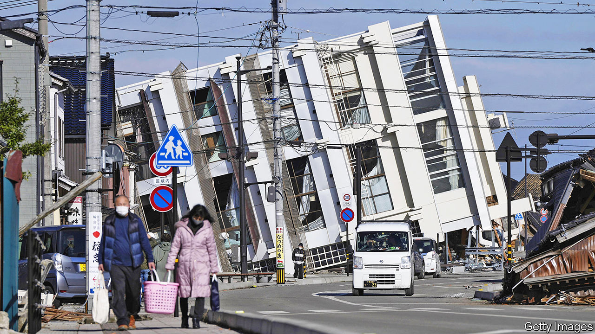
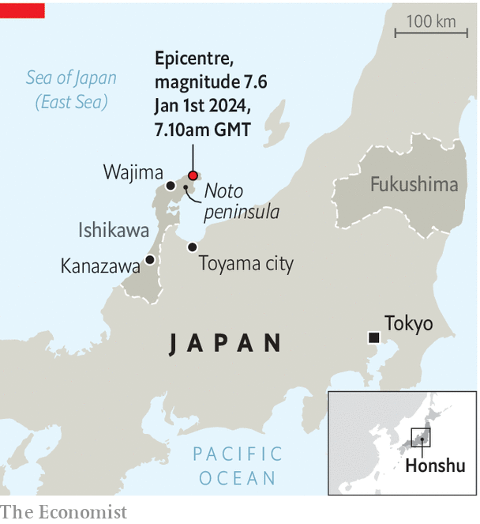

###### Off to a dire start

# A major earthquake in Japan highlights the country’s resilience 

##### At least 78 were killed. But the feared tsunami did not happen 

 

> Jan 2nd 2024 

THE NEW YEAR began dreadfully in Japan. At around 4:10pm on January 1st a magnitude 7.6 earthquake struck the Noto peninsula on the northern side of Honshu, the country’s main island, killing at least 78 people. The earth shook even in Tokyo, some 300km (185 miles) away. The following day a Japan Airlines flight burst into flames after landing at Tokyo’s Haneda airport and colliding with a Japan Coast Guard plane that entered the same runway while on a mission to deliver supplies to the earthquake disaster zone. 

The disasters proved less catastrophic than was feared. In the wake of the quake, officials warned of an impending tsunami with five-metre waves. Broadcasters urged residents to evacuate, evoking a tremor in 2011 that triggered a vast tsunami and a meltdown at the Fukushima nuclear plant. Yet the major tsunami did not materialise; the highest waves reached 1.2m in Wajima port, near the epicentre. Though dire, the death toll is far from the roughly 20,000 people killed in 2011. Several nuclear plants are located near Noto but none experienced operational abnormalities, according to the Nuclear Regulation Authority, a body set up after Fukushima’s meltdown. 

 


Dramatic video footage of the burning Japan Airlines plane spread on social media. The images made the chances of survival for passengers look slim. In the event, five of the six crew members on the coastguard flight were killed. But all 379 people aboard the civil aircraft made it out alive.

The earthquake still caused severe damage. The recovery will be protracted. Some 97,000 people were initially ordered to evacuate their homes. More than 30,000 households lost power; water service ceased in dozens of towns and villages. Bullet-train service was halted. The runway at Noto’s main airport cracked. Many roads collapsed, complicating evacuation and rescue efforts. In light of the suffering this caused, Japan’s emperor and empress cancelled their traditional New Year appearance, planned for January 2nd.

Japan sits in one of the world’s most seismically active areas.  have occurred regularly throughout its history, often causing political aftershocks. In 1923 a magnitude-7.9 quake struck near Tokyo, triggering a disaster in which at least 105,000 perished. The tragedy prompted the government to introduce seismic building codes and to support extensive research into plate tectonics.

Japan is still dealing with , in particular the Fukushima meltdown, which led to the temporary closure of its nuclear plants. The current government has been pushing to revive nuclear power, and public opposition has softened in recent years. But each subsequent quake is a reminder that seismic risk is ever-present.

Yet the earthquake in Noto also shows how resilience can be cultivated. The destruction would probably have been much worse were it not for Japan’s attention to disaster risk. The country invests heavily in prevention measures. Early-warning systems beam messages about big quakes to mobile phones and television screens; one alert for an aftershock on January 1st interrupted a live broadcast of an appearance by the prime minister. Local governments and businesses plan and train rigorously for disasters. Ishikawa prefecture, which includes the Noto peninsula, created a “Disaster Countermeasures Headquarters” almost as soon as the disaster hit. JR East, which operates trains in the regions closest to the quake, had its bullet-train lines running again by 3pm on January 2nd—less than 24 hours after the quake.

Similarly, those aboard the Japan Airlines flight survived largely thanks to thorough preparation and calm execution. The carrier is known as an industry leader in safety culture. Despite flames licking at the plane’s windows and smoke filling its cabin, a well-trained crew evacuated all 367 passengers, including eight infants, within 18 minutes. Flight attendants implored passengers to keep calm while they identified three safe exits and employed backup megaphones to communicate when the in-flight announcement system failed. Passengers in turn seem to have followed instructions not to take luggage during their escape. Together they slid to safety, turning a potential tragedy into an object lesson.■

