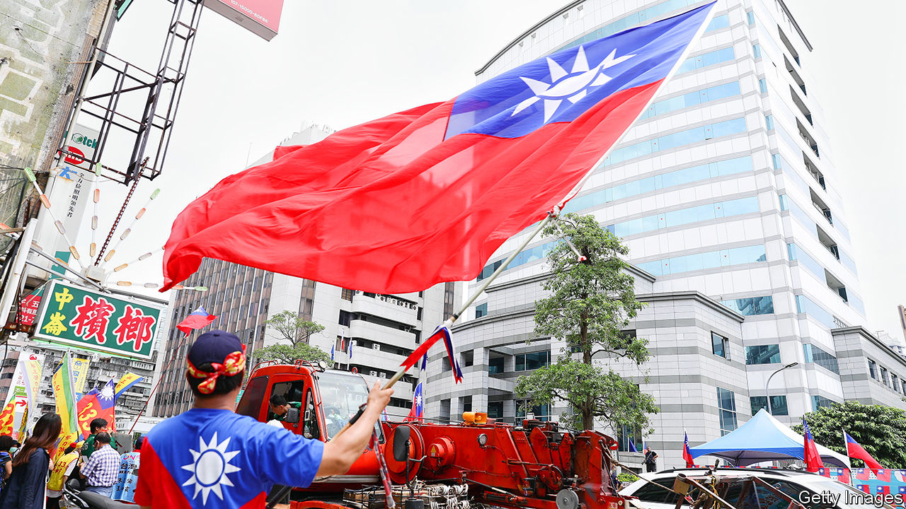

###### Turning unPacific?

# America braces for Taiwan’s election—and vice versa 

##### Presidential races in both places may worsen tensions with China 

 

> Jan 4th 2024 

The year 2022 brought the war in Ukraine; 2023 the one in Gaza. Will 2024 add a crisis over Taiwan? The self-governing island will hold elections on January 13th, as will America on November 5th. Both polls will raise the geopolitical heat at a time of military tension across the Taiwan Strait and deepening rivalry between America and China.

Many in Washington worry that a clash over Taiwan looms, despite efforts by the American and Chinese presidents, Joe Biden and Xi Jinping, to stabilise relations at a  in November. China claims the island as its own, and America says Mr Xi has ordered the  to develop the means to invade Taiwan by 2027. American commanders, worried about the shifting military balance, talk of a “window of vulnerability” in the second half of the decade. Yet conflict could erupt sooner, if the delicate balance between Taiwan, China and America is upset.


America, Taiwan’s main protector, will not favour any candidate in the island’s election. But American officials have long fretted that a victory for , deputy to President Tsai Ing-wen and fellow member of the independence-minded Democratic Progressive Party (dpp), could lead to escalation. He is leading polls by five percentage points, according to ’s .

China calls Mr Lai a “destroyer of peace”. Mr Lai, for his part, once described himself as a “pragmatic worker for Taiwan independence”. Of late, though, he has emphasised the fudgy status quo. He says Taiwan is “already a sovereign country” and thus has no need to declare independence. That position still infuriates the mainland, and Mr Lai’s election could quickly be met with intensified Chinese economic or military pressure. 

America has a history of tense dealings with the dPP. Of late relations have improved owing to Ms Tsai’s caution and increased bullying by China—not least a missile barrage in 2022, almost blockading Taiwan, after it was visited by Nancy Pelosi, then speaker of America’s House of Representatives. Still, American officials worry about Mr Lai’s proclivity for loose language, including a remark about hoping to “enter the White House” as Taiwan’s president, which would break with precedent.

All of which might suggest that a win for Mr Lai’s nearest rival, Hou Yu-ih of the Kuomintang (kmt), could reduce tensions. The former mayor of New Taipei City (the exurbs of Taiwan’s capital) is preferred in Beijing. The nationalist kmt is the Chinese Communist Party’s old enemy: its leaders fled to Taiwan after losing a civil war in 1949. But it at least shares the party’s belief in one China (even if the kmt wants a democratic one). Mr Hou accuses the dpp of endangering Taiwan by flirting with independence and promises to bring peace through dialogue with China.

Yet Mr Hou might not bring greater calm. He opposes both independence and China’s offer of unification under a “one country, two systems” arrangement. Most Taiwanese reject that model, which failed to protect Hong Kong’s former freedoms. Mere dialogue will not satisfy Mr Xi, who will want concessions that Mr Hou cannot deliver, like progress towards unification. A foot-dragging Mr Hou could prove as irksome to Mr Xi as Mr Lai. 

A second danger, in American eyes, is that Mr Hou might curb the push for a more asymmetric strategy, ie, using lots of mobile defensive weapons to turn the island into a “porcupine”. The dpp has hiked defence spending and extended conscription. Mr Hou tells American interlocutors he values deterrence, but says Taiwan can save on defence and shorten conscription by improving ties with China.

Were he to prove more overtly pro-China, Mr Hou might irk America. Evan Medeiros, a former China hand at the White House, notes a “background debate” about America’s one-China policy. The United States would in theory be content to see the unification of Taiwan with the mainland if done peacefully. In practice these days it is wedded to the status quo. Pentagon officials see the “”, running from Japan through Taiwan to Indonesia, as “America’s forward defence perimeter in the western Pacific”, in the words of one.

Whoever wins the presidency may be constrained by a hostile or hung Yuan, Taiwan’s parliament. “The question is less whether the new president will enact a radical change in the status quo. The question is more: how will an untested leader deal with a change in the status quo due to exogenous factors?” says Jude Blanchette of the Centre for Strategic and International Studies, another American think-tank. What would happen if Taiwan overreacted to Chinese military probing; or if there were a clash during an encounter between American and Chinese forces?

 


America’s elections could also unsettle things in several ways. One is that Mr Biden, burdened by wars in Ukraine and Gaza, and by his re-election campaign, could yield to Chinese pressure on Taiwan despite his repeated vows to defend the island. Another is that, during a fevered presidential race in which standing up to China becomes a virility test, Mr Biden overreacts or hawks in Congress stage a provocation akin to Ms Pelosi’s trip.

As for Donald Trump, Mr Biden’s likely Republican challenger, he has long been contemptuous of America’s alliances, and has accused Taiwan of stealing America’s semiconductor industry. In his first term he told aides he would not defend the island. Yet it is also possible that his future aides might push to confront China more forcefully, using Taiwan as leverage. Many in Congress want to give Taiwan greater support and diplomatic recognition.

For now, isolationism is paralysing American policy. Republicans in Congress are holding up a supplemental budget to help friends and allies—including support for Ukraine, Israel and Taiwan’s military defences. In exchange, they want measures to curb migration across America’s southern border. The budget bill also includes funds for American submarine yards to facilitate the aukus deal, under which America and Britain would supply nuclear-powered submarines to Australia. Congress has also delayed a full defence appropriations bill for fiscal year 2024, hampering the Pentagon’s efforts to prepare for possible conflict with China. Mr Trump may or may not return to power. But Trumpism is already undermining Taiwan and other Indo-Pacific allies. ■

