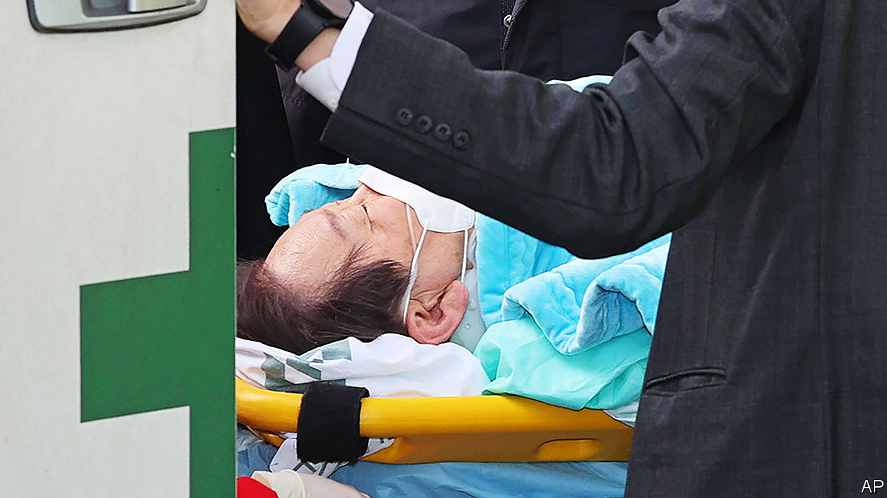

###### Going for the jugular

# Lee Jae-myung, South Korea’s opposition leader, survives a stabbing 

##### The motive for the attack is unclear 

 

> Jan 2nd 2024 

With a parliamentary election due in April,  was quick to start campaigning in the New Year. On the stump in Busan, South Korea’s second-most populous city, on January 2nd, the leader of the opposition Democratic Party (DP), which hopes to enlarge its majority in parliament, criticised the country’s ruling party and promised solutions to his audience’s cost-of-living problems. Then things went off-script. A man in the crowd wearing a blue paper crown lunged at Mr Lee, and stabbed him in the throat with a knife.

He left a centimetre-long hole in Mr Lee’s neck, fortunately missing his carotid artery. The opposition leader was rushed to hospital, where he is recovering. The knifeman was wrestled to the ground by security guards and arrested. 

Nearby Japan has recently seen such attacks, including last year a failed assassination attempt against its prime minister, Kishida Fumio, and in 2022 a  against one of his predecessors, Abe Shinzo. They are rarer in South Korea, but not unprecedented. Song Young-gil, then head of the DP, was struck on the head with a hammer in March 2022 while campaigning for Mr Lee. An American ambassador, Mark Lippert, needed 80 stitches to his face and hand after being attacked by a North Korean sympathiser in 2015. In 2006 Park Geun-hye, later South Korea’s president, was gashed with a Stanley knife. 

The latest violence comes at an especially ugly time in South Korean politics. The most recent presidential election, in which Yoon Suk-yeol beat Mr Lee by 0.7% of the vote, was notable for mudslinging. It has deepened partisan animosity. Yet what motivated Mr Lee’s attacker, identified by the police as a 66-year-old man named “Kim”, is unclear.

He had purported to be a fan of Mr Lee. He carried a sign reading “200 [DP] seats at the National Assembly”, more than the party has now. On his crown was written, “I am Lee Jae-myung”, a slogan used by diehard fans of the politician. Still, his intention was clear. After his arrest he told police: “I tried to kill him.”

The feuding parties have vowed to dial it down. Mr Yoon and others in his People Power Party (PPP) expressed concern for Mr Lee. Hong Joon-pyo, a combative ppp veteran, called for an end to the “gladiatorial politics of us hating and killing each other”.

If this leads to even a modest sympathy vote for Mr Lee, it would be invaluable for the DP, which is tied in polling with its rival. If the opposition party can preserve its parliamentary majority in April, it could block Mr Yoon’s policy agenda until he leaves office in 2027.■

