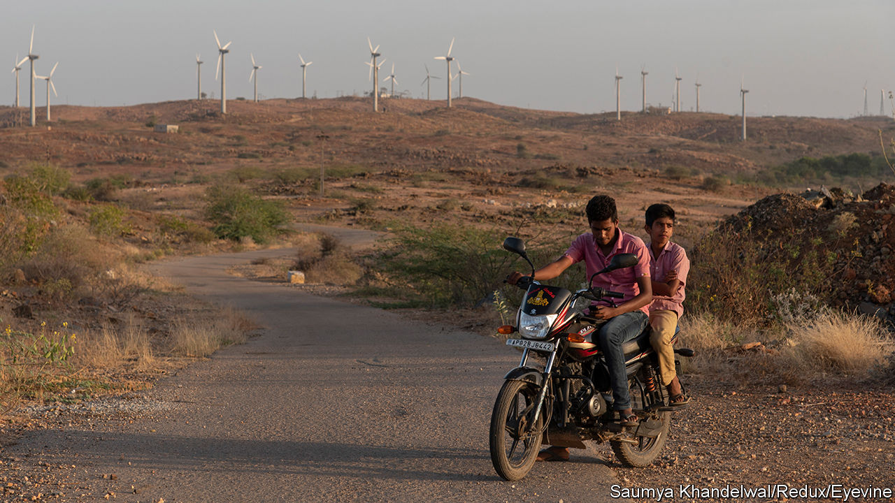

###### Powering down

# The energy transition could make India even more unequal 

##### Rich Indian states are sunny and windy, while poor ones have lots of coal 

 

> Jan 4th 2024 

INDIA’s energy transition is well under way. Generation capacity from renewable sources nearly doubled in the five years to last November, from 72 gigawatts (GW) to 133GW. The government of Narendra Modi has set a target of generating 500GW from renewable sources, or half the projected total capacity, by 2030. 

But coal will remain an important part of the mix. According to a study by Niti Aayog, a government think-tank, demand for it will not peak until 2035-2040. That helps explain why India has given itself until 2070 to hit net-zero emissions. This should provide latitude to develop its economy—and also give the regions most reliant on fossil fuels time to adjust.

India’s mineral riches are largely in its eastern and central states. These are among its poorest places. Without proper planning, dwindling coal revenues could throw their economies into disarray. Neither can they rely on much investment in renewables. In a cruel quirk of geography, six of the eight Indian states that receive the most sunshine and wind are in the prosperous south and west.

Consider Jharkhand. It is India’s biggest coal-producing state, with 28% of proven reserves. It is also grindingly poor: 28% of its people are classified as living in extreme poverty, the second-highest rate of any state. Mining is a big chunk of its economy, accounting for 78% of non-tax revenues. Of its 24 districts, 18 produce coal or host coal-dependent industries.

Yet of India’s 1050GW wind-and-solar potential, Jharkhand accounts for just 18GW, or 1.7%. By contrast, four states in south India and two in its west, along with Madhya Pradesh in the middle and the desert state of Rajasthan in the north-west, account for two-thirds. “The power vector will change from [flowing] east to west or centre to south to the reverse…It is inevitable,” says Sutirtha Bhattacharya, a former chairman of Coal India, a state-owned firm that is the world’s biggest coal producer.

India’s energy economy is already shifting. Nearly 75% of the country’s installed solar and wind generation capacity in 2020 was in the six southern and western states. Less than 5% was in ten northern, eastern and central states, excluding Madhya Pradesh. Though coal production and consumption are still growing, coal’s share in the electricity-generation mix declined from 57% to 48% in the five years to last November. States such as Jharkhand face a prospect of having to buy energy from other states, even as their revenues from coal decrease. Their fiscal deficits are likely to balloon, according to a working paper by Rohit Chandra and Sanjay Mitra for the National Institute of Public Finance and Policy, a research institution in Delhi.

Jharkhand, the state that will be hardest-hit, is already thinking ahead. In late 2022 it set up a task-force to plan for what it calls a “just transition”. “We were considered to be blessed because we have so much coal. Today people are saying it’s a curse,” says Ajay Kumar Rastogi, the task-force’s chairman. “But we see it as an opportunity for the state to plan.”

The task-force is charged with devising policies to help exploit whatever solar potential Jharkhand has, perhaps on disused coalfields, and to incentivise green industries such as hydrogen. It is also working to ensure its policies are implemented by the state’s bureaucracy. This is an example to other affected states. Chhattisgarh, a similar case, is said to be considering setting up a task-force of its own.

Limiting the negative fallout of the energy transition will be important not just for such states, but also for regions that stand to benefit and for India overall. As part of its federal compact, richer states help fund poorer ones by paying more into central government coffers than they draw out. If Jharkhand and its peers grow poorer, southern and western states will find themselves footing a larger bill. So far, write Mr Chandra and Mr Mitra, the “central government ministries have shown little interest” in thinking through, and mitigating, such economic consequences. That needs to change. ■


