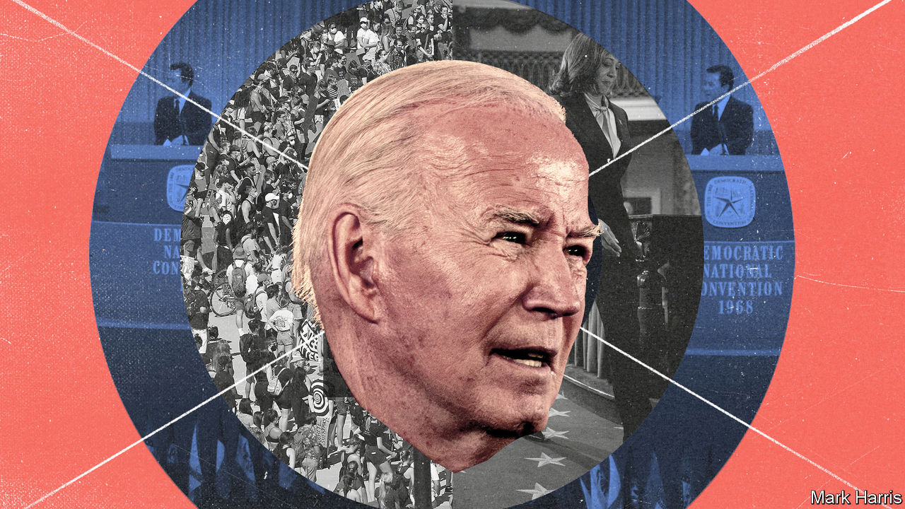
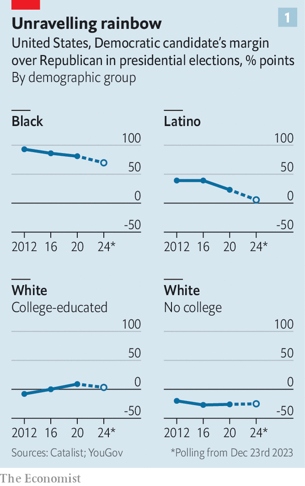
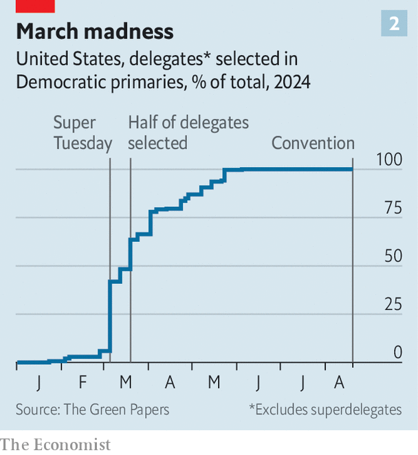
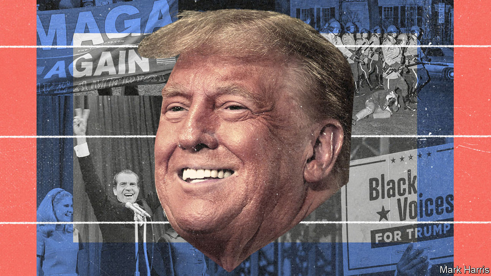

###### Biden or bust

# Joe Biden’s chances do not look good. The Democrats have no plan B 

##### It is too late to hold a competitive primary to allow a better candidate to emerge 

 

> Jan 4th 2024 

SITTING PRESIDENTS do not tend to abandon bids for re-election. The most recent to do so was Lyndon Johnson, in 1968. And that is a year that his party, the Democrats, would rather forget. Johnson was unpopular. The country and the party were divided by the Vietnam war and the civil-rights movement. After a surprisingly strong challenge in the first primary, he stood aside, only to unleash chaos. One of the leading candidates to replace him, Robert Kennedy, was assassinated. The nomination was eventually awarded by party grandees to a man who had not won a single primary, Hubert Humphrey. In the end the Republican candidate, Richard Nixon, who had been widely considered unelectable at the beginning of the year, won convincingly. He went on to do more damage to the presidency than anyone bar the Republicans’ likely candidate this year, Donald Trump.

Mr Trump, too, should be unelectable, owing to the 91 felonies with which he has been charged in different parts of America. Yet Joe Biden, the incumbent president, is so unpopular he may well lose to Mr Trump. There have been occasional calls for Mr Biden to step aside, like Johnson. But there is no sign that he is willing to do so and no guarantee that the Democrats would end up with a stronger candidate if he did. For that reason, although many Democratic operatives have grave misgivings about his candidacy, most are keeping quiet. As one puts it, if you’re all stuck on a boat of questionable seaworthiness, it is natural to wish for a finer vessel, but unproductive to poke holes in the hull or stoke a mutiny.

Whitmer and wisdom

It is Mr Biden’s feeble polling that is seeding the angst. ’s  puts Mr Trump more than 50 percentage points ahead of his nearest rival, making him the prohibitive favourite. A polling average for the general election compiled by RealClearPolitics shows Mr Trump ahead of Mr Biden by a margin of 2.3 percentage points. This is well above his showing in the past two presidential contests, in which he consistently lagged in the polls. At this point in 2016 Mr Trump’s support was seven points lower: he trailed Hillary Clinton by a margin of five points. At this point in 2020 he trailed Mr Biden by five points. 

With most states so partisan that they are not worth contesting, the presidential campaign will be centred on six where the outcome is actually uncertain: Arizona, Georgia, Michigan, Nevada, Pennsylvania and Wisconsin. Early polling in these states also shows Mr Biden several points behind. And some Democrats fear that these polls may be underestimating Mr Trump’s support, because his conspiracy-minded voters may not be open with those taking the surveys.

 


Underpinning Mr Trump’s strength is a broad political shift. Partisan allegiance in America may seem hysterically entrenched, but in fact it is mutable. White working-class voters powered Mr Trump to victory in 2016; in the years since, the non-white working class has begun to shift, too. Between 2016 and 2020 Hispanic Americans, once fairly loyal Democratic voters, moved 18 points towards the Republicans. Black men are also slowly peeling away from the Democrats. Only the influx of white college graduates has kept the Democratic Party competitive nationally. These demographic trends are sizeable enough to determine the outcome of the election if they persist—and they do appear to be. The latest polls indicate higher support for Mr Trump among African-American and Hispanic voters than he enjoyed in 2020 (see chart 1). “It seems like the 2024 polls right now are 2020 trends carried forward,” says Patrick Ruffini, a Republican pollster. 

Secular trends aside, there is plainly a problem with Mr Biden himself. The president’s net approval rating is -16 points, according to several public polling averages. That is notably worse than Mr Trump’s at this point in his presidency. Voters are worried about his fitness for office. One of YouGov’s weekly polls for  in December found that 55% of Americans think that the 81-year-old Mr Biden’s health and age “severely limit his ability to do the job” of president, including 25% of Democrats. Only 24% of Americans want him to run for president again. Fully 61% of them do not, including 38% of those who voted for him in 2020.

Americans are only marginally more enthusiastic about the 77-year-old Mr Trump’s revenge bid for the White House, but they are much less likely to think that he is too old or frail to resume the office. Mr Biden, after all, did not do much campaigning in 2020, owing to the pandemic. He does not seem to relish the arduous campaign ahead, whereas Mr Trump appears to like nothing better than rambling on in front of adoring crowds. Four years ago Mr Biden reportedly toyed with promising to remain in office for just a single term. “If Trump wasn’t running, I’m not sure I’d be running,” he said to a room full of donors in December. When asked how many other Democrats could beat Mr Trump, he said, “Probably 50 of them…I’m not the only one who could defeat him. But I will defeat him.”

There is almost no chance that Mr Biden will voluntarily abandon his re-election bid. He sees himself as a divinely appointed Trumpbuster and believes his electoral record reflects that. First he vanquished Mr Trump in 2020. Then in the midterm elections of 2022, when Republicans had expected to deliver a terrible rebuke to Democrats, the Democrats’ support held up surprisingly well. 

Mr Biden’s supporters, naturally, express great confidence. “If you play poker, which I do, you’d rather have our cards than their cards,” says Jim Messina, the manager of Barack Obama’s successful re-election bid in 2012—although he admits, “This thing will be really close.” The campaign argues that the president has been underestimated before, as in the hotly contested Democratic primary of 2020, when he looked fatally unpopular before suddenly becoming the consensus candidate.

Campaign staffers point to the mid-terms as proof that Republican candidates who champion abortion and reject the election results of 2020 will fare poorly. They argue, correctly, that polls conducted ten months from an election are a poor guide to the outcome. Most voters will not devote much thought to the election for months and the billion-dollar campaign machines are only just gearing up. When Americans are paying more attention, the campaign insists, the spectacle of Mr Trump shuttling between rallies and court appearances will remind Americans of the chaos of his time in office.

Mr Biden’s polling deficit is not insurmountable. Bidenworld also thinks that, with time, voters will give the president more credit for his achievements. The labour market is robust, unemployment is low and wage growth is strongest at the bottom of the income distribution, reducing wage inequality. Inflation, which has infuriated many voters, is abating without a recession. YouGov’s polling for  suggests Americans are unduly gloomy: 58% think the country has high unemployment (it does not); 44% think the country is in a recession (it is not); and 40% think inflation will be higher in six months (quite unlikely). The Democrats are hoping that voters will notice that the economy is doing better than they thought by election day. But Republicans keep talking about “Bidenomics” as a pejorative, suggesting that they doubt the topic will end up helping the president.

Mr Biden’s apologists also argue, in effect, that he will win because he must. “We’re going to win because democracy and freedom and the very ideas that make America America are on the line. We have no other choice,” says Quentin Fulks, his deputy campaign manager. They see a battle for the very “soul of the nation”, as Mr Biden often says. This is a stirring appeal, but only for the converted. A new study by the Democracy Fund Voter Study Group finds that Americans like to invoke democratic norms to chide someone from the opposing party, but are willing to suspend them when it comes to their own preferred candidate. Mr Trump is also muddying things by deploying apocalyptic rhetoric of his own: he has recently taken to calling Mr Biden “the destroyer of American democracy”. Republicans in Congress may pursue a farcical impeachment inquiry against Mr Biden in order to claim that both men are equally disreputable.

Newsom fine day

Anyway, the end-of-days argument cuts both ways. It could be used to assert that the Democrats cannot risk as weak a candidate as Mr Biden. The party has plenty of non-geriatric politicians who could helm a presidential ticket. The problem is that none of them has dared to enter the primaries, in part for fear that they would not be able to beat Mr Biden and instead would only harm his chances in the general election. Only little-known politicians such as Dean Phillips, a Democratic congressman from Minnesota, have put themselves forward. “President Biden—a man I respect and I think a person of decency and integrity—is perhaps one of the only Democrats who could lose and probably will lose to Donald Trump,” explains Mr Phillips. He says he is merely saying “the quiet part out loud” about the president’s advanced age and unpopularity.

As reasonable as Mr Phillips’s criticisms may be, his challenge looks doomed (“keep the faith” is one of his catchphrases). He could score unexpectedly highly in the New Hampshire primary, to be held on January 23rd, which Mr Biden is boycotting over a scheduling spat within the Democratic Party. Thereafter, things will be harder. Some states, such as Florida, have in effect cancelled their Democratic primaries altogether, declaring that there is only one qualified candidate. The difficulty of getting on the ballot prompted Robert Kennedy junior, the son of the candidate assassinated in 1968, to abandon an attempt to stand in the primaries against Mr Biden and instead try to get on the ballot in the general election as a third-party candidate.

 


Even if more plausible candidates saw any hope of defeating Mr Biden, they are too late to initiate a serious primary challenge. The deadlines to file as a candidate in the primary have already passed in more than 20 states, and several more loom in early January. In recent years the primary calendar has become much more compressed: most of the almost 4,000 ordinary delegates will be allocated by the end of March (see chart 2), giving an insurgent candidate very little time to gain any momentum. 

All of which suggests that Mr Biden will easily secure his party’s nomination. It is possible, of course, that he might be forced to step aside by what pundits politely call a “health event”. But such an outcome would not necessarily be providential for the Democrats. As when Johnson declared in 1968, “I shall not seek, and I will not accept, the nomination of my party for another term as your president”, pandemonium would probably follow. The party might have to rewrite the rules of the primaries, to allow more candidates late access to the ballot, but even so, the campaign would presumably be nasty, brutish and short. Only a few candidates, with the resources to crank up an electoral machine at short notice, would be able to compete.

Harris teeters

Kamala Harris, the vice-president, would be the presumptive nominee, with the institutional support of the party behind her and perhaps even Mr Biden’s endorsement. Democrats are a hierarchical bunch. The last time they denied a vice-president seeking the presidential nomination was in 1952. The unfortunate man was Harry Truman’s deputy, Alben Barkley, a septuagenarian whose abysmal eyesight required documents to be set in inch-tall font.

But Ms Harris, who ran a disastrous campaign for the presidency in 2020 that ended before the first votes were cast, would almost certainly attract challengers. Only 36% of Americans think she is qualified to be president, according to YouGov. Only 23% think she would beat Mr Trump (including 43% of those who voted for Mr Biden in 2020 and just 3% of Trump voters). Although it would be awkward in an identity-conscious party to attempt to step over the first black and the first female vice-president, some rivals would probably be willing to take the plunge. 

 


Gavin Newsom, the governor of California, is plainly clamouring for the chance to be president, although he denies it, and has built a formidable political machine. The governor of Illinois, J.B. Pritzker, has both ambition and an inherited fortune worth billions. But the moderate governors whom many Democrats see as best-placed to take on Mr Trump—such as Andy Beshear of Kentucky, Josh Shapiro of Pennsylvania or Gretchen Whitmer of Michigan—might not have enough money to hand to compete properly in a suddenly open primary or enough time to build a viable campaign. The biggest political talents in Mr Biden’s cabinet, such as Pete Buttigieg, the secretary of transportation, and Gina Raimondo, the secretary of commerce, would probably have to resign if they wanted to enter the fray. A coronation of Ms Harris might simply be unavoidable.

If Mr Biden were forced to abandon his bid for the White House after lots of primaries had concluded, the confusion would be all the more intense. The big parties’ rules for nominating a candidate are fiendishly complicated, but in essence they require a majority of delegates to back the winner at a national convention. For Democrats this will be held in Chicago in August—the same city as the traumatic convention of 1968, where police brutally dispersed anti-war protesters outside while bewildered delegates debated the way forward inside. Normally, most delegates are “pledged” meaning that they are expected to reflect the outcome of the primary in their home state. But if they are pledged to a candidate who is no longer in the race they are treated much as “superdelegates”, the 746 party grandees who get to vote as they please.

If Mr Biden were to withdraw after winning a big share of delegates, candidates to replace him would be forced to woo the party’s patricians rather than its plebeians. The convention would revert from its present form—a four-day bout of pageantry—to its old-fashioned format: four days of haggling in smoke-filled rooms. Hans Noel, a political scientist at Georgetown University, argues that a contested convention is more likely to produce a candidate able to unite a fractious modern party than the current “sports tournament” system. But most Democratic operatives think the party would emerge more divided rather than united after such tumult. American voters, too, are unused to such machinations. They have not witnessed such a contested convention since 1976, when Republican grandees plumped for Gerald Ford over Ronald Reagan.

If Mr Biden fell ill and were unable to contest the election after securing the nomination in August, the Democratic National Committee, which consists of a few hundred party operatives, would decide who to place at the top of the ticket. Such a meeting has only been required once before, in 1972, when the Democrats’ vice-presidential candidate, Thomas Eagleton, had to withdraw after revelations that he had suffered from depression and received electroshock therapy. Again, it is likely that the crown would pass in this instance to Ms Harris. Mr Biden appears loyal to her as his running-mate. Yet her shakiness as a candidate is thought to be one of the reasons Mr Biden is reluctant to bow out.

Mr Biden’s swooning poll numbers leave the Democrats in a miserable predicament. The alternatives that might still be possible are not obviously preferable. When asked whether it would be better if Mr Biden withdrew, the party’s preferred public-relations strategy is to pretend that the idea is absurd. Mr Biden’s staffers tell heroic stories about the punishing days he routinely endures and insist that he is so alert, informed and mentally agile that the reporter asking the awkward questions “couldn’t survive a ten-minute policy briefing with the president”. What they really mean is that there is no Plan B. ■


