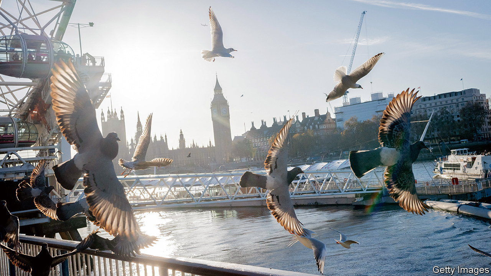

###### Poll exploration

# Older British voters still favour the Tories. Others, not so much 

##### The Economist’s poll tracker shows the scale of the task facing the Conservatives 

 

> Jan 4th 2024 


The next general election must be called no later than December 17th (which would mean the actual vote happens in January 2025). The Tories should not be written off, but they have a mountain to climb. According to s , which is updated online each week and breaks voters down by age, region and choice on Brexit, Labour has a poll lead of around 20 percentage points, the largest gap one year before an election since its landslide victory under Sir Tony Blair in 1997. It leads in every region, Scotland included. Older Britons still lean blue: 40% of people aged 65 and over say they will vote Tory. Just 18% of voters aged between 18 and 34 say the same. ■


