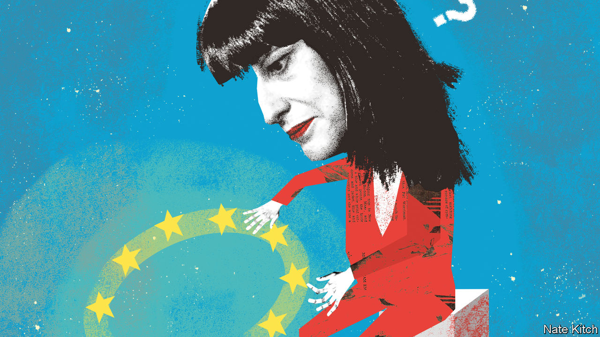

###### Bagehot

# What Britain’s Labour Party thinks of Europe 

##### Rachel Reeves is heir to a long Labour history of ambivalence towards the EU 

 

> Jan 2nd 2024 

RACHEL REEVES can surprise visitors by her coldness towards Europe. At a recent dinner the shadow chancellor was asked when Britain would rejoin the European Union. A naive question, met with a blunt response. “No, no, no! You don’t get it!” she said, according to one who was there. Ms Reeves voted to remain in 2016; in the deadlock that followed she reluctantly supported a second referendum. But, she told her fellow diners, her constituents in Leeds had seen local factories advertising for workers in Poland; lifelong Labour voters had come out for Brexit in their droves. “The constitutional question is closed.” 

Plenty think that is just a practised feint from a former junior chess champion. Sir Keir Starmer, the Labour leader, has packed his shadow cabinet with second-referendists. Many Labour voters would cheer a reintegration with the EU: 78% of them think divorce was a mistake. Brexit is a drag on growth, the party’s proclaimed number-one priority. In opposition, the Labour Party is proposing only modest tweaks to Britain’s EU trade deal. If elected later this year, will they not yearn for Brussels’s embrace? 

The short answer is “no”. Ms Reeves represents the dominant strand of thinking in the Labour Party: not Europhilia, but Euro-agnosticism. The binary choice imposed by the Brexit referendum masked older Labour instincts on Europe: ambivalence, indifference and suspicion. In government, these instincts will prevail.

Electoral strategy demands Euro-agnosticism. Leavers may be a minority of Labour’s electorate but they predominate in the places it lost in the rout of 2019, and on which the Starmer project is singularly focused. When activists ask why, given Labour’s , it can’t be bolder about Europe, Ms Reeves rebukes their complacency. The party loses too often, she argues, to alienate a wing of its support. Voters’ identities as Leavers and Remainers persist; you stir them up at your peril. 

And in Ms Reeves’s telling, Leave voters had a point. In a pamphlet in 2018 she argued that the EU’s single market, and the free movement of labour it brought, were part of four decades of globalisation which caused fissures in Labour’s electoral coalition. Labour-supporting urban professionals prospered from cross-border services; its socially conservative working-class heartlands got only low-wage migration, low investment and the spectre of “the redundancy of its way of life”. Labour could circumvent such folk, she wrote, and squeak into power with a “progressive alliance”. But that “would bring to an end Labour’s historic role as the party of working people. And what then would be its purpose?” 

As a result, Labour is Euro-agnostic on economics. Out with what Ms Reeves terms the “hyper-globalisation” of the New Labour era; in with industrial subsidies, shortened supply chains and “Buy British” policies, framed by the rhetoric of resilience, security and a “home-grown” economy. This vision is not incompatible with EU membership. But it casts the liberalising force of the single market as yesterday’s thinking and as a distraction from much older problems in the British economy. Sir Keir these days dismisses the European question as an intellectual “warm bath”. His shadow chancellor argues that a party which promises investors stability can hardly re-litigate the paralysing Brexit debates.

While Tories still obsess about the EU, in other words, Labour doesn’t think about it much at all. The party’s blueprint to decarbonise electricity—a project ripe for co-operation—makes no mention of Europe other than to gripe about foreign ownership of British wind farms. Few of the shadow cabinet are familiar with Brussels. Labour , to the Democrats, for ideas. The typical party member voted to remain but is more animated by poverty and the health service. 

Europe is foreign policy, not destiny. David Lammy, the shadow foreign secretary, sees Britain as an active power in a concentric Europe, with new security treaties and regular summits. The ambition reflects internationalism more than integrationism; the EU is spoken of in the same breath as aid and climate diplomacy. 

All of which accords with a long history of Labour Euro-agnosticism. “I don’t stand on the south coast, look towards the continent and say ‘There’s the new Jerusalem’,” declared Harold Wilson, a Labour prime minister who called Britain’s first referendum on Europe in 1975. James Callaghan, his successor, thought it a handy commercial “instrument” but not a vision like the empire. Ed Miliband, the Labour leader in the 2015 election, put Labour on a course towards an in-out referendum, albeit on a slower timetable than David Cameron’s (at the next EU treaty change, rather than by 2017). He and Lord Cameron shared a nitpicky critique of Brussels: too bossy, too expensive, too many migrants. 

She’s just not that into EU

Can a party that has promised the fastest growth in the G7 afford to be ambivalent about Britain’s largest trading partner? Some around the party muse that a radical rethink of the relationship would be a project for Labour to pursue during a second term. But Euro-agnosticism can breed naivety about other European leaders’ appetite for a new deal with Britain. It would require of Labour hard diplomatic graft, a willingness to spend political capital and a vision that is currently lacking. It would also mean grappling with the EU’s constitutional glue: the writ of the European Court of Justice, the supervision of the commission and so on. Labour MPs flinch at that. They are not sovereignty-fetishists but they are creatures of Westminster, at home with parliamentary supremacy. 

A first Labour term is likely to yield a few worthwhile improvements in the relationship with the EU—shaving paperwork for food products, school visits and the like. The day may come when it sees no alternative to a pitch for serious reintegration. But the strictures entailed by that would not be sold as crowning achievements of a European project. They would be the price to be paid, reluctantly and without fanfare, for a higher standard of living. ■


