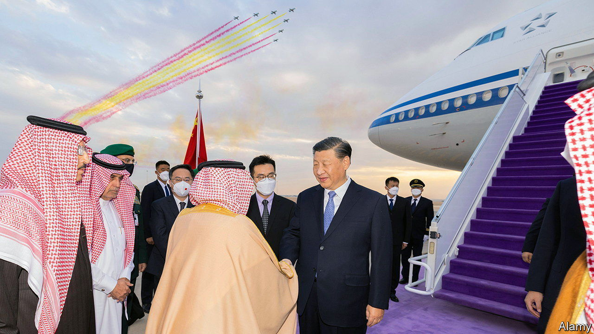
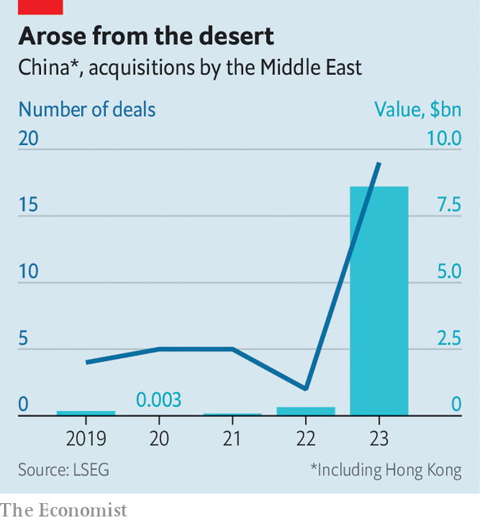

###### The Gulf between them

# Can Sino-Arabian business ties replace Sino-American ones? 

##### The Middle Kingdom gets cosy with the Middle East 

 

> Jan 4th 2024 

WHEN CHINESE and Middle Eastern moneymen meet, it is usually behind closed doors. Last month they mingled openly in the lobby of the Hong Kong Stock Exchange, at the “FII Priority” summit, an event organised by the Public Investment Fund (PIF), a $780bn vehicle for Saudi sovereign wealth. It was the first meeting of its kind in east Asia. It will not be the last. The PIF announced it was planning to set up an office in China. Mubadala and the Investment Corporation of Dubai, two Emirati sovereign wealth funds, the Qatar Investment Authority and Kuwait Investment Authority are all said to be preparing to deploy more capital in the world’s second-biggest economy. They think they can to do this without angering the increasingly China-wary West. “We are friendly people, we are friends with everyone,” Jerry Todd, an executive at the PIF, told the conference in Hong Kong. 

China’s investment firms and the companies they back need friends right now. As Sino-American geopolitics sour, American investments in China have collapsed. Chinese tech firms got $1.2bn from American venture capitalists in 2022, down from $14bn in 2018. Mergers and acquisitions (M&amp;A) by American firms in China fell below $9bn in 2023, down from $20bn five years earlier. Meanwhile M&amp;A deals by Gulf entities have ballooned—from next to nothing in 2019 to nearly $9bn in 2023, according to data from LSEG, a financial-information firm (see chart). 

 


Last month NIO, a Chinese Tesla wannabe, said it had received $2.2bn from CYVN Holdings, a firm controlled by Abu Dhabi’s government that had previously put more than $1bn into the electric-car maker. The NEOM Investment Fund, part of a pharaonic Saudi project to build a futuristic city in the desert, has backed Pony.AI, a part-Chinese developer of self-driving tech. Earlier in the year Saudi Aramco, the kingdom’s oil colossus, invested $3.6bn in a Chinese petrochemical refinery called Rongsheng, and entered into a joint venture with the PIF and Baosteel, one of China’s largest steelmakers, to produce high-quality metal plates in Saudi Arabia. Chinese VC firms are tight-lipped in public about their limited partners but privately confirm that in the past two years interest from Middle Eastern ones has jumped. 

Tech talent, of which the Gulf is short but China has aplenty, is flowing in the other direction. The Shenzhen campus of the Chinese University of Hong Kong and the Shenzhen Research Institute of Big Data are helping Saudi Arabia’s King Abdullah University of Science and Technology (KAUST) build an artificial-intelligence model to power an Arabic-language chatbot called AceGPT. Around one in five of KAUST’s students and one in three of its postdoctoral researchers are Chinese.

The budding Sino-Arabic relationship will not replace the wilting Sino-American one. Dubai and Riyadh cannot match the depth of Silicon Valley’s expertise and New York’s capital markets. The Gulf wealth funds mostly cut cheques for a few hundred million dollars, whereas Americans also back early-stage startups in need of a few million. And for the Gulf, America remains a vital partner. In December an Emirati AI startup called G42, whose backers include Mubadala and Silver Lake, an American investor, said it would sever ties with Chinese firms rather than lose access to American technology. “We cannot work with both sides,” its chief executive, Xiao Peng, told the . So much for being friends with everyone. ■


