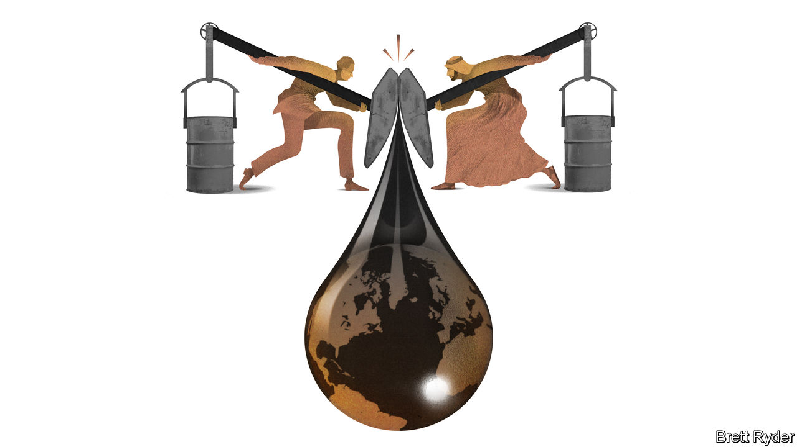

###### Schumpeter

# Meet the shrewdest operators in today’s oil markets 

##### America’s supermajors should worry OPEC+ 

 

> Jan 3rd 2024 

Almost a decade ago, a price war broke out between  in the Persian Gulf and the  in America, whose innovative drilling techniques gave rise to the shale revolution. In December 2014   of both antagonists standing back to back, frowns on their faces and petrol pumps at the ready. It called the new economics of oil “Sheikhs v shale”. Missing from that picture were two companies that until then had been the biggest stalwarts of America’s oil industry, ExxonMobil and Chevron. Had they been pictured, the two crusty supermajors would probably be standing awkwardly on the sidelines, struggling to make sense of what was going on. At last, they are moving back to centre stage. 

For much of the interim period the petrostates and the hardscrabble shale producers remained critical to the new oil order, though their tussle unfolded in strange ways. In 2016 the OPEC producers’ cartel joined forces with Russia to create OPEC+, which its autocratic masterminds hoped would let them control oil prices in order to benefit their regimes. Yet instead of responding by dousing the world in oil, the frackers unexpectedly developed OPEC-like self-restraint. Under pressure from investors to improve profits, they kept a tight rein on drilling activity even when crude surged above $100 a barrel. 

That unusual discipline continued until 2023, when American producers awoke from their chaste slumber. Record shale output allowed America to extract more oil than any country in history, offsetting desperate efforts by OPEC+ to curtail production in order to prop up prices. According to S&amp;P Global, a consultancy, America and Canada together pumped more oil and gas in 2023 than the whole of the Middle East. The bonanza spread to South America, where producers in Brazil and Guyana also drilled unprecedented amounts of oil. Daniel Yergin, an energy historian, calls it “the great rebalancing”—a historic shift of oil production away from the Gulf and towards the western hemisphere. 

It is in this context that you should consider two recent megadeals: ExxonMobil’s $64.5bn merger with Pioneer Natural Resources, a fracking giant, and Chevron’s $60bn acquisition of Hess, an independent producer. Both acquisitions are aimed at regaining the clout in the oil industry that was once their birthright. Alone, neither firm is powerful enough to push around oil prices as OPEC+ tries to. But together, they can double down on production in the Americas in a way that represents a new challenge to the petrostates. Forget the scrappy frackers. It is the deep-pocketed, tech-savvy supermajors that the sheikhs should worry about. 

The two firms look like the shrewdest operators in today’s oil markets. One reason is their focus on oil that is cheap to produce. This is likely to leave them in a good position when demand for the stuff eventually wanes amid the shift to cleaner energy. The two acquisitions give the duo access to abundant fresh resources. The Pioneer deal is a big bet on the future of shale. Once completed by mid-2024, it aims to double ExxonMobil’s production capacity in the shale-rich Permian Basin of West Texas to 1.3m barrels a day. This will rise to 2m barrels by 2027. By buying Hess, Chevron, too, gets better access to some shale acreage where, like its bigger rival, it hopes to boost production by applying advanced technology and financial muscle. The company believes that an even bigger prize is Hess’s oil assets developed in partnership with ExxonMobil off the coast of Guyana, the extraction of which is, in keeping with the times, not very carbon-intensive. Taken together, the western-hemisphere wagers give the two companies options regardless of oil’s precise future. Shale is “short-cycle” production that can be quickly flexed depending on the near-term vagaries of demand. Guyana is a longer-term project.

The second reason the supermajors are looking shrewd is by letting themselves be guided by the economics of oil rather than by energy geopolitics. Their aim is not to rig prices. It is to turn a profit whatever happens in the markets. They can achieve this by integrating exploration and production with downstream operations such as refining and distribution. Contrast that with Saudi Aramco, the biggest oil firm of all. Like ExxonMobil and Chevron, it is a model of American-style efficiency. But when it comes to output management, it is also at the mercy of Crown Prince Muhammad bin Salman’s desire to walk tall on the world stage. 

Molecules v electrons 

A third reason for the American firms’ bright prospects has to do with their decarbonisation strategies. Both refused to take climate change seriously for too long. But once they did, they chose to back clean-energy technologies such as carbon capture and storage and hydrogen production that fit well with their engineering skills in oil and gas. The dabbling by their European counterparts, such as Shell and BP, in the provision of low-carbon electricity has meanwhile proved tougher than expected.

Like everyone, the Americans remain hostages to fortune. Their shale exposure may deplete far sooner than they expect; forecasters already point to a decline in the number of drilling rigs as an ominous sign. In a worst-case (albeit unlikely) scenario, Venezuela may try to make good on its threat to seize oil-rich territory from Guyana, its neighbour, putting their assets there in jeopardy. Most serious, they may have disastrously miscalculated the speed of the energy transition, leaving them with oceans of stranded oil if demand collapses.

For now, though, they look more like old pros in an industry in the grip of upheaval. They know the value of focusing on profitable growth, of keeping their long-term options open and of sticking to their free-market guns. The sheikhs have long insisted that, whatever oil’s future, their access to abundant reserves will ensure they will be the last oilmen standing. America’s supermajors will not let that happen without a fight. ■


