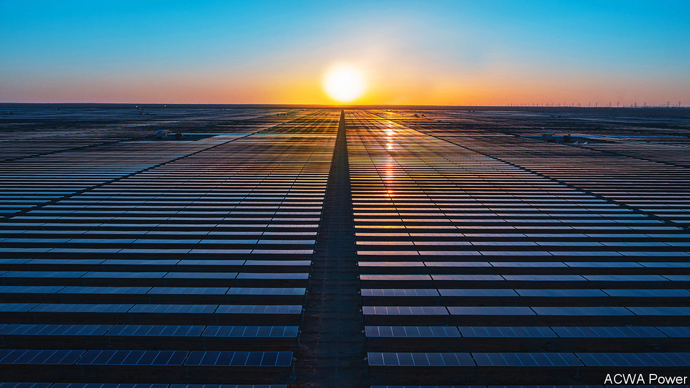

###### Life ACWAtic

# Saudi Arabia has an unlikely solar star 

##### ACWA Power has green ambitions beyond its desert home 

 

> Jan 4th 2024 

SITTING ATOP a fifth of the world’s oil reserves, Saudi Arabia doesn’t spring to mind when you think about renewables. Muhammad bin Salman, its crown prince and de facto ruler, would like this to change. He wants half of Saudi electricity to come from wind and solar farms by 2030. Two-thirds of that capacity, or around 40 gigawatts (GW) will, if Prince Muhammad gets his wish (as he tends to do), be courtesy of one firm: ACWA Power.

For most of its 19-year existence the utility was a relatively anonymous family-run affair. No longer. Since it went public in Riyadh in 2021 its market value has swelled nearly four-fold. It is now worth $50bn. The Public Investment Fund (PIF), the steward of Saudi sovereign wealth, owns a 44% stake. ACWA has 24GW of green projects at home and abroad either already running or at an advanced stage, up from 0.3GW in 2014. Add its other capacity under construction and the total is 54GW. Its original business of desalinating water went from 1m cubic metres a day in 2006 to 7.6m cubic metres in December. Its newish boss, Marco Arcelli, a seasoned Italian energy executive, expects assets it has a stake in to triple between now and 2030, to $250bn. Its projects will, he hopes, help create a broader domestic green-energy supply chain. “We are a big enabler,” he says.

ACWA has thrived as many other renewables operators around the world have struggled. Whereas those rivals are seeing the cost of projects soar as a result of rising interest rates, ACWA has received non-interest-bearing loans from the PIF, in addition to debt secured against individual projects and loans from banks to tide it over while it raises more equity capital and brings in partners. Access to easy money has allowed ACWA to expand capacity, while lowering costs for customers. This has helped make the levelised cost of Saudi solar energy, which takes into account both construction and operation of a power plant, among the lowest in the world. 

Nevertheless, ACWA’s returns on domestic projects are low by global standards. Mr Arcelli is thus keen to take advantage of juicier ones on offer abroad. He is investing nearby (in Bahrain, Egypt, Jordan, Oman, Turkey and the United Arab Emirates) and farther afield (Azerbaijan, Morocco, South Africa and Uzbekistan). Two-fifths of ACWA’s overall capacity is to be found outside Saudi Arabia. It is also eyeing China, a highly competitive market but one where ACWA could, thinks Mr Arcelli, gain both scale and technology partners in the form of Chinese manufacturers of wind turbines and solar panels.

ACWA has its work cut out. To meet Prince Muhammad’s domestic goals for it, the company must add 6-7GW of capacity—equivalent to three or four big projects—every year for the rest of the decade. It currently has just 14GW at various stages of development. Managing fast expansion will require a laser focus on costs (those of its nascent hydrogen venture has already risen by 70% from initial estimates, to $8bn). It will also require more debt. In September ACWA was already sitting on $7bn of it, equivalent to seven times its earnings before interest, taxes, depreciation and amortisation. Such a ratio would be considered a red flag at most firms. 

ACWA may yet rise to the challenge. It can count on the PIF’s deep pockets. And it is a fast learner; its domestic 1.5GW Sudair solar project may be fully up and running in just over two years, reckons Oliver Connor of Citigroup, a bank, brisk by industry standards. Mr Arcelli wants things to go faster still. Given that the prince is watching, that is no surprise. ■


