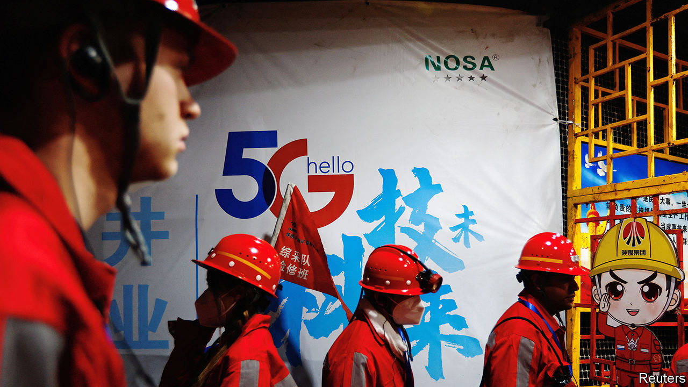

###### Hard-tech tonic

# The Chinese Communist Party wants (a bit) less consumer internet 

##### The signals it is sending to investors are loud, if somewhat cacophonous 

 

> Jan 4th 2024 

INVESTORS IN CHINESE tech stocks might feel like characters in an online “party game”, a type of multiplayer activity that became all the rage in 2023. The latest addition to the genre is “DreamStar”, released on December 15th by Tencent, China’s biggest digital giant, with a big gaming business. Players speed around a track as cartoon sheep and pandas, dodging cannon balls and grabbing magic clouds, sometimes plummeting through chasms only to end up back where they started. 

Tencent’s share price jumped on hopes the game would challenge the wildly popular “Eggy Party”, a similar offering from NetEase, a rival developer. A week later it fell off a cliff, as did that of NetEase, after the National Press and Publication Administration (NPPA) published draft rules capping spending on online games. The next day the NPPA seemed to proffer one of those magic clouds, declaring that it desired “prosperous and healthy” development for the online-gaming industry. Tencent and NetEase shares have returned almost to where they were at the start.

The incident hints that President Xi Jinping has little appetite for another harsh tech crackdown of the sort that torched about $1trn in shareholder value between early 2021 and late 2022; on January 2nd Reuters reported that an official behind the draft gaming rules had been fired. But it is also a reminder that the government dislikes Chinese big tech’s big presence in citizens’ everyday lives—and that it would anyway prefer entrepreneurs and investors to focus on serious things like chipmaking, cloud computing and artificial intelligence (AI) for industry. 

The signal from Beijing, cacophonous though it may be, is being heard. On January 1st Baidu, the country’s search giant, said it had scrapped a $3.6bn purchase of a local live-streaming platform called JOYY. Baidu said only that conditions of the deal, originally signed in 2020, were not fulfilled. These may have included regulatory approvals for expansion, insiders reckon. Tencent and Alibaba, China’s biggest e-emporium, have been divesting some assets. (On December 29th a court also ordered Alibaba to pay 1bn yuan, or $140m, in damages to JD.com, a rival e-merchant, which had accused the company of forbidding sellers to use other platforms.)

The travails of China’s domestic digital darlings stand in stark contrast to a boom in state-favoured “hard tech”. Companies trying their luck in industries which the government deems to be critical to its strategic contest with America can count on helpful policies and generous subsidies. They are also flush with money. Over the past three years, even as capital for the consumer internet has all but dried up, hard-tech developers have collectively raised about 550bn yuan through initial public offerings. 

No company embodies this trend more than Huawei. The maker of telecoms gear appeared doomed after America blacklisted it in 2019 out of fear that Chinese spooks could use its equipment to eavesdrop on Western mobile communications (an allegation which Huawei vociferously denies). American sanctions deprived it of components, including advanced semiconductors, needed for its handsets and data centres. In September Huawei shocked the world, including security hawks in Washington, by unveiling a 5G smartphone powered by sophisticated silicon manufactured by SMIC, China’s biggest chipmaker. Huawei and SMIC are also shipping similarly advanced server chips for data centres, which could be used to train AI models. On December 29th Huawei said its revenues in 2023 hit nearly $100bn, 9% more than the year before. Mr Xi couldn’t have hoped for a clearer signal as to where there is money to be made. ■


