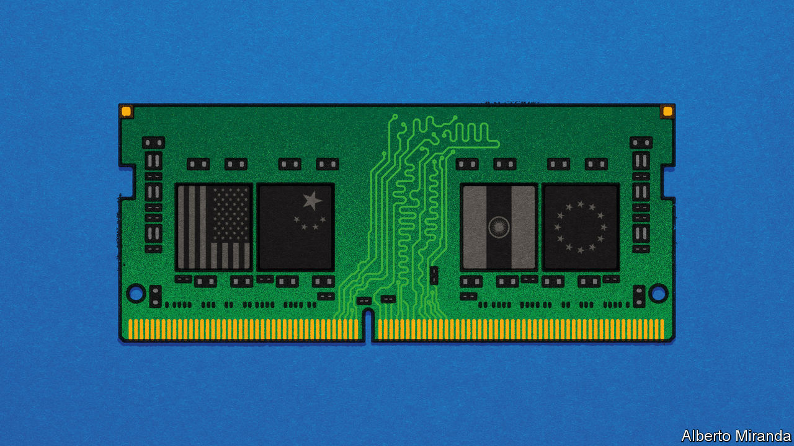
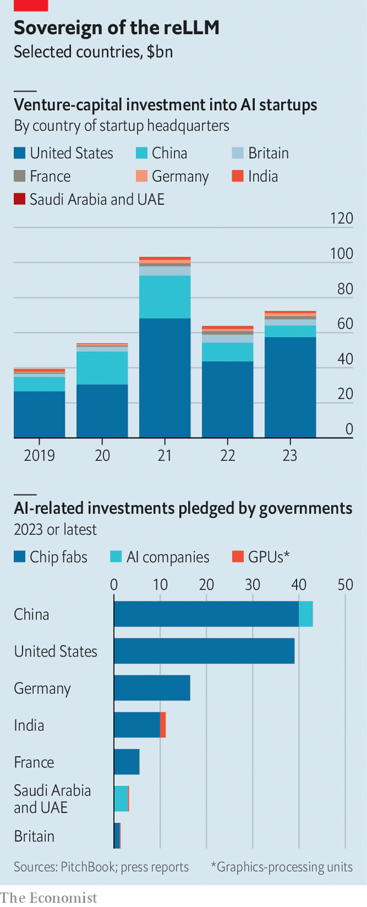

###### Machine of the state

# Welcome to the era of AI nationalism 

##### Sovereigns the world over are racing to control their technological destinies 

 

> Jan 1st 2024 

The hottest technology of 2023 had a busy last few weeks of the year. On November 28th Abu Dhabi launched a new , AI71, that will commercialise its leading “large language model” (LLM), Falcon. On December 11th Mistral, a seven-month-old French AI startup, announced a blockbuster $400m funding round, which insiders say will value the firm at over $2bn. Four days later Krutrim, a new Indian startup, unveiled India’s first multilingual LLM, barely a week after Sarvam, a five-month-old one, raised $41m to build similar Indian-language models.

 


Ever since , an American firm, launched ChatGPT, its humanlike conversationalist, in November 2022, just about every month has brought a flurry of similar news. Against that backdrop, the four latest announcements might look unexceptional. Look closer, though, and they hint at something more profound. The three companies are, in their own distinct ways, vying to become AI national champions. “We want AI71 to compete globally with the likes of OpenAI,” says Faisal al-Bannai of Abu Dhabi’s Advanced Technology Research Council, the state agency behind the Emirati startup. “Bravo to Mistral, that’s French genius,” crowed Emmanuel Macron, the president of France, recently. ChatGPT and other English-first LLMs “cannot capture our culture, language and ethos”, declared Krutrim’s founder, Bhavish Aggarwal. Sarvam started with Indian languages because, in the words of its co-founder, Vivek Raghavan, “We’re building an Indian company.”

AI is already at the heart of the intensifying technological contest between America and . In the past year their governments have pledged $40bn-50bn apiece for AI investments. Other countries do not want to be left behind—or stuck with a critical technology that is under foreign control. In 2023 another six particularly AI-ambitious governments around the world—Britain, France, Germany, India, Saudi Arabia and the United Arab Emirates (UAE)—promised to bankroll AI to the collective tune of around $40bn (see chart). Most of this will go towards purchases of  (GPUs, the type of chips used to train AI models) and factories to make such chips, as well as, to a lesser extent, support for AI firms. The nature and degree of state involvement varies from one wannabe AI superpower to another. It is early days, but the contours of new AI-industrial complexes are emerging. 

Start with America, whose tech firms give everyone else AI envy. Its vibrant private sector is innovating furiously without direct support from Uncle Sam. Instead, the federal government is spending around $50bn over five years to . The idea is to reduce America’s reliance on Taiwanese semiconductor manufacturers such as TSMC, the world’s biggest and most sophisticated such company. Supplies from Taiwan could, fear security hawks in Washington, be imperilled if China decided to , which it considers part of its territory.

Another way America intends to stay ahead of the pack is by . President Joe Biden’s administration has enacted brutal export controls that ban the sale of cutting-edge AI technology, including chips and chipmaking equipment, to adversaries such as China and Russia. It has also barred Americans from sharing their AI expertise with those countries. 

It is now coercing those on the geopolitical fence to fall in line. In October the American government started requiring companies in third countries, including Saudi Arabia and the UAE, to secure a licence in order to buy AI chips from Nvidia, an American firm that sells most of them. The rules have a “presumption of approval”. That means the government will “probably allow” sales to such firms, says Gregory Allen, who used to work on AI policy at the Department of Defence—as long, that is, as they do not have close ties to China. On December 6th Xiao Peng, who runs a state-backed AI startup in Abu Dhabi called , announced that the company would be cutting ties with Chinese hardware suppliers such as Huawei, a Chinese electronics company.

China’s AI strategy is in large part a response to American techno-containment. According to data from JW Insights, a research firm, between 2021 and 2022 the Chinese state spent nearly $300bn to recreate the chip supply chain (for AI and other semiconductors) at home, where it would be immune from Western sanctions. A lot of that money is probably wasted. But it almost certainly helped Huawei and SMIC, China’s biggest chipmaker, to design and manufacture a surprisingly sophisticated GPU last year. 

The central and local authorities also channel capital into AI firms through state-backed “guidance funds”, nearly 2,000 of which around the country invest in all manner of technologies deemed to be strategically important. The Communist Party is guiding private money, too, towards its technological priorities. Often it does so by cracking down on certain sectors—most recently, in December, —while dropping heavy hints about which  should be looking at instead. The government is also promoting data exchanges, where businesses can trade commercial data on everything from sales to production, allowing small firms with AI ambitions to compete where previously only large data-rich firms could. There are already 50 such exchanges in China.

Elements of this state-led approach are being emulated in other parts of the world, notably in the Gulf’s petrostates. Being autocracies, Saudi Arabia and the UAE can move faster than democratic governments, which must heed voters’ concerns about AI’s impact on things like privacy and jobs. Being wealthy, they can afford both the GPUs (on which the two countries have together so far splurged several hundred million dollars) and the energy needed to run the power-hungry chips. 

They can also plough money into developing human capital. Their richly endowed universities are quickly climbing up global rankings. The AI programme at King Abdullah University of Science and Technology in Saudi Arabia and the Mohamed bin Zayed University of Artificial Intelligence (MBZUAI) in Abu Dhabi, the world’s first AI-focused school, have poached star professors from illustrious institutions such as the University of California, Berkeley, and Carnegie Mellon University in Pittsburgh. Many of their students and researchers come from China. And plenty stick around. Nearly all of MBZUAI’s graduates, who number a couple of hundred, stay in the region to work at local firms and labs, says its provost, Timothy Baldwin (himself lured to the Middle East from the University of Melbourne). 

The Gulf approach is producing results. The capabilities of the Falcon model, first built by a team of 20 or so engineers, rival those of Llama 2, the most widely used “open-source” model, devised by Meta, an American tech giant. AI71 plans to improve its open-source models using national datasets from fields including health, education and, some day, perhaps oil. “In the last 50 years, oil drove the country…now data is the new oil,” says Mr al-Bannai.

The alignment problem

A third group of governments is combining elements of America’s approach with those of the Chinese and Emiratis. The EU has its version of America’s incentives for domestic chipmaking. So do some member states: Germany is footing a third of the €30bn ($33bn) bill for a new chip factory to be built there by Intel, an American chipmaker. Outside the bloc,  has promised to funnel £1bn ($1.3bn) over five years to AI and supercomputing (albeit without going into detail about how exactly the money will be spent). India’s government is promoting manufacturing, including of semiconductors, with generous “production-linked incentives”, encouraging big cloud-computing providers to build more Indian data centres, where AI models are trained, and thinking about buying $1.2bn-worth of GPUs. 

Like China and the Gulf but unlike America, where federal and state governments are reluctant to part with public data, India and some European countries are keen on making such data available to firms. France’s government “has been very supportive” in that regard, says Arthur Mensch, Mistral’s boss. Britain’s is considering allowing firms to tap rich data belonging to the National Health Service. India’s government has enormous amounts of data from its array of digital public services, known as the “India Stack”. Insiders expect it eventually to integrate Indian AI models into those digital services.

In contrast to China, which regulates consumer-facing AI with a heavy hand, at least for the time being Britain, France, Germany and India favour light-touch rules for AI or, in India’s case, none at all. The French and German governments have soured on the , the final details of which are being hotly debated in Brussels—no doubt because it could constrain Mistral and Aleph Alpha, Germany’s most successful model-builder, which raised €460m in November.

It is natural for countries to want some control over what may prove to be a transformational technology. Especially in sensitive and highly regulated sectors such as defence, banking or , many governments would rather not rely on imported AI. Yet each flavour of AI nationalism also carries risk. 

America’s beggar-thy-neighbour approach is likely to upset not just its adversaries but also some allies. China’s heavy regulation may offset some of the potential gains from its heavy spending. Building models for local languages, as Krutrim and Sarvam in India plan to do, may prove futile if foreign models continue to improve their multilingual capabilities. The Gulf’s bet on open-source models may misfire if other governments limit their use, as Mr Biden has hinted at in a recent executive order and the EU could do through its AI Act, out of fear that open LLMs could be put to malign uses by mischief-makers. Saudi and Emirati institutions may struggle to hold on to talent; a developer who worked on Falcon admits it greatly benefited from a partnership with a French team of engineers who have since been poached by Hugging Face, a high-flying Silicon Valley AI startup. As one sceptical investor notes, it is not yet clear how vast or useful public Emirati data actually is. 

As Nathan Benaich of Air Street Capital, a venture-capital firm, sums it up, most efforts to create national models “are probably a waste of money”. Mr Benaich’s warning is unlikely to dissuade AI-curious governments, mindful of the rewards should they succeed, from meddling. Mr Macron will not be the only leader to greet it with a Gallic shrug. ■


