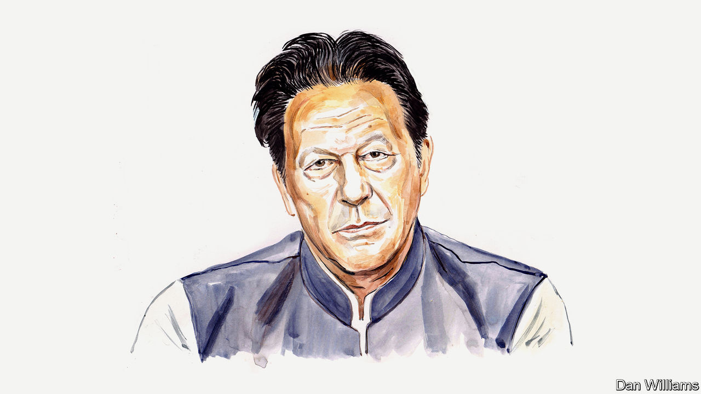

###### Pakistan

# Imran Khan warns that Pakistan’s election could be a farce 

##### His party is being unfairly muzzled, the former prime minister writes from prison 

 

> Jan 4th 2024 

TODAY PAKISTAN is being ruled by caretaker governments at both the federal level and provincial level. These administrations are constitutionally illegal because elections were not held within 90 days of parliamentary assemblies being dissolved. 

The public is hearing that elections will supposedly be held on February 8th. But having been denied the same in two provinces, Punjab and Khyber Pakhtunkhwa, over the past year—despite a Supreme Court order last March that those votes should be held within three months—they are right to be sceptical about whether the national vote will take place. 

The country’s election commission has been tainted by its bizarre actions. Not only has it defied the top court but it has also rejected my Pakistan Tehreek-e-Insaf (PTI) party’s nominations for first-choice candidates, hindered the party’s internal elections and launched contempt cases against me and other PTI leaders for simply criticising the commission.

Whether elections happen or not, the manner in which I and my party have been targeted since a farcical vote of no confidence in April 2022 has made one thing clear: the establishment—the army, security agencies and the civil bureaucracy—is not prepared to provide any playing field at all, let alone a level one, for PTI. 

It was, after all, the establishment that engineered our removal from government under pressure from America, which was becoming agitated with my push for an independent foreign policy and my refusal to provide bases for its armed forces. I was categorical that we would be a friend to all but would not be anyone’s proxy for wars. I did not come to this view lightly. It was shaped by the huge losses Pakistan had incurred collaborating with America’s “war on terror”, not least the 80,000 Pakistani lives lost. 

In March 2022 an official from America’s State Department met Pakistan’s then ambassador in Washington, DC. After that meeting the ambassador sent a cipher message to my government. I later saw the message, via the then foreign minister, Shah Mahmood Qureshi, and it was subsequently read out in cabinet. 

In view of what the cipher message said, I believe that the American official’s message was to the effect of: pull the plug on Imran Khan’s prime ministership through a vote of no confidence, or else. Within weeks our government was toppled and I discovered that Pakistan’s Chief of Army Staff, General Qamar Javed Bajwa, had, through the security agencies, been working on our allies and parliamentary backbenchers for several months to move against us.

People flocked onto the streets to protest against this regime change, and in the next few months PTI won 28 out of 37 by-elections and held massive rallies across the country, sending a clear message as to where the public stood. These rallies attracted a level of female participation that we believe was unprecedented in Pakistan’s history. This unnerved the powers that had engineered our government’s removal. 

To add to their panic, the administration that replaced us destroyed the economy, bringing about unprecedented inflation and a currency devaluation within 18 months. The contrast was clear for everyone to see: the PTI government had not only saved Pakistan from bankruptcy but also won international praise for its handling of the covid-19 pandemic. In addition, despite a spike in commodity prices, we steered the economy to real GDP growth of 5.8% in 2021 and 6.1% in 2022.

Unfortunately, the establishment had decided I could not be allowed to return to power, so all means of removing me from the political landscape were used. There were two assassination attempts on my life. My party’s leaders, workers and social-media activists, along with supportive journalists, were abducted, incarcerated, tortured and pressured to leave PTI. Many of them remain locked up, with new charges being thrown at them every time the courts give them bail or set them free. Worse, the current government has gone out of its way to terrorise and intimidate PTI’s female leaders and workers in an effort to discourage women from participating in politics. 

I face almost 200 legal cases and have been denied a normal trial in an open court. A false-flag operation on May 9th 2023—involving, among other things, arson at military installations falsely blamed on PTI—led to several thousand arrests, abductions and criminal charges within 48 hours. The speed showed it was pre-planned. 

This was followed by many of our leaders being tortured or their families threatened into giving press conferences and engineered television interviews to state that they were leaving the party. Some were compelled to join other, newly created political parties. Others were made to give false testimony against me under duress.

Despite all this, PTI remains popular, with 66% support in a Pattan-Coalition 38 poll held in December; my personal approval rating is even higher. Now the election commission, desperate to deny the party the right to contest elections, is indulging in all manner of unlawful tricks. The courts seem to be losing credibility daily. 

Meanwhile, a former prime minister with a conviction for corruption, Nawaz Sharif, has returned from Britain, where he was living as an absconder from Pakistani justice. In November a Pakistani court overturned the conviction.

It is my belief that Mr Sharif has struck a deal with the establishment whereby it will support his acquittal and throw its weight behind him in the upcoming elections. But so far the public has been unrelenting in its support for PTI and its rejection of the “selected”.

It is under these circumstances that elections may be held on February 8th. All parties are being allowed to campaign freely except for PTI. I remain incarcerated, in solitary confinement, on absurd charges that include treason. Those few of our party’s leaders who remain free and not underground are not allowed to hold even local worker conventions. Where PTI workers manage to gather together they face brutal police action. 

In this scenario, even if elections were held they would be a disaster and a farce, since PTI is being denied its basic right to campaign. Such a joke of an election would only lead to further political instability. This, in turn, would further aggravate an already volatile economy.

The only viable way forward for Pakistan is fair and free elections, which would bring back political stability and rule of law, as well as ushering in desperately needed reforms by a democratic government with a popular mandate. There is no other way for Pakistan to disentangle itself from the crises confronting it. Unfortunately, with democracy under siege, we are heading in the opposite direction on all these fronts. ■


