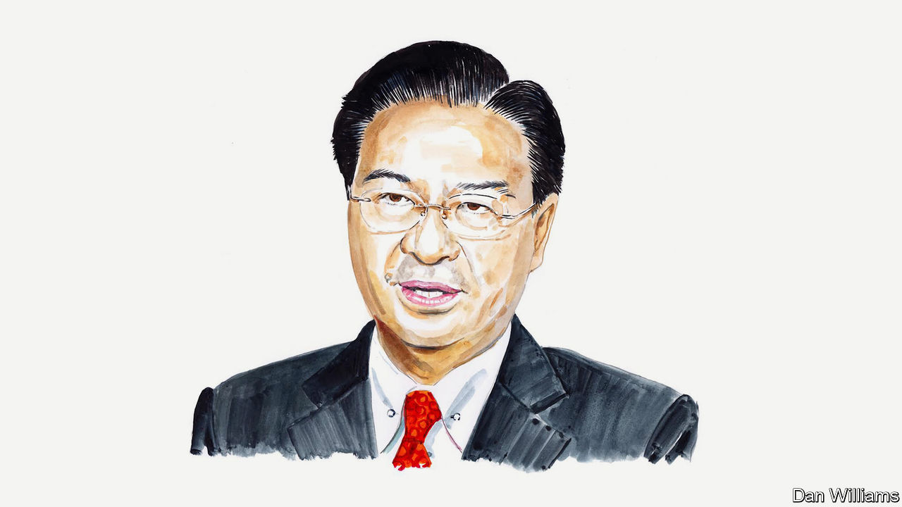

###### Taiwan’s election

# Taiwan’s foreign minister on what’s at stake in the coming election 

##### The vote is a front in the global war between democracy and autocracy, says Joseph Wu 

 

> Jan 3rd 2024 

AS TAIWAN’S ELECTORATE prepares to cast ballots in the presidential and parliamentary elections on January 13th, voting will once again be taking place under the shadow of hybrid warfare and covert influence from the People’s Republic of China (PRC), which is motivated by a desire to sabotage the rules-based international order and expand its global influence.

Starting with its first direct presidential election in 1996, Taiwan has conducted seven rounds of elections for president, with three peaceful changes of governing party. Through the years following Taiwan’s successful transition from authoritarianism to democracy, democratic values have become deeply ingrained in the Taiwanese psyche. In recognition of this success story, international institutions regularly rate Taiwan’s freedom, democracy and human rights as the best in Asia.

In the upcoming elections, the stakes are higher than ever before—not just for Taiwan but for the global democratic community. As Taiwan’s main political parties and their candidates gear up for the final days of campaigning, the PRC has been making unprecedented efforts to meddle in the democratic process in Taiwan. China’s military aircraft continue to cross the median line of the Taiwan Strait to remind voters that war is still a possibility. Just before Christmas, the PRC announced that it would cancel tariff reductions on some Taiwanese petrochemical products as a warning to the electorate about potential economic challenges.

The Chinese regime has made no bones about the purpose of its military coercion and trade manipulation. The message is clear: Taiwan’s voters must reject the ruling Democratic Progressive Party ticket of Lai Ching-te and Hsiao Bi-khim, or else. The bluntness of the language shows that the government in Beijing is not afraid of being seen as a player in Taiwan’s national elections.

The most flagrant, and yet not at all surprising, abuses are conducted by PRC surrogates in Taiwan who set up fake organisations and fake news websites, conduct fake polls and use thousands of fake social-media accounts to manipulate public debate and opinion. The PRC has invited Taiwanese grassroots elected officials on tours of China that include indoctrination on who to support in the elections. Taking advantage of Taiwan’s openness, China has flooded Taiwan with disinformation and stepped up its cyber-warfare activities to try to dupe the Taiwanese people into accepting its narrative. Its plan is to win over a critical minority of swing voters. In a  like this one, and with the concerted effort the PRC is making, it might just get its way.

China’s behaviour and its potential to cause more mischief have not gone unnoticed. An American national-security official quoted in the  in December said that China could conduct major operations—including the use of artificial intelligence—to spread false information and influence elections in democratic countries. It is an established fact that Taiwan is a test ground for China’s ambitions to exert its malign influence abroad. In this sense, Taiwan is at the forefront of efforts to counter China’s authoritarian expansionism.

Having built an Orwellian surveillance state at home, China is turning its attention to steering the outcomes of elections in other countries in its favour. If Taiwan’s freedom is undermined, the shared values of democracies around the world will be profoundly affected. And since Taiwan is an important player in international supply chains, not least for cutting-edge semiconductors, there will also be a significant impact on global economic prosperity.

Should China succeed in shaping the outcome of voting in Taiwan, it will apply the same tactics to other democracies to promote its preferred international order. Democratic countries should never let this happen. Taiwan’s elections on January 13th will be just one of over 40 free and fair national elections to be held worldwide in 2024. No authoritarian power should be allowed to influence the outcome of any democratic process.

In recent years, and especially since Russia’s invasion of Ukraine in 2022, democracies have shown more concern over the issue of peace and stability across the Taiwan Strait and warned China against unilaterally changing the status quo. Taiwan truly appreciates statements of support from the G7, the EU, the US-Japan-South Korea summit at Camp David last August and other international meetings. As Taiwan’s foreign minister, I urge the international community to pay more attention to China’s attempts to undermine Taiwan’s democracy through influence operations and hybrid warfare, including cyberattacks and disinformation campaigns. Although less dramatic, these tactics could turn out to be more effective and less costly for the PRC than changing the status quo by force or coercion.

Taiwan is taking measures to counter China’s interference and is documenting its experiences. Analysis will be published soon after the elections in consultation with international experts. We hope this will soften the learning curve for fellow democracies in dealing with malign authoritarian influence. Our desire is to turn Taiwan’s experience into a positive contribution to the rules-based international order, thereby helping the free world’s fight against authoritarian powers bent on eroding democratic systems. It is our belief that democracy will prevail. ■


