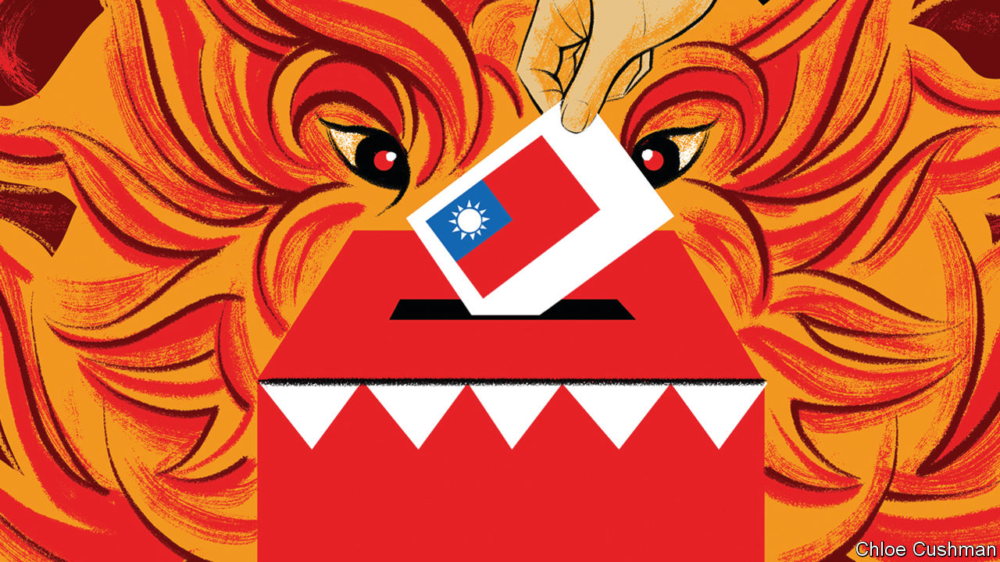

###### Chaguan

# For China, Taiwan’s elections are a looming crisis 

##### Xi Jinping wants Joe Biden to constrain Taiwan’s democracy for him 

 

> Jan 4th 2024 

XI JINPING HAS a lot riding on upcoming elections in Taiwan. Those polls will do more than choose the island’s leaders for the next four years. The results may clarify whether politics can still resolve the “Taiwan question”, or whether only force can compel the island to submit to Chinese Communist Party rule.

In an address on December 31st, Mr Xi called Taiwan’s unification with China “a historical inevitability”. Logically, the party chief would rather fulfil that promise without betting his regime on an all-out invasion of Taiwan, which would risk war with America. A safer option involves some mix of blandishments and strangulation, both economic and military, leading to capitulation by Taiwan’s political and business elites. Peace has long rested on America deterring Chinese aggression, and on China deterring Taiwan from declaring independence. It also rests on party bosses being able to plausibly maintain that such a negotiated settlement is possible, not least to China’s people, schooled to believe that most in Taiwan long to return to the motherland. 


It is nearly 75 years since China’s civil war ended with Communist Party control of the mainland, and with exile on Taiwan for the Nationalist, or Kuomintang (KMT), regime. Today the island is a raucous democracy, marked by divisions about ties to China. If on  Taiwanese voters hand the presidency to William Lai Ching-te, the candidate of Taiwan’s pro-independence Democratic Progressive Party (DPP), they will cast fresh doubt on the prospects for a peaceful, negotiated unification.

Victory for Mr Lai would mark the DPP’s third presidential win in a row. Chinese officials and scholars have issued warnings—notably to counterparts in America, Taiwan’s superpower protector—that they have no trust in Mr Lai, whom they call a dangerous, lifelong campaigner for Taiwanese independence. According to Chinese warnings, there would be “no wait and see” period after a Lai victory. To deter a President-elect Lai from radical moves, the People’s Liberation Army can be expected to stage exercises that threaten Taiwan in new ways, it is said. These would aim to show resolve to the Chinese public and to teach the island’s voters that they have rejected the path of peace. New provocations could include unmanned Chinese aircraft flying over Taiwan, or China’s navy or coastguard finding a pretext to search island-bound ships. China recently reimposed tariffs on some Taiwanese goods, arguing that the current DPP-led government had trampled commitments needed to preserve a cross-strait trade deal, the Economic Co-operation Framework Agreement (ECFA). Victory for Mr Lai could see the ECFA suspended in its entirety.

Worryingly, the Chinese side has (or pretends to have) unrealistic expectations that President Joe Biden and his administration would help to constrain a Lai presidency. In part, that nods to China’s scornful insistence that the DPP—and indeed Taiwan’s voters—are America’s hapless pawns in a superpower game to hold China down. In part, it reflects a Chinese hunch that America does not trust Mr Lai, either. When the DPP candidate visited America last August in his capacity as Taiwanese vice-president, his meetings were strictly controlled by his American hosts, and Chinese diplomats briefed in advance on his itinerary. China should be realistic, though. True, over the past 20 years American officials have offered bruising, public rebukes to DPP leaders, urging them not to provoke China. But Washington politics have changed. If China bullies Mr Lai, America will have to back him up.

China sees Taiwan’s election as a test of American sincerity. Mr Biden insists that he does not support Taiwanese independence, but muddles that message with unconditional pledges to defend the island in a crisis, says Xiang Lanxin of the Shanghai University of Political Science and Law. For China, Taiwan’s election is “an opportunity for America to clarify what its position really is”, he suggests. Against that, several Chinese scholars suggest that their country has few incentives to stoke a big crisis over Taiwan before America’s presidential contest in November. Mr Xi needs to know whether he will face Mr Biden again or the transactional Donald Trump, who talks tough on China but has no great love for Taiwan.

Mr Lai’s victory is not assured, with the presidential vote split three ways. In reality, a win for the second-ranked candidate, Hou Yu-ih of the KMT, might also offer its own painful clarity about the prospects for peaceful unification. Mr Hou, a mayor and former police chief, urges dialogue with the mainland. But Taiwan has changed. Today’s KMT cannot offer Mr Xi the same concessions that the party did just a decade ago. For China, a Hou presidency could be as frustrating as another DPP term, just in a different way.

A peace offer backed with threats

Along with Taiwan’s presidential race, China’s leaders will be watching parliamentary elections held on the same day. Quite possibly the KMT and a newer, centrist outfit, the Taiwan People’s Party, may do well and secure a majority in the Legislative Yuan and significant control over the agenda of the next president, even if that is Mr Lai of the DPP. In that case, Taiwan’s rambunctious democracy would be keeping alive Communist Party hopes of imposing its rule without a war, for now at least.

If both presidential and legislative elections are a rout of the KMT, that will trigger heated debate on the mainland about whether that party has a future, scholars predict. Over the past century China’s Communist Party and the KMT have been variously comrades in arms, enemies in a civil war and now uneasy partners in cross-strait dialogue, bound by a shared hostility to Taiwanese independence. Familiarity has not bred respect. When KMT leaders visit the mainland and complain that aggressive Chinese policies make it hard to woo Taiwanese voters, Communist Party bosses hear the KMT whining about its own political incompetence. China is learning that elections have consequences. For Mr Xi’s party, that is always someone else’s fault. ■


