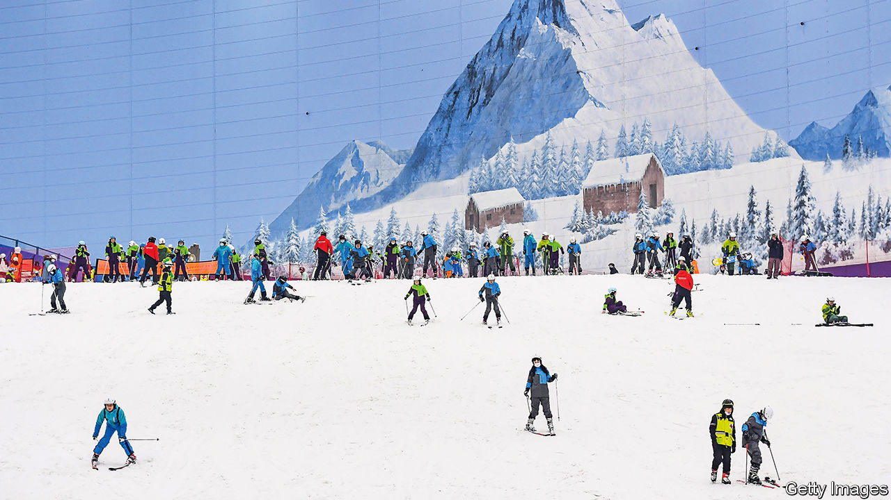

###### China is going downhill

# Millions of Chinese have embraced skiing 

##### The country has seen a post-pandemic boom in winter sports 

 

> Jan 4th 2024 

EYES WIDE and arms flailing, a skier slowly makes her way down the slope at Mission Hills. Outside the weather is balmy, but at this snow-dome in the southern city of Shenzhen, skiing is a year-round pursuit. Mission Hills, which opened last year, is one of nearly 700 indoor and outdoor ski centres in China. Visits to such places are increasing, according to state media.

When Beijing won the right to host the 2022 Winter Olympics, Xi Jinping, China’s leader, called on people to show their passion for winter sports. New resorts were built. According to the government, some 300m Chinese (out of a population of 1.4bn) have taken part in a winter sport since 2015. Those figures may be an overestimate, but this mass campaign appears more appealing to middle-class Chinese than others of a more ideological nature.

“If sports are strong, a nation is strong,” Mr Xi has said. China won just one gold medal at the Winter Olympics in 2018, but nine in 2022. To achieve that success it naturalised some foreign athletes, notably . The freestyle skier was born in America, but decided to compete for China, becoming the face of the Beijing games. She won two golds at the Olympics and claimed victory again in December at the Freestyle Skiing World Cup, which was also held in China.

But the government’s promotion of winter sports is about more than just medals. China’s most recent five-year plan included targets for participation in sports and exercise. The primary goal is increased fitness. Around half of China’s population is overweight, reported the National Health Commission in 2020. The state would also like Chinese holidaymakers to spend their money on activities at home—such as skiing.

Most skiers in China are beginners, so few complain that the country’s destinations tend to have tiny slopes with gentle inclines. The largest Chinese resorts are the size of small European ones. Mission Hills devotes more space to photo opportunities and shoot-em-up games than skiing. But those who master its simple, single run have something to look forward to: in 2025 the world’s largest indoor ski centre will open in Shenzhen.

For now, Chinese seeking steeper slopes might consider the north-western region of Xinjiang, with its high mountains and long winters. Xinjiang has 64 ski resorts, nearly 10% of China’s total. Xinhua, the state news agency, says visitors to the prefecture of Altay, a wonderland for skiers, increased six-fold over the five years to 2022. While boosting the local economy, skiing also distracts from the human-rights abuses that the government has inflicted upon Xinjiang over the past decade.

The Communist Party even claims that Xinjiang is the birthplace of skiing. The evidence? Rock paintings in Altay—which date back 12,000 years, according to state media—apparently depict hunters on skis. But history, like skiing, can be a slippery business in China. ■


