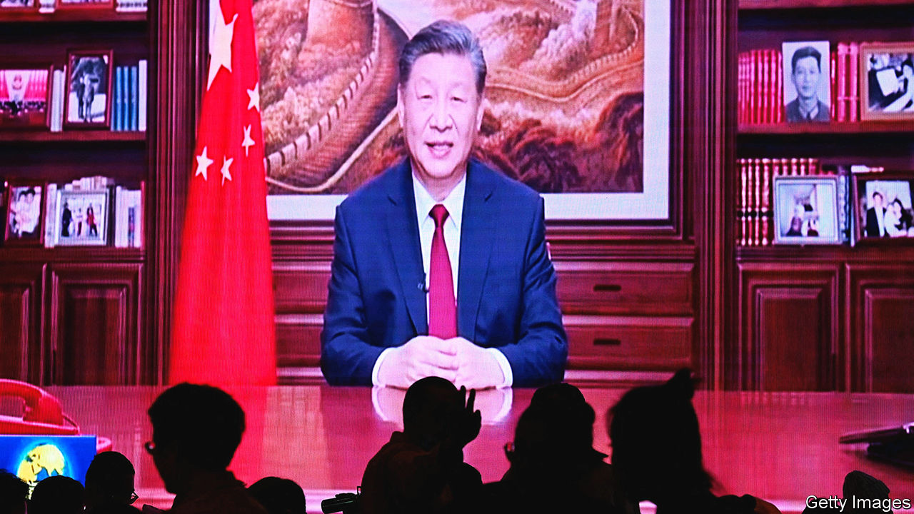

###### Here be dragons

# Xi Jinping and China face another tough year 

##### Amid numerous challenges, will the government be able to keep a lid on dissent? 

 

> Jan 2nd 2024 

EVERY YEAR on December 31st a glimpse of an impenetrable world is revealed. On Chinese state television, Xi Jinping delivers his New Year address to the nation (pictured). China’s netizens pore over the footage. On no other occasion do they get to see their leader sitting at what purports to be his desk. They swap analysis of Mr Xi’s collection of photographs, displayed on bookshelves behind him. And they parse his ponderously delivered words. “Along the way, we are bound to encounter headwinds,” he said this year. Many will see that as an understatement of . 

Just over a year ago, Mr Xi abandoned his strict “zero-covid” measures, which had been in force for nearly three years and had led to ever more frequent lockdowns. But the country did not experience what Mr Xi described in his speech as a “smooth transition”. China’s under-vaccinated population was ill-prepared: according to some estimates, well over 1m people died of the disease as the country staggered back to normality (officials covered up the actual death toll). The economy failed to gather momentum. Youth unemployment soared, the property market continued to slump and foreign investors grew more nervous. The headwinds were fierce. The coming year looks hardly less troubled. 

Mr Xi will try to put on a brave face. He will send an unusually large delegation to schmooze with plutocrats at the World Economic Forum in mid-January, an annual gathering of the rich and powerful in Davos, Switzerland. Reuters, a news agency, says the team will be led by China’s prime minister, Li Qiang—the highest-ranking Chinese official to attend in person since Mr Xi himself showed up in 2017. Mr Li, a protégé of Mr Xi, got the job in March 2023 after serving as Communist Party leader in Shanghai. He impressed foreigners there with his business-friendly ways. 

He will find that much harder in Davos. When Mr Xi went there, it was different. Many officials and firms in the West were shuddering at the prospect of Donald Trump’s presidency (he was about to be sworn in) and the impact that his threatened trade war with China would have on global growth. They were enraptured by Mr Xi’s efforts to portray himself as a champion of free trade. Now many of them see China as a source of risk, whether caused by the country’s faltering economy, strategic rivalry with America or Mr Xi’s own West-loathing politics, with their growing emphasis in all domains on the need to protect national and regime security. 

In Western capitals and boardrooms the new year begins with much China-related worry. On January 13th a presidential  could whip up cross-strait tensions if the front-runner,  of the ruling Democratic Progressive Party, wins. China sees him as a diehard separatist. 

By the normal political calendar, the party’s Central Committee—a body comprising more than 370 members of the political, military and business elite—should have convened its “third plenum” late in 2023. In the party’s five-yearly cycle of gatherings, third plenums attract much attention because of their usual focus on economic reform. That no such meeting has yet been held in the current cycle has caused much speculation about disharmony among the elite over how to tackle China’s long-term economic difficulties, such as an ageing population, shrinking workforce and high levels of debt. Senior officials did manage to hold an annual conference in December to discuss more immediate economic problems. Nothing that emerged from the gathering suggested any bold new measures to rev up growth. 

 


For the economy, 2024 will be no less bumpy than 2023. It will not enjoy the brief boost that it gained from the end of covid controls and the pickup in consumer demand. GDP growth this year may be slower than in 2023, when it was probably close to the government’s target of around 5% (the lowest one in more than three decades). The World Bank predicts the economy will grow by 4.5% in 2024 and 4.3% in 2025. There will be “continued fragility” in China’s recovery, it says. Most economists seem to agree (see chart).

Some clues to the government’s economic strategy will be revealed in March at the annual session of China’s rubber-stamp legislature, the National People’s Congress. In his report to the delegates Mr Li is likely to announce a growth target for 2024. If it matches the previous year’s, despite all the headwinds, that could signal that the state is prepared to boost stimulus measures to ensure the target is reached. 

But investors will remain wary, not least because the government’s messaging is becoming ever more untrustworthy (in 2023, for example, it stopped publishing data on youth unemployment). At December’s meeting on the economy, officials were told to “strengthen economic propaganda” and “sing the praises of the bright prospects of the Chinese economy”. China’s Ministry of State Security went further. In a commentary on the meeting, posted on social media, it suggested that negativity about the economy was a serious political sin. The aim of people who air disparaging views, it said, was to “attack and deny” Chinese-style socialism in a “futile attempt” to subject the country to “strategic containment and suppression”. 

 


On December 25th , a magazine in Beijing, published a pro-reform editorial, noting that during the Cultural Revolution “the national economy was on the brink of collapse, yet the authorities insisted that the situation was ‘very good’ and ‘getting better and better’.” The article was quickly deleted from ’s website. 

In 2024 Mr Xi will be in no mood for dissent. A few days before the zero-covid policy was scrapped, he saw one of the most powerful displays of discontent with the government since the Tiananmen Square unrest of 1989. The protests, though brief and small, broke out in several big cities. Ostensibly they were against covid-related lockdowns, but they also had a political hue. People held up sheets of white paper to symbolise opposition to censorship. As their counterparts did in Tiananmen, they sang the communist anthem, the “Internationale”—loved by protesters in China not for its ideological message, but for its language of revolt. In Shanghai some even shouted “Communist Party step down” and “Xi Jinping step down”. In a country so saturated with surveillance technology, it was an extraordinary moment of bravery. Mr Xi will remain haunted by it. 

Throughout 2023 police tracked down participants, warning many and detaining some. Fear has taken hold again. A young resident of Beijing describes how the government ordered many of his friends to leave the city because of their roles in the protests. “They’ve had to pay a huge price,” he says. At a meeting on December 23rd to discuss their priorities in 2024, police chiefs around the country were ordered by their bosses in Beijing to “tighten the strings of political security” and step up “proactive” efforts to protect China’s political system and its ideological sanctity. 

In Hong Kong security will be a prominent theme of the political year, too. The territory is planning to adopt new laws in 2024 relating to crimes such as treason, secession, sedition and subversion. This is required by article 23 of China’s mini-constitution for Hong Kong, the Basic Law, but previous efforts to enact such legislation have been frustrated by strong public opposition. Since an eruption of anti-government unrest in Hong Kong in 2019, China’s sweeping clampdown on dissent in the territory has cleared the way for these laws to be passed. Few observers believe that residents would dare to organise any large protests. In the coming months verdicts will be reached in juryless trials of dozens of Hong Kong’s most prominent pro-democracy activists. The outcomes could cast an even deeper chill over Hong Kong’s shrinking space for free speech. 

Turbulence at the top

Among China’s leaders, the purges that have been an ever-present feature of Mr Xi’s rule will continue apace. The past year saw a dramatic display of these, with the ousting of a foreign minister, Qin Gang, and a defence minister, General Li Shangfu—both of whom had been in the job for just a few months. No reasons have been given for the dismissals, but it is believed that Mr Qin’s related at least in part to an extramarital affair and General Li’s to corruption. Mr Qin was replaced by his predecessor, Wang Yi. After months without a defence minister, China named a new one on December 29th: Admiral Dong Jun, a former chief of the navy. On the same day, nine military officials were purged from the legislature, without explanation. 

It is sometimes difficult to tell what motivates these shake-ups. Mr Xi is waging a relentless war on corruption as well as a campaign to enforce loyalty to his rule; there may be hidden political reasons why certain people are targeted for graft. But in the financial industry, fighting corruption appears to be the main reason for a sweeping clean-up in the past year. State media say that in 2023 more than 100 financial officials, mostly bankers, were rounded up for graft. The campaign is “expected to be ratcheted up” in 2024, says Jiemian, a Shanghai-based business-news portal. 

So is Mr Xi’s control of financial affairs generally. In March 2023 he announced the setting up of a new party-led agency, the Central Financial Commission, to take charge of all financial matters. Its duties include oversight of watchdogs such as the People’s Bank of China, the central bank, and the newly established National Administration for Financial Regulation. He also re-established a long-disbanded body—the Central Financial Work Commission—to enforce party discipline. Far from reinvigorating pro-market reforms, the third plenum, whenever it is held, will probably stress the party’s—and Mr Xi’s—leadership of everything. The glumness that has settled over China’s private sector is unlikely to be dispelled in 2024. 

Mr Xi may hope that China’s troubles will be offset by malaise in the West, such as divisions over support for Ukraine and Israel’s war in Gaza, and political strife in America as a presidential election looms. But the West’s anxieties about China will not abate—whoever wins America’s election, China will remain a bugbear in Washington. America will keep trying to handicap the development of cutting-edge technology in China with restrictions on investment and trade. Economic friction between China and the West will grow, not least as governments in Europe struggle to protect their car industries from a deluge of cheap electric vehicles (EVs) made in China. The European Commission is investigating whether Chinese EVs receive subsidies that violate trade rules. Punitive tariffs could ensue. 

Mr Xi will exploit such moves to portray his country as a victim, hoping to nurture nationalist sentiment. Celebrations in October of China’s 75th anniversary as a communist state will be milked for the same purpose. (A new law on patriotic education, which took effect on January 1st, will hammer home the point that sharing this sentiment is not optional.) But nationalism is not entirely effective as a bulwark against the party’s critics: the protests in 2022 showed that. Murmurings about Mr Xi’s rule, fanned by the country’s troubles since then, will probably remain mostly private. But they are unlikely to subside in the upcoming year of the dragon. ■


