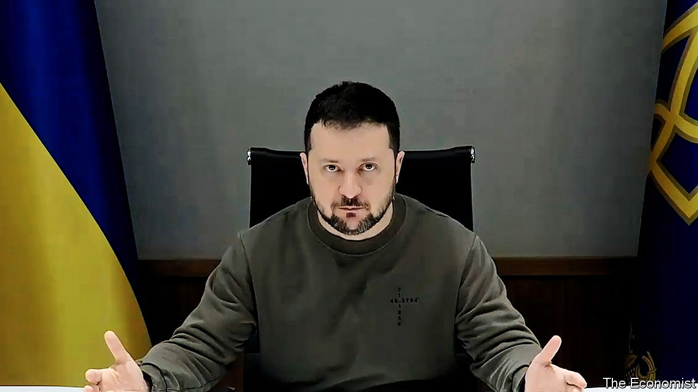
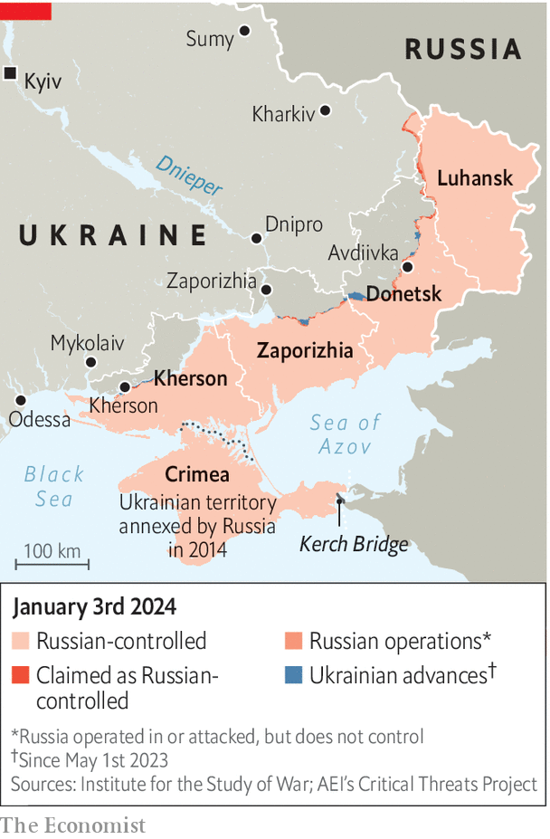

###### Battle of wills

# A New Year’s interview with Volodymyr Zelensky 

##### The Ukrainian president remains defiant, despite the prospect of a bleak year ahead 

 

> Jan 1st 2024 

The president of Ukraine is angry; not about the  (he sees none) nor even about his own army’s  on the battlefield. Instead, Volodymyr Zelensky is exasperated by the , as well as a sense of detachment among some of his compatriots. And he wants you to know it.

Hardened by the pressures of war, a year of negative headlines and the failure of a counter-offensive that promised so much at the start of 2023, he has shed the lightness and humour of . Seated in his situation room and speaking to  via Zoom, he punches out his message as if trying to break through the computer screen. 


The day after Russia invaded on February 24th 2022, Mr Zelensky galvanised the world and mobilised his country with a 32-second video recorded on his phone in which he said simply: “We are here.” He and his team are still there, in the vast government complex in Kyiv. Russia is  at Kyiv, Dnipro, Kharkiv, Odessa and elsewhere, but the world is no longer listening as intently and the master-communicator no longer controls the narrative as he did two years ago. In Ukraine, weariness is setting in. In the West headlines ask whether Vladimir Putin, Russia’s president, has started to win. Aid to Ukrainians has become a subject for  and Europe.

The West has lost a sense of urgency and many Ukrainians have lost a sense of existential threat, Mr Zelensky says. He is now trying to rekindle both. “Maybe we did not succeed [in 2023] as the world wanted. Maybe not everything is as fast as someone imagined,” he says, but the idea that Mr Putin is winning is no more than a “feeling”. The reality, he says, is that Russian forces are still being slaughtered in places like Avdiivka, from where he has just returned. British defence intelligence sources estimate that, on current trends, Russia will have suffered more than 500,000 casualties, killed and wounded, by 2025.


“Thousands, thousands of killed Russian soldiers, nobody even took them away.” He emphasises that Mr Putin’s army failed to take a single large city in 2023, whereas Ukraine was able to break through Russia’s blockade of  and is now shipping millions of tonnes of grain abroad using a new route that hugs Ukraine’s southern coast. “Huge result!” the president declares.

Yet, as a former actor who managed to change how the world sees Ukraine, Mr Zelensky knows that perceptions can become reality in less helpful ways, too. In a war that has become about mobilising resources, the belief among Ukraine’s backers that victory has become impossible risks starving Ukraine of the money and arms that it needs to win. Fatalism can become a self-fulfilling prophecy. 

That is what makes the coming year so vital. As Russia’s war effort cranks up a gear and Ukraine’s resources are depleted, the attention of America and many European countries is shifting to domestic politics in a. Mr Zelensky’s task is harder than ever. The stakes have not been higher since those first days of fighting. 

Central to his argument is that by supporting Ukraine, Europe is protecting itself from Russian aggression. “Giving us money or giving us weapons, you support yourself. You save your children, not ours,” he warns bleakly. If Russia is allowed to take , “they will take other children”. If Russia violates the rights of Ukrainians, “it will violate the rights in the world”. If Ukraine loses, warns Mr Zelensky, Mr Putin will bring his wars closer to the West. “Putin feels weakness like an animal, because he is an animal. He senses blood, he senses his strength. And he will eat you for dinner with all your EU, NATO, freedom, and democracy.”

With hunched shoulders, Mr Zelensky rams home his points by banging his fingers on the white formica desk of the situation room: “Maybe something is missing. Or maybe someone is missing. Someone who can talk about Ukraine as a defence of all of us.” European countries should be lobbying America to support Ukraine for their own sake. “Intelligence services of several European countries have started to [examine] a possibility of attack on their territory from Russia...even those countries that were not in the USSR.” 

As for talk of negotiations, Mr Zelensky does not detect “any fundamental steps forward to the peace from Russia”. What he and Ukrainians experience instead is a barrage of aerial attacks on Ukrainian cities in the east, south, north and west. “I see only the steps of a terrorist country.” And if Russia sends signals about wanting to freeze the conflict, as some media have reported, “it is not because they are righteous men, but because they don’t have enough missiles, ammunition or prepared troops. They need this pause. Restore all their strength. And then with all their strength, turn the page of this war.” 

Mr Zelensky gives little away about what Ukraine can achieve in 2024, saying that leaks before last summer’s counter-offensive helped Russia prepare its defences. But if he has a message, it is that  and the connected battle in the Black Sea will become the war’s centre of gravity. Isolating Crimea, annexed by Russia in 2014, and degrading Russia’s military capability there, “is extremely important for us, because it’s the way for us to reduce the number of attacks from that region,” he says. 

 


A successful operation would be an “example to the world”, he continues. It would also have a big effect inside Russia. Losing a centrepiece of the Kremlin’s propaganda would show that “thousands of Russian officers died just because of Putin’s ambition.” Ukraine is already scoring improbable victories on the strategically important peninsula, destroying a “good number” of ships in the Black Sea fleet—British officials say that a fifth of that fleet has been destroyed in the past four months alone. Losing naval bases that Russia has held for the past 240 years would be a huge embarrassment for Mr Putin. 

But Mr Zelensky says that the speed of any success will depend on the military assistance he gets from Western partners. He has asked for the Taurus, a German-made, long-range stealth cruise missile with the ability to explode deep inside a target. This could enable Ukraine to destroy the $4bn Kerch bridge, in effect isolating the Crimean peninsula from Russia. “Russia has to know that for us this is a military object.” He suggests the Germans are not the only Western power standing in his way. 

Mr Zelensky is still less open about his goals in the east and . Ukraine’s stated strategic ambition to restore Ukraine to its original borders has not changed, and will not, but he is no longer setting timelines and makes no promises about how much territory Ukraine can “de-occupy” next year. Its immediate task in the land war will be “to defend the east, to save these very important cities of Ukraine, east and south, Kharkiv, Dnipro, Zaporizhia, Kherson, Mykolaiv”, and to protect his country’s critical infrastructure. 

The long grind ahead

The inflated expectations Mr Zelensky created ahead of the counter-offensive of 2023 were partly what led to a sense of disappointment. An , the commander of Ukrainian forces, with  in November 2023 acknowledged the stalemate on the battlefield. Although it initially sparked an angry reaction from Mr Zelensky, it has also given him an opportunity to shift his message. To sustain this grinding war it is not just the West that needs to mobilise, but first and foremost Ukraine itself. 

“We must consider our own strength,” says Mr Zelensky. While he reckons America will in the end provide military aid, Ukraine, he says, is also building up its own production. It was a message he echoed in a defiant and sober New Year address that was markedly less upbeat than his words a year ago. As part of this Plan B, he is asking America to provide licences to Ukraine to produce weapons ranging from artillery systems and missiles to air defence. 

The “mobilisation of Ukrainian society and of the world” at the start of the war is not present today, Mr Zelensky says. “That needs to change.” Polls suggest that reducing the minimum age for mobilisation from its current 27 years and reducing the grounds for exemption are not popular. But Ukraine’s leader insists there is . “Mobilisation is not just a matter of soldiers going to the front. It is about all of us. It is the mobilisation of all efforts. This is the only way to protect our state and de-occupy our land. Let’s be honest, we have switched to domestic politics,” Mr Zelensky says. This is a choice Ukrainians will have to make. “If we continue to focus on domestic politics, we need to call elections. Change the law, the constitution. But forget about counter-offensive actions and de-occupation.” 

Nearly two years into a full-scale war, Mr Zelenksy has lost his youthful vibrancy. But he insists Ukraine cannot abandon its plan to defeat Russia. “The most important profession a Ukrainian can do at the moment is to be in Ukraine…and for our Western partners, it is to be with Ukraine…If you don’t have the strength, then either get out or step aside. We will not retreat.” The question is whether the master-communicator of 2022 can persuade the rest of the world to share that conviction. ■


