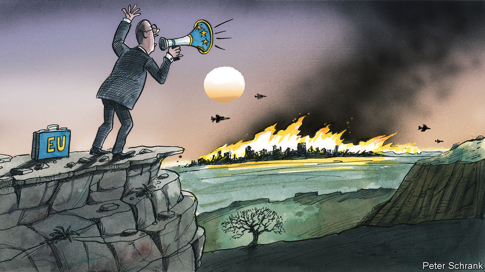

###### Charlemagne

# On Gaza, Europe is struggling to make its diplomacy matter 

##### Call it the agony of inaudibility 

 

> Jan 4th 2024 

When Europeans face a crisis beyond their shores, there is only one thing worse than not agreeing on what to say: not even being heard. The war between Israel and Hamas in Gaza has cruelly reminded Europe that, for all its talk of geopolitical clout, it is not treated in the region as an indispensable interlocutor. Frank-Walter Steinmeier, the German president, was made to wait in his plane on the tarmac in Doha recently for 30 minutes until a Qatari minister turned up to welcome him. In December his French counterpart, Emmanuel Macron, had to scale back a would-be regional Middle East tour to just two Gulf cities. Britain and France have each sent naval vessels to the eastern Mediterranean, but this gesture has barely registered. For all such efforts and more besides, if and when Israel silences the guns in Gaza, it will not be thanks to the Europeans. 

In some respects this should come as no surprise. As its closest friend and supplier of arms, America is the only Western power with proper influence in Israel. In the region it is Qatar and Egypt that have a line to Hamas. Europe’s voice is not only marginal, but discordant. In the immediate aftermath of the Hamas terrorist attacks of October 7th, Europeans paraded their differences with a procession of unco-ordinated visits. Germany’s history keeps it close to Israel. Spain has angered Israel with its pro-Palestinian leanings. When in December America voted against an emergency United Nations resolution calling for an immediate ceasefire in Gaza, Britain and Germany abstained; France voted in favour.

Moreover, what Europeans lack in unity they do not always make up for in clarity. In countries with big Muslim and Jewish populations national leaders are treading a perilous line, wary of inflaming inter-communal tensions at home. Many try not to take sides, even as they harden their words in the face of the devastation in Gaza. Complexity engenders confusion. 

Take the example of France as a good way to encapsulate the problem. After terrorists struck Paris in 2015, the leaders of Israel and the Palestinian Authority joined a march in the French capital in a symbolic display of international support. When Mr Macron flew to Israel in October, keen to show reciprocal solidarity, he initially called for nothing less than an international “coalition” against Hamas, based on the one set up to fight Islamic State. Weeks later, as the shells rained down, he was telling Israel to stop bombing women and children, and called for a ceasefire. 

French diplomats wind a heroic thread from one presidential position to the other. At the outset, they point out, Mr Macron did also urge Israel to respect international law and spare civilians, and restated French support for a Palestinian state (which is true). There is no inherent contradiction between supporting Israel’s right to defend itself against terrorism and calling for restraint in how that right is exercised (which is also true). Yet the perception that the French president initially tilted too far in Israel’s direction took hold, including among some of his own ambassadors. By the end of 2023 Mr Macron emerged as one of Europe’s more outspoken critics of the way Israel is waging war in Gaza. 

Such a shift in tone, prompted by a mix of indignation and concern about the radicalisation of a new generation of Palestinians, is now to be heard in many of Europe’s chancelleries. Britain and Germany, staunch allies of Israel, have both also called for a ceasefire, albeit one they call “sustainable” rather than “immediate”. Europeans seem to be converging on a note of public censure. Yet even so they are up against the limits of declarative diplomacy. The sad truth is that their voice does not carry in the region. 

The agony of inaudibility is felt both by national leaders and those who run Europe’s Brussels-based institutions. It is acutely frustrating for France, where nostalgia lingers for the days when its traditional “Arab” foreign policy secured the country a certain stature in the region. In 1974 France, unlike America and Britain, voted to invite the Palestine Liberation Organisation to take part in relevant meetings at the UN. When Jacques Chirac was president in the mid-1990s, under a very different world order, he was mobbed by enthusiastic crowds on the streets of Ramallah, in the West Bank. Later, France’s opposition to the American-led invasion of Iraq earned it credibility across the Arab Levant. France still sees itself as a useful power in the region, allied to America but not bound by it, and one that can speak to all. Yet today an awkward gap has opened up between a hugely energetic diplomatic effort on the one hand and a frustratingly meagre return on the other. 

The voice

Does inaudibility render the European effort futile? Not necessarily. The French, for one, have no illusions about what they alone can achieve. Those close to Mr Macron talk about the country being a “facilitator”, rather than a decisive intermediary. International pressure, if co-ordinated, still counts for something. Some Arab officials invoke in private the early French call for a ceasefire, if only in order to put pressure on the Americans to do the same. Moreover, Europeans get a hearing of sorts by sending medicine, tents, generators and food to Gaza, as they have long done. In Lebanon, where France has historic ties, a line to Hizbullah and hundreds of soldiers in the UN peacekeeping force, the French (along with the British) are working with the Americans to try to contain the conflict in the country’s south. Boots on the ground there secure a seat at the table.

If the war in Gaza has exposed the limits to European ambition, it has done so just as Russia’s war on Ukraine has revealed the bloc can stay relatively united, and make a difference. Therein lies a thought for 2024. Gaza matters hugely. But Europeans are also dealing with an existential war on their own soil, emerging war fatigue, a stalemate on the ground and the prospect of America unplugging support in 2024. On this battlefield, Europe’s voice is not just audible but crucial. That is where its leaders should use it. ■


