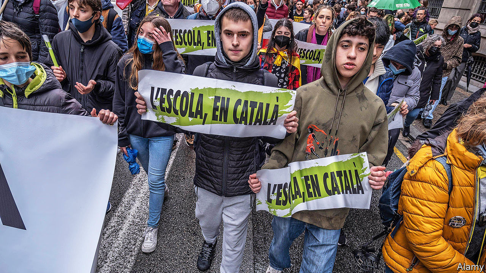

###### Get them while they’re young

# The simmering row over Spanish-language teaching in Catalan schools 

##### Now fuelled by a poor result in the latest PISA educational tests 

 

> Jan 4th 2024 

WHEN THE PISA worldwide educational comparisons came out late in 2023, most countries fell to wondering how to do better. In Catalonia the results were seen through the lenses of nationalism and language—as everything is. Spain had lost ground since the last time the tests were done, in 2018. But students in Catalonia lost even more, and native Spanish-speakers did worse than Catalan-speakers to boot—a failing critics were quick to pin on language policy.

In the 1980s Catalonia began a transition to teaching all subjects in Catalan, except Spanish. Several years ago the region’s top court ruled that at least 25% of classes must be given in Spanish. The regional government, led by separatists, then passed a law allowing individual school heads to raise or lower the level of teaching in Spanish, according to need. 

A new report for the Association for Bilingual Schools in Catalonia (AEB), which campaigns for more Spanish, said that hardly any schools have changed their published policies. And so they petitioned the European Parliament to investigate what they call a violation of pupils’ basic rights. The week before Christmas a delegation made a fact-finding trip. The Catalan education secretary says they came having already made up their minds that the region’s language policy harms pupils’ performance. She blames child poverty, which is above the European average.

In the Escola Sant Jaume, a primary school in El Prat de Llobregat, a heavily Spanish-speaking town near Barcelona, all signs are in Catalan. Only about 10% of the pupils are native Catalan-speakers, says the director, Arturo Ramírez. A pupil who asks a question in Spanish is gently encouraged to try in Catalan, but children may speak to each other in Spanish in class—as they overwhelmingly do in breaks. Everyone eventually learns both languages, Mr Ramírez says.

Indeed, that is the stated goal of both his school and that of the AEB: fluency in Spanish and Catalan. Despite the never-ending dispute across Spain, it is one largely achieved in Catalonia, where over 80% of the population speaks and reads Catalan, and everyone barring some immigrants speaks Spanish too. Of the happy charges on his playground, Mr Ramírez says “There is no problem here. The problem is outside the building.”■

