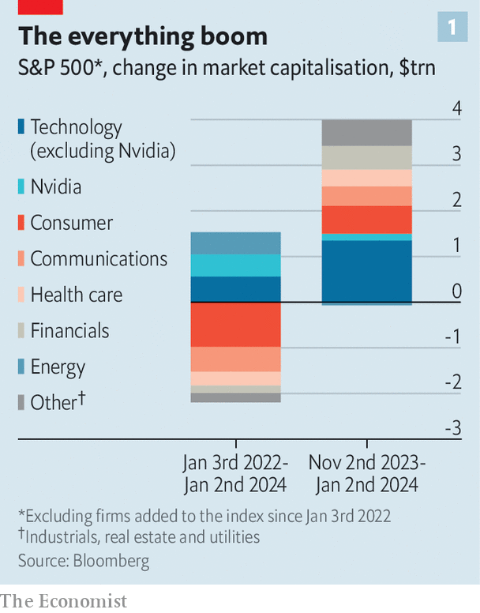

###### Falling short

# American stocks loiter near an all-time high 

##### Their performance this year will depend on the real economy 

 

> Jan 4th 2024 

It is the first trading day of the year. The stockmarket opens a whisker away from an all-time high. American equities have soared over the past 12 months, up by around 25%, with a handful of technology giants leading the charge. There is a big move in the share price of Apple, the world’s most valuable company, which sets off a move in the broader market. This dictates the tone for the rest of the day.

 


Feeling déjà vu? For these facts describe both January 3rd 2022 and January 2nd 2024. In 2022 the mood on the first trading day of the year was approaching euphoria. The s&amp;p 500 index of large American firms rose to 4,796 points, setting a new all-time high. Apple became the first company in the world to be worth $3trn, even if its market capitalisation then dipped. After the boom of 2021, the stockmarket appeared to be signalling that it was ready to continue its charge, surging to ever-greater heights.

So far 2024 is looking rather different. When an analyst downgraded Apple to a “sell” recommendation on January 2nd, arguing that a slowdown in demand for the company’s phones would persist, the world’s biggest firm saw its share price fall by 4%. The rest of the market followed in short order. Instead of surging past the high-water mark set on January 3rd 2022, stocks slipped by 0.6%. Despite the roaring bull market that marked the end of 2023, the tone became anxious. Television talking-heads began to voice obituaries for the hot streak in American shares. The mood did not improve the following day, either. Stocks slid by another 0.8% on January 3rd. 

 


To understand whether such anxiety is warranted, consider the lightning-fast rally that preceded it. Stocks jumped by 16% in the final two months of 2023, a rise that represented two-thirds of the gain for the entire year. The s&amp;p 500 rose for nine consecutive weeks, its longest winning streak since 2004. Having dipped in and out of a true “bull market” (defined as stocks rising at least 20% above their most recent low) throughout 2023, equities now tower some 31% above that level. 

Many of the market moves over the past two years appear to be sensible. After Nvidia, which makes semiconductors, the next-best-performing firm, measured by its rise in market capitalisation, is Eli Lilly, which is at the forefront of another technological advance (in its case: weight-loss drugs). Meanwhile, manufacturing companies have benefited from the return of generous industrial policy under the Biden administration’s Inflation Reduction Act. Although firms that mirror the wider economy, like banks and consumer retailers, have done well recently, they remain well below their levels in early 2022. Vaccine-makers such as Moderna and Pfizer have seen their prices collapse, reflecting the fall in the importance of covid-19. As such, the overall picture is not that of a market gripped by irrational exuberance. 

But the recent surge has been broad-based, with nearly all types of firms soaring (see chart 1), which reflects economic conditions. Growth has been better than expected. After cutting earnings forecasts through most of 2023, analysts became more optimistic. Annualised core inflation, the Federal Reserve’s preferred measure, has more or less been on target for the past three months (see chart 2). All this has led to a big decline in interest-rate expectations. In October investors expected that one-year interest rates would be close to 5% towards the end of 2024. After lower inflation data and a doveish set of forecasts from the Fed, investors now think that they will be just 3.5% (see chart 3). They expect the Fed to cut as soon as March, and to keep cutting at almost every meeting in 2024. 

Yet nerves are understandable. Financial markets often overshoot. And a lengthy hot streak is a sign that such an overshoot may have occurred. The most obvious risk to the bull market is if any of the rosy economic indicators become gloomier in 2024. The combination of falling rates, slow inflation and steady growth is Utopian for investors. Were strong growth to continue for too long, though, the Fed might be slower to cut rates than they hope. With less relentlessly upbeat news, it would only be natural for the market to give up some of its gains. ■


