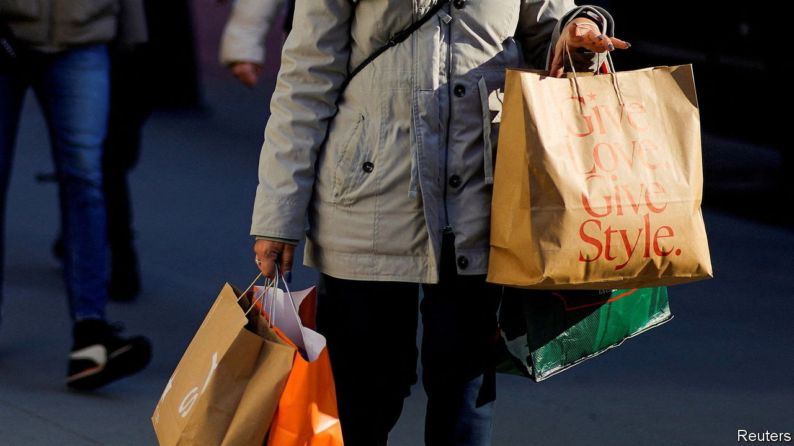

###### Still energised

# Has America really escaped inflation? 

##### The country’s extraordinary economic vigour keeps the threat alive 

 

> Jan 3rd 2024 

At some point American economic growth will disappoint expectations. For now, though, it appears to have ended 2023 much as it passed the previous few years, with yet another expansion that defied forecasts. Recent data suggest that the economy grew at an annualised pace of 2.5% or so in the final three months of the year, more than twice the median expectation of analysts at the start of the quarter. 

Although such momentum is welcome, it complicates the outlook as the Federal Reserve contemplates when to start cutting interest rates. America’s strength is broad-based. Investment in manufacturing facilities has soared to record highs, propelled by the Biden administration’s subsidies for electric-vehicle and semiconductor production. Elevated mortgage rates have led to big falls in sales of existing houses, but property developers have responded to the dearth of single-family homes on the market by ramping up building. The government has remained a backstop to growth—albeit a worrying one from the standpoint of long-term fiscal sustainability—with its deficit running at about 7% of GDP, which is virtually unprecedented during peacetime without a recession.

Most important of all, American consumers have remained indomitable, defying expectations of a retrenchment in personal spending. Two factors help explain their resilience. The stash of savings accumulated by households during the covid-19 pandemic, thanks to the government’s fiscal largesse, has continued to offer them a buffer. Economists at the Fed’s branch in San Francisco reckon that households had about $290bn of excess savings, relative to the expected baseline, as of November. Moreover, the tight labour market has led to robust wage growth, especially for lower-income workers, who, in turn, have a higher propensity to spend. As inflation has come under control their real wage gains look even more substantial.

These various sources of strength contributed to America’s barnstorming third quarter in 2023, when it posted annualised growth of 4.9%. Some slowing was only natural after such a rapid expansion. As recently as early October analysts had pencilled in growth of just 0.7% in the final quarter of 2023. But the latest reading from a real-time model by the Atlanta Fed—which has proved to be a reliable guide for recent GDP figures—points instead to annualised growth of 2.5%. Although the reading will fluctuate as more data trickle in, the margin for error shrinks as the date of a gdp release nears; the next one is on January 25th. For 2023 as a whole growth is likely to be about 2.5%, impressive considering that most economists expected America to be flirting with recession. 

What makes the growth all the more striking is that it has come at the same time as inflation has receded. The Fed’s preferred measure of inflation—the personal consumption expenditure (PCE) price index—hit 2.6% in November compared with a year earlier, down from 7% in mid-2022. Even more encouragingly, core PCE prices, which strip out volatile food and energy costs, have risen by just 2.2% on an annualised basis over the past three months, in line with the Fed’s target of 2%. The disinflation has been propelled by declines in goods prices as supply chains have recovered from pandemic disruptions.

This has given rise to a best-of-both-worlds scenario: resilient growth and fading inflation. Such a propitious combination might allow the Fed to cut rates in the coming months not because growth is weakening, but because it wants to avoid excessive monetary restraint. Jerome Powell, the Fed’s chairman, seemed to give voice to these hopes after the central bank’s meeting in mid-December, when he said that rate cuts “could just be a sign that the economy is normalising and doesn’t need the tight policy”. His words fuelled a rally in both stocks and bonds.

Yet the strong growth points to a less pleasant scenario: that the fall in inflation is a false signal. Whereas goods prices have declined, those for many services continue to rise at a faster clip than their pre-pandemic trend. Housing prices even rebounded in 2023, despite mortgage rates climbing to 8%, their highest in two decades. With mortgage rates falling back below 7% in December, the prospect of a bigger re-acceleration in the property market looms large. An easing in financial conditions as a result of rate cuts would support economic growth but would also feed into renewed price pressures.

If inflation rebounds the Fed would have little choice but to keep interest rates elevated, perhaps reviving the fears of a recession that have all but vanished. These risks help explain why John Williams, president of the New York Fed, poured cold water on the most feverish speculation about imminent rate cuts in the wake of Mr Powell’s comments last month. He said it was “just premature to be even thinking about that”. It is probably also premature to celebrate America’s escape from the past few years of brutal inflation with barely a bruise to its economy. ■


