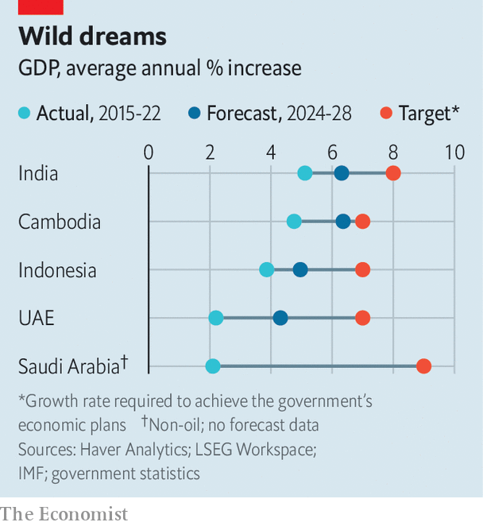
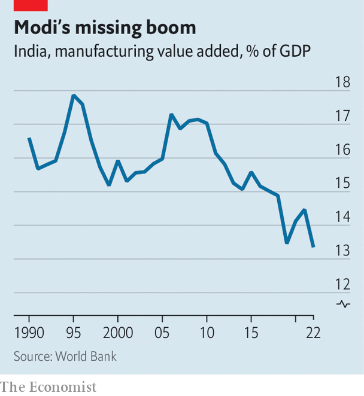
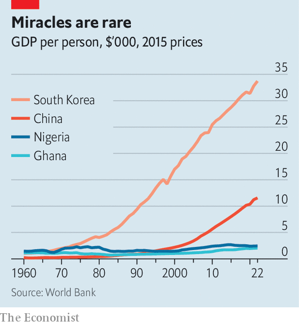

###### Paths to prosperity

# How to get rich in the 21st century 

##### The race to become the next economic superpower 

 

> Jan 2nd 2024 

By 2050 there will be a new crop of economic powers—if things go to plan. , India’s prime minister, wants his country’s GDP per person to surpass the World Bank’s high-income threshold three years before then. Indonesia’s leaders reckon that they have until the mid-century mark, when an ageing population will start to drag on growth, to  with rich countries. The middle of the century is also the ultimate finale for many of Muhammad bin Salman’s “Vision 2030” reforms. Saudi Arabia’s crown prince wants to  from an oil producer into a diversified economy. Other smaller countries, including Chile, Ethiopia and Malaysia, have schemes of their own. 

These vary widely, but all have something in common: breathtaking ambition. India’s officials think that GDP growth of 8% a year will be required to meet Mr Modi’s goal—1.5 percentage points more than the country has managed on average over the past three decades. Indonesia will need growth of 7% a year, up from an average of 4.6% over the same period. Saudi Arabia’s non-oil economy will have to grow by 9% a year, up from an average of 2.8%. Although 2023 was a good year for all three, none experienced growth at this sort of pace. Very few countries have maintained such growth for five years, let alone for 30.

Nor is there an obvious recipe for runaway growth. To boost prosperity, economists typically prescribe liberalising reforms of the sort that have been advanced by the IMF and the World Bank since the 1980s under the label of the “Washington consensus”. Among the most widely adopted are sober fiscal policies and steady exchange rates. Today technocrats urge looser competition rules and the privatisation of state-owned firms. Yet these proposals are ultimately concerned with removing barriers to growth, rather than supercharging it. Indeed, William Easterly of New York University has calculated that, even among the 52 countries which had policies most consistent with the Washington consensus, GDP growth only averaged 2% a year from 1980 to 1998. Mr Modi and Prince Muhammad are unwilling to wait—they want to develop, fast. 

The aim is to achieve the sort of meteoric growth that East Asian countries managed in the 1970s and 1980s. As globalisation spread, they made the most of large and cheap workforces, gaining an edge in markets for cars (Japan), electronics (South Korea) and pharmaceuticals (Singapore). Industries were built behind protectionist walls, which restricted imports, then thrived when trade with the rest of the world was encouraged. Foreign companies later brought the know-how and capital required to churn out more complex and profitable goods, increasing productivity. 

Little surprise, then, that leaders across the developing world remain enthusiastic about manufacturing. In 2015 Mr Modi announced plans to increase industry’s share of Indian GDP to 25%, from 16%. “Sell anywhere, but make in India,” he urged business leaders. Cambodia hopes to double the exports of its factories, excluding clothing, by 2025. Kenya wants to see its manufacturing sector grow by 15% a year. 

There is a snag, however. Industrialisation is even more difficult to induce than it was 40 or 50 years ago. As a result of technological advances, fewer workers than ever are needed to produce, say, a pair of socks. In India five times fewer workers were required to operate a factory in 2007 than in 1980. Across the world, industry now runs on skill and capital, which rich countries have in abundance, and less on labour, meaning that a large, cheap workforce no longer offers much of a route to economic development. Mr Modi and others therefore have a new game plan: they want to leap ahead to cutting-edge manufacturing. Why bother stitching socks when you can etch semiconductors?

 


This “extraordinary obsession with making stuff right on the technological frontier”, as a former adviser to the Indian government puts it, sometimes leads to old-fashioned protectionism. Indian companies may be welcome to sell anywhere, but Mr Modi wants Indians to buy Indian. He has announced import bans on everything from laptops to weapons. 

But not all the protectionism is old-fashioned. Since the last outbreak in India, in the 1970s, subsidies and tax breaks have mostly replaced import bans and licensing. Back then every investment above a certain threshold had to be cleared by a civil servant. Now senior officials are under orders from Mr Modi to drum up $100bn-worth of investment a year, and the prime minister has declared luring chipmakers to be among his main economic goals. “Production-linked incentives” give tax breaks for each computer or missile made in the country, as well as for other high-tech products. In 2023 such subsidies carried a bill of $45bn, or 1.2% of GDP, up from $8bn or so when the scheme was launched three years earlier. Similarly, Malaysia is offering handouts to firms that establish cloud-computing operations, and helps with the cost of factories set up in the country. Kenya is building five tax-free industrial parks, which will be ready in 2030, and has plans for another 20.

 


In some places, there has been early success. Cambodia’s manufacturing sector produced three percentage points more of the country’s GDP last year than it did five years ago. Firms that are looking to diversify from China have been lured by low costs, subsidies for high-tech manufacturing and state investment. Elsewhere, though, things are proving harder. In India manufacturing has stayed steady as a share of GDP—Mr Modi is not going to hit his 25% target by next year. Big names like Apple and Tesla have put their brands on a factory or two, but show little desire to make the sort of investments they once lavished on China, which offers superior infrastructure and a better-educated workforce.

The danger is that, in seeking to attract high-tech manufacturing, countries end up repeating past disasters. From 1960 to 1991 manufacturing’s share of Indian GDP doubled. But when protective barriers were removed in the 1990s, nothing was cheap enough to export to the rest of the world. The risk is especially great this time around since Mr Modi sees manufacturing as being synonymous with “self-reliance”—or India’s ability to produce everything that it needs, especially the tech that goes into weapons. Along with Indonesia and Turkey, India is one of a group of countries that view getting rich as route to a stronger geopolitical position, increasing the chance of misdirected investment. 

Green thumb

These drawbacks to both basic manufacturing and attempts to leap ahead are helping convince some countries to try another approach: attracting industries that use their natural resources, especially the metals and minerals powering the green transition. Governments in Latin America are keen. So are the Democratic Republic of Congo and Zimbabwe. But it is Indonesia that is leading the way, and doing so with striking heavy-handedness. Since 2020 the country has banned exports of bauxite and nickel, of which it produces 7% and 22% of global supply. Officials hope that by keeping a tight grip they can get refiners to move to the country. They then want to repeat the trick, persuading each stage of the supply chain to follow, until Indonesian workers are making everything from battery components to wind turbines.

Officials are also offering carrots, in the form of both cash and facilities. Indonesia is in the midst of an infrastructure boom: spending between 2020 to 2024 ought to reach $400bn, over 50% more a year than in 2014. This includes funding for at least 27 multibillion-dollar industrial parks, including the Kalimantan Park, constructed on 13,000 hectares of former Bornean rainforest at a cost of $129bn. Other countries are also offering sweeteners. Firms that want to install solar panels in Brazil will receive subsidies to also build them there. Bolivia nationalised its lithium industry, but its new state-owned conglomerates will be permitted to enter into joint ventures with Chinese companies.

This approach—of trying to scale the energy supply chain—has little precedent. The world’s oiliest countries mostly ship their crude abroad. Indeed, more than 40% of global refining capacity can be found in America, China, India and Japan. Saudi Arabia refines less than a quarter of what it produces; Saudi Aramco, its state oil giant, refines in northern China. Experiments with export bans have mostly been in simpler commodities, such as timber in Ghana and tea in Tanzania. By contrast, obtaining nickel pure enough to be used in electric vehicles from Indonesia’s supply is ferociously complex, notes Matt Geiger of MJG Capital, a hedge fund. Doing so requires three different types of factory, and the nickel must then pass through several more before it enters a car.

Fossil fuels have made parts of the Gulf rich, but almost every industry in the world constantly guzzles oil. There is no guarantee that the bonanza from green metals will be anywhere near as large. Batteries only need replacing every few years. Officials at the International Energy Agency, a global body, reckon that pay-offs from green commodities will peak in the next few years, after which they will taper off. Moreover, technological development could suddenly reduce appetite for certain metals (say, if another type of battery chemistry becomes dominant). 

Meanwhile, fossil-fuel beneficiaries are trying another strategy altogether: to reinvent the entrepot. The Gulf wants to be where the world does business, welcoming trade from all corners of the globe and providing shelter from geopolitical tensions, particularly between America and China. By 2050 the world should have reached net-zero emissions. Although the Gulf is rich, its economies are still developing. Local workforces are less skilled than those in Malaysia, yet receive wages comparable to those in Spain. This makes foreign workers essential. In Saudi Arabia they account for three-quarters of the total labour force. 

 


The United Arab Emirates (uae) was one of the first countries in the region to diversify. It has focused on industries, such as shipping and tourism, that may help to facilitate other business, as well as on high-tech industries, such as  (AI) and chemicals. Abu Dhabi is already home to outposts of the Louvre and New York University, and has plans to make money from space travel for tourists. Qatar is building Education City, a campus that will cost $6.5bn and sprawl across 1,500 hectares, working a bit like an industrial park for universities, hosting the branches of ten, including Northwestern and University College London. 

Others in the Gulf are also getting involved. Saudi Arabia hopes to see flows of foreign investment increase to 5.7% of GDP in 2030, up from 0.7% in 2022, and is spending fabulous amounts of money in pursuit of this ambition. The Public Investment Fund has disbursed $1.3trn in the country over the past decade—more than is forecast to be unleashed by the Inflation Reduction Act, President Joe Biden’s industrial policy in America. The fund is shelling out on everything from football teams and petrochemical plants to entirely new cities. Industrial policy has never been conducted on such a scale. Dani Rodrik of Harvard University and Nathaniel Lane of the University of Oxford reckon that China spent 1.5% of GDP on its own efforts in 2019. Last year Saudi Arabia disbursed sums equivalent to 20% of GDP.

Everyone’s a winner

The problem with throwing around quite so much money is that it becomes difficult to see what is working and what is not. Manufacturers in Oman, making products from aluminium to ammonia, can obtain a factory rent-free at one of the country’s new industrial parks, buy materials with generous grants and pay their workers’ wages by borrowing cheaply from shareholders, which usually include the government. They can even draw on export subsidies to sell abroad at a lower cost. How is it possible to tell which comapanies will outlast all this cash, and which ones would collapse without it?

One thing is already painfully clear. The private sector is yet to take off in the Gulf. Almost 80% of all non-oil economic growth in the past five years in Saudi Arabia has come from government spending. Although an impressive 35% of Saudi Arabian women are now in the labour force, up from 20% in 2018, overall workforce-participation rates across the rest of the Gulf remain low. Researchers at Harvard have found that legislation introduced in 2011, which stipulated Saudis should make up a set portion of a firm’s headcount—for instance, 6% of all workers in green tech and 20% in insurance—decreased productivity and did nothing to move the needle on private employment. 

Ultimately, a few countries will make it to high-income status. Perhaps the UAE’s spending on AI will pay off. Perhaps new tech will make the world more dependent on nickel, to Indonesia’s advantage. India’s population is too young for growth to stagnate entirely. But the three strategies employed by countries looking to get rich—leaping to high-tech manufacturing, exploiting the green transition and reinventing the entrepot—all represent gambles, and expensive ones at that. Even at this early stage, a few lessons can be drawn.

 


The first is that the state is now much more active in economic development than at any point in recent decades. Somehow an economy must evolve from agrarian poverty to diversified industries that can compete with rivals in countries which have been rich for centuries. To do so requires infrastructure, research and state expertise. It may also require lending at below market rates. This means that a certain amount of state involvement in the process is inevitable, and that policymakers will have to pick some winners. Even so, governments are now intervening much more frequently. Many have lost patience with the Washington consensus. The benefits of its most straightforward reforms, such as independent central banks and ministries stuffed with professional economists, have already been reaped; the institutions that once enforced it (namely, the IMF and World Bank) are shadows of their former selves. 

Today policymakers in the developing world take cues from China and South Korea. Few recall their own country’s interventionist follies. In the 1960s and 1970s it was not just those in East Asia that were enthusiastically experimenting with industrial policy; many in Africa were as well. For the best part of a decade, the two regions grew at a similar pace. Yet from the mid-1970s it became apparent that policymakers in Africa had made the wrong bets. A debt crisis kicked off a decade known as the “African tragedy”, in which the continent’s economies shrank by 0.6% a year on average. Later, in the 2000s, Saudi officials unsuccessfully spent big to foster a petrochemical industry, forgetting that shipping oil abroad was cheaper than paying people to work at home.

A spanner in the works

The second is that the stakes are high. Most countries have sunk enormous sums into pursuing their chosen path. For the smaller economies, such as Cambodia or Kenya, the result could be a financial crisis if things go wrong. In Ethiopia, this has already happened, with debt default accompanying civil war. Even bigger countries, such as India and Indonesia, will not be able to afford a second stab at development. The bill from their current efforts, should they fail, and the cost of ageing populations will leave them short of fiscal space. Wealthier countries are constrained, too, albeit by another resource: time. Saudi Arabia needs to develop before demand for its oil drops off, or else there will be few ways to sustain its citizens. 

The third is that the manner in which countries grow is changing. According to work by Mr Rodrik, manufacturing has been the only type of work where poor countries have improved their productivity at a faster rate than rich countries, and so caught up. Modern industry may not offer the same benefit. Rather than spending time attempting to make factory processes marginally more efficient, workers in countries trying to get rich increasingly mine green metals (working in an industry with notoriously low productivity), serve tourists (another low-productivity sector) and assemble electronics (rather than making more complex components). All this means that the race to get rich in the 21st century will be more gruelling than the one in the 20th century. ■


