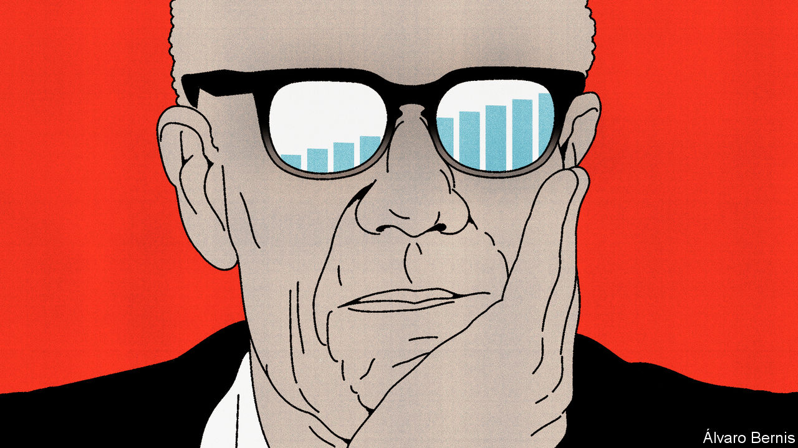

###### Free exchange

# Robert Solow was an intellectual giant 

##### His criticisms were energetic and witty, which could make them harder to take 

 

> Jan 4th 2024 

Ensconced in a lorry, hidden from the enemy by the brow of a hill, the young Robert Solow decoded the radio signals of Nazi platoons across Italy. “We were very, very good at it,” he said. The trick was to get close to the enemy but not too close: near enough to pick up their transmissions, but not so near as to risk capture.

The codes were not fancy—it was “combat stuff”. But if they could be broken quickly, they might reveal an ammunition delivery that could be thwarted. The radiomen were not fancy either. Most were high-school graduates. Even Solow, who would go on to earn a Nobel prize in economics, the Presidential medal of freedom and a Portuguese knighthood, before his death on December 21st 2023, was “middle-middle-class”. He was educated at Brooklyn state schools. He preferred softball to books, and was destined for Brooklyn College until a teacher spotted his potential, broadened his reading, and encouraged him to apply to Harvard University, which he joined two years early and rejoined after the war.

Solow’s years as a soldier only strengthened his egalitarian streak. He declined to become an officer, so he would not have to boss anyone around. When the Massachusetts Institute of Technology (mit) offered him a job in 1949, he asked what the lowest paid professor earned, and accepted the same. When he served in President Kennedy’s Council of Economic Advisers, the Swiss embassy wanted to know his protocol rank. His answer was that he was a full professor at MIT and the government had no rank as high. Informed in the predawn hours in October 1987 that he had won the Nobel prize, his first instinct was to go back to sleep.

What he craved was more precious than prizes: the esprit de corps that comes from membership of a small, highly motivated band of colleagues. “If you’re in a group that is doing good work, it’ll have a high morale. And if it has high morale, it’ll do good work,” he once said. As an economist, he liked formal models and mathematics. But nothing too fancy. Over-refinement reminded him of the man who knew how to “spell banana” but did not “know when to stop”. His strategy was to break big questions—about growth, resources, unemployment—into littler ones, in the hope that small answers would aggregate into larger ones. 

The MIT culture he embodied disdained hierarchy, cherished collegial lunches and made time for students, many of whom became illustrious friends. Four of Solow’s students later received their own sleep-disturbing calls from Sweden. Economics, Solow maintained, was a “handicraft” industry, often driven by the “extraordinarily powerful research apparatus” of one professor and one undergraduate assistant.

Something he liked about academia was that ideas, no matter how prestigious their source, could be scrutinised by anyone. His own criticisms were energetic and witty, which could make them harder to take. He found the “freshwater” school of macroeconomics, identified with the University of Chicago, preposterous, especially in its early incarnations, which assumed a “representative agent” could stand in for the many actors in an economy. To get into a technical discussion with freshwater types was like discussing cavalry tactics with someone claiming to be Napoleon, he said. The claim is absurd, however well they know their stuff.

The work that made his name began as criticism of the growth theories of the 1930s and 1940s. In these, investment added both to national spending and the economy’s productive capacity. There was no guarantee these additions to demand and supply would stay in line with each other. Moreover, excessive spending, by boosting demand, would inspire firms to invest even more, whereas inadequate investment would induce firms to spend still less. The economy was for ever poised on a “knife-edge” between deepening unemployment or intensifying labour shortages.

This precariousness was hard to square with the relatively stable progress of advanced economies like America, where even the Great Depression eventually ended. Solow showed that the knife-edge disappeared if economies could vary the capital-intensity of production. Strong investment would not then be destabilising. It would merely result in higher capital per worker.

High investment would not, however, result in faster growth over the long run. At some point, capital would run into diminishing returns, leaving growth to be dictated by other factors. Solow calculated that capital accumulation could explain less than 13% of the growth in income per person in America from 1909 to 1949. The remainder was attributable to other forces, which he loosely labelled “technical change”. This vast unexplained portion of growth became known as the “Solow residual”.

Tough paternal love

Although his work created reams of subsequent research, the father of growth theory was not impressed by many of his progeny. He was sceptical of statistical exercises that dissected growth rates across countries at every stage of development. Nor had he intended to imply that technological progress, which he did not model, fell entirely outside economics. A lot of innovation was “dumb luck”. And much of it emerged on the factory floor, “invented” by unheralded foremen. But some was the result of profit-driven investment in research. Later attempts to create formal theories of technological progress nevertheless asked more questions than they answered, he argued. 

Part of the problem was that innovation is often peculiar and particular, whereas growth theorists strive for generality and abstraction. Solow, who had himself observed the research labs at General Motors and collaborated with the McKinsey Global Institute on industry-level studies of productivity, thought model-builders could learn from case studies and business histories. The aim was to “extract a few workable hypotheses” without getting lost in the detail. To understand how the economy works, to decode its secrets, you need to get up close, but not too close. ■


