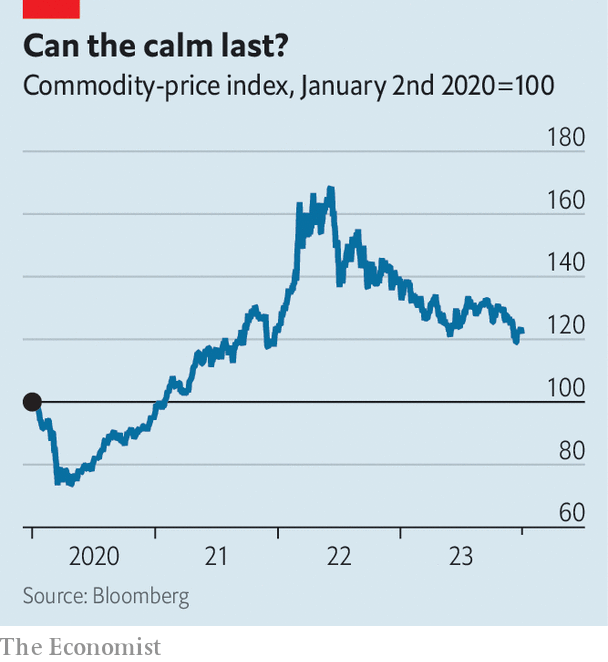

###### Guns and hoses

# Three surprises that could inflame commodity markets in 2024 

##### What it would take for another bout of mayhem 

 

> Jan 4th 2024 

As Russia continues to pound Kyiv, Western sanctions are beginning to cripple Arctic LNG 2, the aggressor’s largest gas-export project. In the Red Sea, through which 10% of the world’s seaborne oil travels, American forces are doing their best to repel drone attacks by Yemen’s Houthi rebels. On January 3rd local protests shut down production at a crucial Libyan oilfield. A severe drought in the Amazon risks hampering maize shipments from Brazil, the world’s largest exporter of the grain. 

 


And yet, across commodity markets, calm somehow prevails. After a couple of years of double-digit rises, the Bloomberg Commodity index, a benchmark that covers raw-material prices, fell by more than 10% in 2023 (see chart). Oil prices, at a little under $80 a barrel, are down by 12% over the past quarter and are therefore well below the levels of 2022. European gas prices hover near their lowest levels in two years. Grains and metals are also cheap. Pundits expect more of the same this year. What, exactly, would it take to rock markets?

After successive shocks inflamed prices in the early 2020s, markets have adapted. Demand, held back by suppressed consumption, has been relatively restrained. But it is the supply response to elevated prices, in the form of an increase in output and a reshuffling of trade flows, that makes the world more shockproof today. Investors are relaxed because supply levels for many commodities look better than they have since the late 2010s. 

Take oil, for instance. In 2023 increased production from countries outside the Organisation of the Petroleum Exporting Countries and its allies, a group known as OPEC+, was sufficient to cover the rise in global demand. This pushed the alliance to cut its output by some 2.2m barrels per day (b/d), an amount equivalent to 2% of global supply, in a bid to keep prices stable. Nevertheless, the market only just fell short of surplus in the final quarter. Kpler, a data firm, predicts an average oversupply of 550,000 b/d in the first four months of 2024, which would be enough to replenish stocks by nearly as much as they declined during the heated summer months. New barrels will come from Brazil, Guyana and especially America, where efficiency gains are making up for a fall in rig count.

In Europe manic buying since the start of Russia’s war and a mild winter have helped keep gas-storage levels at around 90% of capacity, well above the five-year average. Assuming normal weather and no big disruptions, they should remain close to 70% full by the end of March, predicts Rystad Energy, a consultancy, easily beating the European Commission’s target of 45% by February 1st. Ample stocks will hold gas prices down, not just in Europe but also in Asia, in turn incentivising more coal-to-gas switching in power generation everywhere. This will help lower coal prices already dulled by a huge ramp-up in production in China and India. 

Mined supply of lithium and nickel is also booming; that of cobalt, a by-product of copper and nickel production, remains robust, dampening green-metal prices. Increased planting of grains and soyabeans (outside Ukraine) and clement weather are prompting pundits to project record output in 2024-25, after a lush 2023-24. That will push the average stocks-to-use ratio at food exporters, a key determinant of prices, from 13% to 16%, a level they last saw in 2018-19, says Rabobank, a Dutch lender. 

Abundant supply suggests a sedate first half of the year. After that, surpluses could narrow. Non-OPEC oil output may level off. Delays at some American liquefaction-terminal projects, which were originally set to start exporting in 2024, will frustrate Europe’s efforts to restock gas. Low grain prices will crush farmers’ margins, threatening planting. Markets will be more exposed to shocks, of which three stand out: a sharp economic rebound, bad weather and military blow-ups.

Whether or not big economies avoid a recession, the pace of global growth is expected to be slow, implying modest growth in raw-material demand. Inflation is also expected to ebb, so commodities will have less appeal as a financial hedge. But a surprise is not impossible. One looks less likely in China, the usual bellwether of commodity markets, than in America, where interest rates might soon be cut and an  is gathering pace. Liberum, a bank, calculates that a one-percentage-point rise in its forecast for annual global GDP growth would boost commodities demand by 1.5%. 

Freakish weather would have a deeper impact. Europe’s winter is not over yet, as evidenced by the cold snap that has just begun. A lasting freeze could force Europe to use an extra 30bn cubic metres of gas, or 6-7% of its usual demand, Rystad reckons. That could push the region to compete more aggressively with Asia for supplies. A climatic surprise would be more disruptive still in the wheat markets, not least if it were to affect Russia, the largest exporter, which has had bumper harvests since 2022. The larder to cover shortfalls is emptying. Owing to rising consumption, which is set to hit records this season, global wheat stocks are already headed for their lowest levels since 2015-16. 

What about war? Four-fifths of Russia’s food exports are ferried across the Black Sea, as are 2m b/d of crude. Naval tit-for-tats could jolt prices, though rising output from OPEC+, and international pressure to protect food shipments, would calm markets. Red Sea flare-ups, caused perhaps by a sustained American campaign against the Houthis, could cause a 15% spike in oil prices, says Jorge León of Rystad—though this may not last long either. War involving Iran and other Gulf states, where most of the unused production capacity lies today, is what would really cause chaos. The potential for terrifying prices of the sorts predicted in March 2022, when barrels at $200 seemed possible, could return. 

It would take something extreme—or a mixture of less extreme but still unlikely events—to blindside commodity markets. That is not quite the solace it seems. They have been blindsided by similarly improbable events several times this decade. ■


