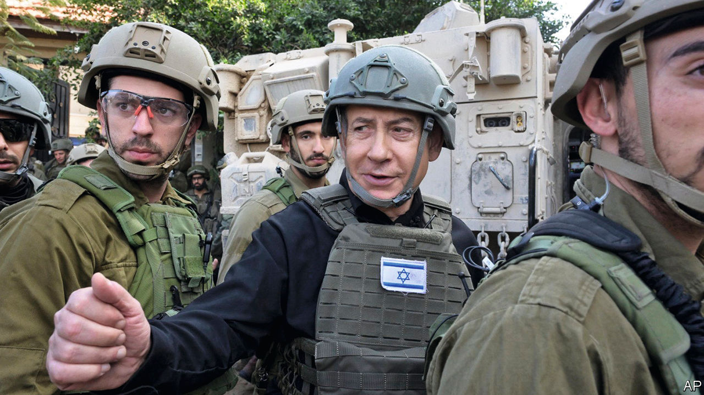

###### Mayhem in the Middle East

# Binyamin Netanyahu is botching the war. Time to sack him 

##### To be safe, Israel needs new leadership 

 

> Jan 3rd 2024 

There is mayhem in the Middle East. In  2m war-battered civilians are at risk of famine.  by the Houthis threaten world trade. Israel’s northern border is tense after the assassination of a Hamas leader in Beirut on January 2nd. A day later two explosions killed almost 100 people in Iran; the Iranians at first blamed “terrorists”, and then America and Israel. War could break out between Israel and , the Iran-backed militia in Lebanon. Two things are clear. The attacks of October 7th are reshaping the Middle East. And under Binyamin Netanyahu’s leadership, Israel is making blunders that undermine its own security.

Since the slaughter of Israeli civilians by Hamas in October, Israel has had to rethink its long-standing security doctrine. That doctrine involved giving up on peace with the Palestinians, building walls and using technology to repel missile attacks and infiltrations. It didn’t work. The Palestinians were radicalised and the walls did not stop the atrocities of October 7th. Israel’s air defences may yet be overwhelmed by the increasingly sophisticated arsenal of missiles aimed at it by Iran-backed militants in Lebanon, Yemen and elsewhere. 


How might a new Israeli security doctrine work? supports removing Hamas from power in Gaza: it has oppressed and impoverished the people there. It is also an impediment to peace. But Israel should make clear its fight is with the terrorists. That means using force judiciously and letting in a lot more aid. It also means having a plan for after the war that creates a path to a moderate Palestinian state. Such an approach would help maintain support for Israel in America and elsewhere. This is crucial: America deters Iran and backs detente between Israel and Gulf states that also oppose Iran’s influence. Most important, it underwrites the security of Israel itself.

Alas, in Gaza, Mr Netanyahu has eschewed this logic. Israel’s tactics show needless disregard for civilian lives. The Hamas-run authorities there say 22,000 civilians and fighters have died. The UN says another 7,000 may lie under the rubble. Israel says it has killed 8,000 terrorists. Far too little water, food and medicine is reaching Gaza and there are no truly safe zones for civilians. Mr Netanyahu seems to have no post-war plan, other than anarchy or occupation. He has excluded rule by the Palestinian Authority in Gaza. Extremists in his coalition talk, outrageously, of permanently displacing Palestinians from the enclave.

What explains this myopia? It is true that Israeli public opinion shows little sympathy for the Palestinians and that the obliteration of Gaza may help restore Israel’s deterrent power. Yet the main explanation is Mr Netanyahu’s weakness. Desperate to stay in office, he has pandered to extremists in his coalition and the Israeli electorate, while testing America’s patience and horrifying Arab states. That will backfire in Gaza and hinder Israel from dealing with its own broader security concerns. 

Take the northern front: the threat of a Hizbullah invasion or missile strikes means that a strip of northern Israel is now uninhabited. Yet Israel’s options are grim. A pre-emptive invasion of Lebanon could lead to a military quagmire, trigger the complete collapse of the Lebanese state and wreck relations with America. Diplomacy might create a buffer zone between Hizbullah and Israel’s border, but a regional plan is needed to contain and deter Iran. That requires the support of America, other Western allies and, ideally, the Gulf Arab states, all of which Mr Netanyahu is alienating. 

Mr Netanyahu’s popularity at home has plummeted. Israel’s Supreme Court has just struck down his controversial judicial overhaul. For Israel’s sake, he has to go. Given the trauma of October 7th, his successor will not be soft on security. But a wiser Israeli leader might understand that famine in Gaza, anarchy or open-ended occupation there and the erosion of American backing will not make Israel safer. ■

