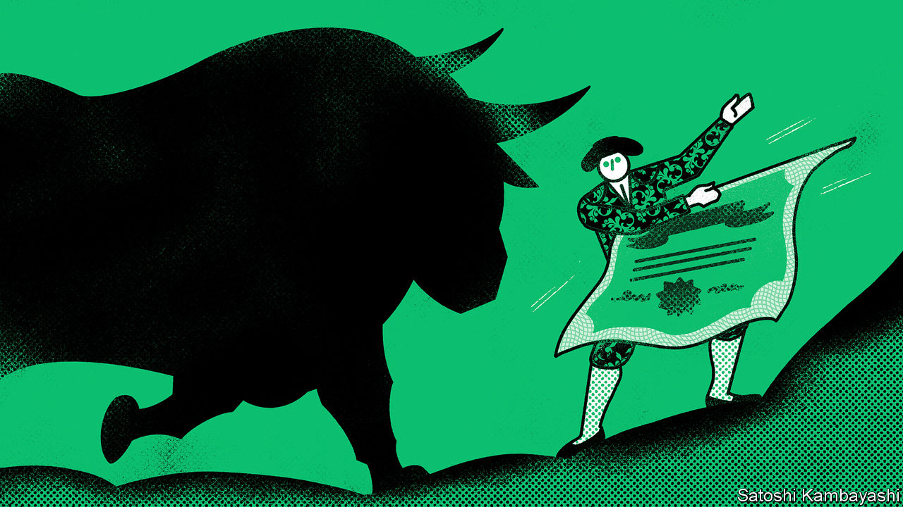

###### Stockmarkets

# Is America’s raging bull market exhausted, or taking a breath? 

##### Investors have a slight hangover 

 

> Jan 4th 2024 

If you had an overindulgent Christmas, you may have begun the new year in a more austere frame of mind. Recent goings-on in the markets may therefore seem familiar. As 2023 drew to a close the American stockmarket was on a ripping run. It ended the year with nine consecutive weeks of gains, the longest winning streak since 2004. The s&amp;p 500 index of leading American stocks was a whisker away from its all-time high, set on January 3rd 2022, when investors thought that interest-rate rises would be small and slow. Now punters are suddenly in a more sober mood, with stocks falling by 1.4% in the first two trading days of the new year. Such modest fluctuations are hardly unusual. Nonetheless, they raise the question of whether the blistering bull market is over, or has further to go. 

For the first ten months of 2023, the market rally was largely concentrated in seven tech stocks, led by Nvidia, a maker of the computer chips that are used to process artificial-intelligence (AI) algorithms. Since then, however, it broadened and gained pace. Firms that mirror the wider economy, such as retailers and banks, soared—JPMorgan Chase is up by a quarter since late October. The s&amp;p 500 rose by 14% in the final two months of 2023, and towers 31% above its most recent trough, well above the 20% that is often used to define a bull market. 

The explanation for the run was a happy mix of strong economic growth, an orderly reduction of inflation and, crucially, an enormous shift in interest-rate expectations over the past two months.  expanded at an impressive annualised pace of 4.9% in the third quarter; real-time estimates suggest it grew at a still-robust 2.5% in the last three months of the year. In the past three months “core” consumer prices have risen at an average annualised pace of just 2.2%, only a smidgen above the Federal Reserve’s inflation target. 

That led to a big shift in investors’ expectations for interest rates. In October they thought one-year rates in a year’s time would be close to 5%. Thanks to lower inflation data and a doveish set of forecasts from the Fed, that has fallen to 3.5%. Bond investors see the central bank cutting rates as soon as March—and continuing in almost every meeting in 2024. This tantalising prospect of immaculate disinflation, robust growth and the promise of easier monetary policy has underpinned the rally. 

Can the bull market be sustained? Asset prices still have room to rise. Although markets are close to the heights they reached after the protracted mania of 2021, that does not mean that things are as excessive now as they were then. In real terms, stock prices remain lower; valuations are therefore not quite as elevated. Participation by retail investors, which reached a giddy peak of 24% of daily trading volumes in early 2021, was steady at around 18% in 2023. 

Moreover, although tech led the charge in both 2021 and 2023, investors this time have been discerning. They have lifted up Nvidia and Microsoft but Alphabet, Amazon and Tesla are all trading below their peak valuations. It is not just Americans excited about AI who are buoying stocks: in dollar terms European and Japanese equity indices are also within touching distance of their level two years ago. 

Rude awakening

Yet everything hangs on whether investors’ ideal economic scenario comes to pass. The expectation that it will helped lift stocks close to a record high last year. But risks to the outlook abound, and may have given investors pause in the cold light of January. Inflation in America may not be fully vanquished, not least with the economy still in rude health and the fiscal deficit unusually wide. Strife in the Middle East could cause another commodity-price shock; the one-time easing of the supply-chain disruptions of the pandemic may be keeping inflation low only temporarily. 

A downturn may merely be delayed, not dodged. Rises in interest rates may not yet have fully fed through to borrowers. Indeed, history suggests that recessions are hard to spot in real time, and tend to catch out central banks. If a recession does not arrive, it is still possible that the Fed will not move with as much alacrity as investors hope. To see what will happen in the markets in 2024, watch the real economy. ■

