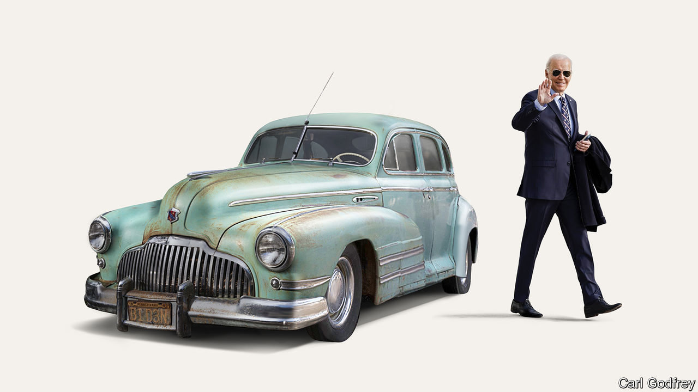

###### Roadworthy in ’24?

# The man supposed to stop Donald Trump is an unpopular 81-year-old 

##### In failing to look past Joe Biden, Democrats have shown cowardice and complacency 

 

> Jan 4th 2024 

AMERICAN POLITICS is paralysed by a contradiction as big as the Grand Canyon. Democrats rage about how re-electing Donald Trump would doom their country’s democracy. And yet, in deciding who to put up against him in November’s election, the party looks as if it will meekly submit to the candidacy of an 81-year-old with the worst approval rating of any modern president at this stage in his term. How did it come to this?

Joe Biden’s net approval rating stands at minus 16 points. Mr Trump, leading polls in the swing states where the election will be decided, is a coin-toss away from a second presidential win. Even if you do not see Mr Trump as a potential dictator, that is an alarming prospect. A substantial share of Democrats would rather Mr Biden did not run. But instead of either challenging him or knuckling down to support his campaign, they have instead taken to muttering glassy-eyed about the mess they are in. 

There are no secrets about what makes Mr Biden so unpopular. Part of it is the sustained  that has been laid at his door. Then there is his age. Most Americans know someone in their 80s who is starting to show their years. They also know that no matter how fine that person’s character, they should not be given a four-year stint in the world’s hardest job.

Back in 2023 Mr Biden could—and should—have decided to be a one-term president. He would have been revered as a paragon of public service and a rebuke to Mr Trump’s boundless ego. Democratic bigwigs know this. In fact before their party’s better-than-expected showing in the midterms, plenty of party members thought that Mr Biden would indeed stand aside. This newspaper  that the president should not seek re-election over a year ago.

Unfortunately, Mr Biden and his party had several reasons for him fighting one more campaign, none of them good. His sense of duty was tainted by vanity. Having first stood for president in 1987 and laboured for so long to sit behind the Resolute desk, he has been seduced into believing that his country needs him because he is a proven Trump-beater.

Likewise, his staff’s desire to serve has surely been tainted by ambition. It is in the nature of administrations that many of a president’s closest advisers will never again be so close to power. Of course they do not want to see their man surrender the White House in order to focus on his presidential library. 

Democratic leaders have been cowardly and complacent. Like many pusillanimous congressional Republicans, who disliked Mr Trump and considered him dangerous—but could not find it within themselves to impeach or even criticise him—Democratic stalwarts have been unwilling to act on their concerns about Mr Biden’s folly. If that was because of the threat to their own careers, their behaviour was cowardly. If it was thinking that Mr Trump is his own worst enemy, it was complacent. Mr Biden’s approval ratings have continued to slide, while the  Mr Trump faces have, so far, only made him stronger.

Given this, you might think that the best thing would be for Mr Biden to stand aside. After all, the election is still ten months away and the Democratic Party has talent. Alas, not only is that exceedingly unlikely, but the closer you look at what would happen, finding an  at this stage would be a desperate and unwise throw of the dice . 

Were he to withdraw today, the Democratic Party would have to frantically recast its primary, because filing deadlines have already passed in many states and the only other candidates on the ballot are a little-known congressman called Dean Phillips and a self-help guru called Marianne Williamson. Assuming this was possible, and that the flurry of ensuing lawsuits was manageable, state legislatures would have to approve new dates for the primaries closer to the convention in August. A series of debates would have to be organised so that primary voters knew what they were voting for. The field could well be vast, with no obvious way of narrowing it quickly: in the Democratic primary of 2020, 29 candidates put themselves forward.

The chaos might be worth it if the party could be sure of going into the election with a young, electable candidate. However, it seems equally possible that the eventual winner would be unelectable—Bernie Sanders, say, a self-declared democratic socialist who is a year older than Mr Biden. More likely, the nomination would go to Kamala Harris, the vice-president. Ms Harris has the advantage of not being old, though it says something about the Democratic Party’s gerontocracy that she will be 60 in November and is considered youthful.

Unfortunately she has proven to be a poor communicator, a disadvantage in office as well as on the stump. Ms Harris is a creature of California’s machine politics and has never successfully appealed to voters outside her state. Her campaign in 2020 was awful. Her autocue sometimes seems to have been hacked by a satirist. Immigration and the southern border—a portfolio she handles for Mr Biden—is Mr Trump’s strongest issue and the Democrats’ weakest. Ms Harris’s chances of beating Mr Trump look even worse than her boss’s.

Better, therefore, for Democrats to focus on electing Mr Biden. The economy promises a soft landing; workers are seeing  and full employment. Were Mr Trump convicted, he could yet be punished by voters. Most important is to invigorate the campaign. Democrats need to unlock some excitement and create a sense of possibility about a second term.

Ridin’ with Biden

The president is not a good campaigner and is up against a candidate whose rallies are a cult meeting crossed with a vaudeville show. He needs someone who can speak to crowds and go on television for him. That person is not Ms Harris. 

One way she could serve her party and her country, and help keep Mr Trump out of the White House, would be to forswear another term as vice-president. Mr Biden could present his second term as a different kind of presidency, one in which he would share more responsibility with a vice-president acting more like a CEO. Either way, Mr Biden needs the help of an army of enthusiastic Democrats willing to campaign alongside him. At the moment he and his party are sleepwalking towards disaster. ■


