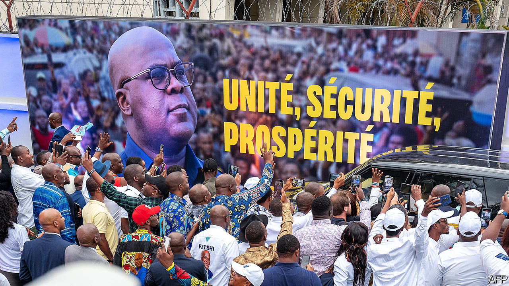

###### They voted, sort of

# A thumping win for Tshisekedi in Congo’s election raises eyebrows 

##### The opposition has few good options 

 

> Jan 4th 2024 

The slick ceremony to hail the results of Congo’s presidential election in a hall of bigwigs in fancy suits gave off an air of official competence. Félix Tshisekedi, the incumbent president, won with a thumping 73% of the vote, declared the electoral commission. The runner-up, Moïse Katumbi, a businessman, got 18%. Yet neither the stylish lighting nor the name of the results hall—Bosolo, meaning truth in Lingala, a local language—could undo the chaos of the election day. Nine opposition candidates, including Mr Katumbi, rejected the results and demanded a re-run, denouncing the election as “a sham”. 

Congo has vast seams of minerals critical for the green transition, yet 60% of its 100m citizens are extremely poor. Four times the size of France, it is battered by an eternal war in the east that has displaced some 7m people. Polling in such a setting was bound to be patchy but Mr Tshisekedi’s margin of victory far exceeded even his own campaign’s surveys (seen by ), which showed him winning but with less than 50%. Despite a huge rise in death and displacement in the east on his watch, the official result gave him close to 90% of the vote there. “The margin of victory raises a lot of questions,” says Trésor Kibangula of Ebuteli, a local think-tank. 

An influential observer mission of Catholic and Protestant churches documented “numerous cases of irregularities that could affect the integrity of the results”. Yet it crucially also said that by its parallel count “one candidate clearly stood out from the others, with more than half of the votes.” That may reassure many that fraud was not on a scale to delegitimise the winner. (After the last election, in 2018, Mr Tshisekedi was declared the victor despite the Catholic Church’s parallel count and leaked official data showing that another candidate, Martin Fayulu, had easily won.)

The opposition says that widespread cheating included ballot-stuffing. Much of this would not be revealed by the parallel count, says Bienvenu Matumo, an activist with LUCHA, a rights group. For example, an unverified video shows someone in a private apartment with a voting machine casting vote after vote for Mr Tshisekedi. Still, the opposition has yet to provide detailed evidence to back its claims. 

It is clear, in any event, that the election was utterly chaotic. Millions waited for hours to vote. Many gave up or never found their name on the voting lists. The electoral process was a “huge failure” that left many disenfranchised and angry, says Richard Moncrieff of Crisis Group, a think-tank based in Brussels. Almost 60% of polling stations opened late, often because the voting papers had not arrived or because voting machines malfunctioned, according to SYMOCEL, a local observer group. Voting also stopped for 30 minutes or more in about a third of polling stations. And the electoral commission announced without a legal basis that the polling would continue for another day in some areas. In fact it was still going on, in some parts of the country, for six more days. 

Official turnout was 43%, the lowest since multi-party elections resumed in 2006. Alarmingly, at least 11,000 of 75,000 polling stations did not open at all. The commission failed to clarify why or where those were. That one in six polling stations were summarily cast aside also bodes ill for the simultaneous elections to the national assembly, whose results have been delayed amid investigations into fraud. Earlier this year, another 1.7m Congolese in the east had not even registered to vote, because of the war. How many missing voters, it may be asked, does it take to invalidate the results of an election?

Mr Tshisekedi’s supporters argue that their man was plainly the most popular because the economy has grown steadily and the president has declared, among other things, free primary education for all. He was helped by a divided opposition and heavy and favourable coverage by the state broadcaster. The country seemed to be smothered in his posters.

He also boasted alliances with regional bigwigs such as Jean-Pierre Bemba, a former warlord in the north whom the International Criminal Court in The Hague had convicted of crimes against humanity (a verdict later overturned), and Vital Kamerhe, convicted in 2020 of embezzling $48m (a verdict also overturned).

Perhaps the key to Mr Tshisekedi’s apparent success was his repeated claim, without evidence, that Mr Katumbi was a foreigner and in bed with Rwanda, which backs rebels in eastern Congo. This helped Mr Tshisekedi cast himself as a defender of Congo’s sovereignty. He even promised to declare war on Rwanda if re-elected.

Both Mr Katumbi and Mr Fayulu, who calls the results a “new coup d’état”, say they will not appeal to the constitutional court because they claim it is not independent. Instead they will try to rally people in the streets. That will be difficult A small protest in Kinshasa, the capital, was clobbered by the police. The army was sent in there the day the results were declared.

“The time for action has arrived,” said Mr Katumbi on January 3rd, calling for peaceful protests while castigating some of Congo’s allies. “Tell me, in which country in the world can you find voting machines in the hands of the ruling party’s candidates and one still rushes to congratulate the winner?” Western governments that put access to Congolese minerals above democracy are loth to be swayed. Congo had an opportunity to do things differently and have an election that did not end in a crisis of legitimacy, says Mr Kibangula, the dismayed think-tanker. “We did not take the opportunity.” ■

