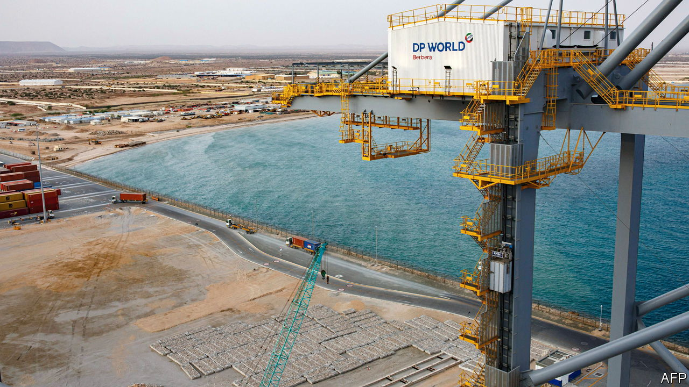
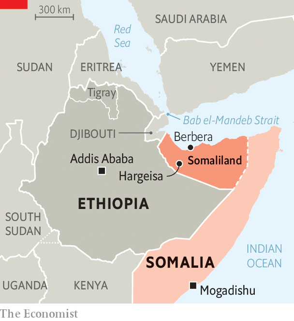

###### A storm over a port

# Ethiopia’s gambit for a port is unsettling a volatile region 

##### Abiy Ahmed is doing a deal for a stretch of Somaliland’s coast 

 

> Jan 2nd 2024 

GEOPOLITICS IN THE Horn of Africa is already off to a combustible start in the new year. On January 1st Abiy Ahmed, Ethiopia’s prime minister, and Muse Bihi Abdi, his counterpart in the would-be state of Somaliland next door, delivered a surprise announcement. At a press conference in Addis Ababa, Ethiopia’s capital, they revealed that landlocked Ethiopia is to lease a naval port and a 20km stretch of coastline in the breakaway Somali state. In exchange, Somaliland is to receive shares in Ethiopian Airlines and—much more significantly—possibly official diplomatic recognition by the Ethiopian government. This would make Ethiopia the first country to formally recognise the former British colony, which  from the rest of Somalia more than three decades ago.

 


The deal has thrown an already volatile part of the world into even greater uncertainty. Authorities in Mogadishu, the capital of Somalia, have reacted furiously to the news that Ethiopia is willing to break with the African Union’s long-standing policy against redrawing the continental map. “Abiy is messing things up in Somalia,” complains an adviser to Hassan Sheikh Mohamud, Somalia’s president. Just three days earlier Mr Mohamud and Mr Abdi had signed an agreement to resume talks over Somaliland’s disputed constitutional status. That deal is now in tatters. Somalia declared the new agreement “null and void” and recalled its ambassador from Addis Ababa. Mr Mohamud said the deal would serve only to fuel support for al-Shabab, the al-Qaeda-linked jihadist group that controls much of the countryside of Somalia and first emerged partly in response to Ethiopia’s invasion of it in 2006. 

Abiy, by contrast, portrayed the deal as a diplomatic triumph that fulfils Ethiopia’s decades-long  for direct access to the sea. In recent months the prime minister had alarmed observers with bellicose calls for Ethiopia’s roughly 120m people to break out of what he has termed a “geographical prison”. Though Ethiopia once had two ports as well as a navy, it lost these when Eritrea, a region to the north, seceded to form its own country in 1993. Since a bloody border war between 1998 and 2000, which deprived it of access to Eritrea’s coastline, Ethiopia has relied on the port of Djibouti for almost all its external trade. In 2018 it struck a deal with Somaliland in which it was to acquire a 19% stake in the recently expanded port of Berbera, some 160km from Somaliland’s capital, Hargeisa. Leaders in Mogadishu were furious; four years later the deal fell through. 


Abiy has long made plain his ambition to make Ethiopia a power on the Red Sea and in the Bab el-Mandeb strait, one of the world’s busiest and most  shipping lanes. A peace agreement with Eritrea was hailed at the time as an opportunity for Ethiopia to regain tax-free access to its neighbour’s ports. The prime minister also mentioned an opaque deal with Somalia’s former president, Mohamed Abdullahi Mohamed, for Ethiopia to use four unnamed ports along the coastline of Somalia, including Somaliland’s.

Neither materialised. More recently foreign diplomats and analysts have fretted that Ethiopia’s prime minister, who is by turns messianic and unpredictable, plans to go to war with Eritrea in order to grab a slice of its coast. Now, though, Abiy can claim to have achieved his goals through diplomacy. “In accordance with the promise we repeatedly made to our people, [we have realised] the desire to access the Red Sea,” he declared. “We don’t have a desire to forcefully coerce anyone.” 

For Somaliland’s leaders the deal marks a breakthrough in its three-decade-long quest for international recognition. “Somalia has been using delaying tactics ever since talks began in 2012,” says Mohamed Farah of the Academy for Peace and Development, a think-tank in Hargeisa. “We can’t wait for ever.” Their hope is that where Ethiopia goes, the rest of Africa will follow: the African Union is based in Addis Ababa. Abiy also enjoys strong relations with the United Arab Emirates (UAE). Some foreign diplomats suspect the UAE, which is also close to Somalia’s government, may have played a part in brokering the deal.

 Its announcement came just as Abiy also played host to Sudan’s most notorious warlord, Muhammad Hamdan Dagalo (better known as Hemedti), whose paramilitary force, flush with Emirati cash and arms, is  over the Sudanese army. In this view an Ethiopian military base in Somaliland is the latest step in an Emirati plan to secure a sphere of influence throughout the broader Gulf region and Horn of Africa.

Further turmoil is likely. Though Eritrea’s rulers may breathe more easily now that Abiy appears to have achieved his goals without resorting to arms, the prospect, however distant, of an Ethiopian navy on their doorstep will hardly be welcome. Djibouti, which stands to lose out from competition for Ethiopia’s trade flows, is also unhappy. The deal will probably also displease Egypt and Saudi Arabia, which are at odds with the UAE in its bid for regional dominance. To calm nerves, Somalia is appealing to the African Union and the UN Security Council to intervene. But as one Western diplomat notes, “This is an age where, if you’re ruthless and reckless, nobody gets in your way.” It is a lesson that Abiy has long taken to heart. ■

: An earlier version of this article suggested Ethiopia is to lease a stretch of Red Sea coastline from Somaliland. The coast is actually on the Gulf of Aden. Sorry. 

