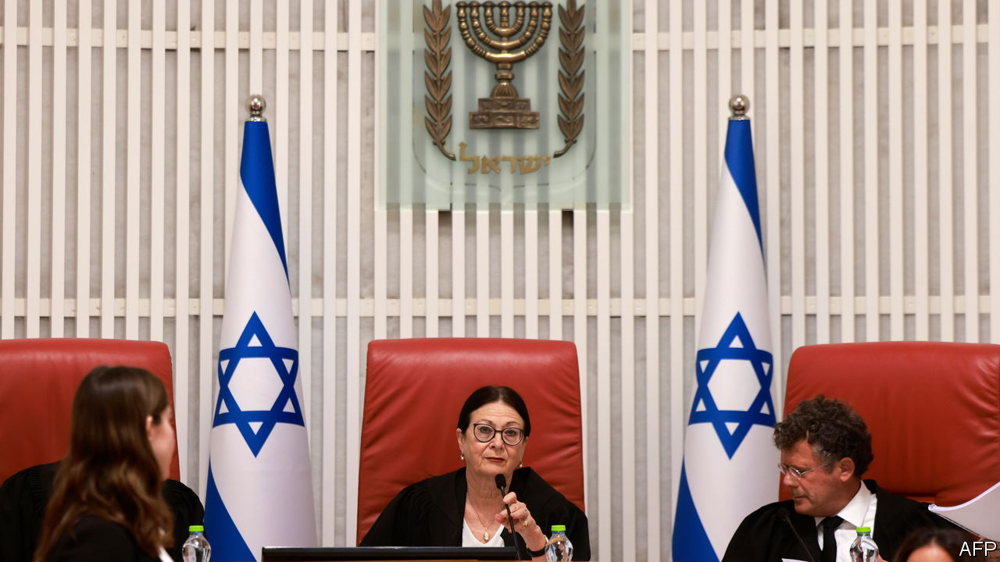

###### The constitutional crisis can wait

# Israel’s Supreme Court strikes back 

##### The justices block a controversial law aimed at weakening the power of the courts 

 

> Jan 2nd 2024 

AT ANY OTHER time it would have provoked a constitutional crisis. For much of 2023 Israelis had taken to the streets to protest against the government’s efforts to  to overrule the government, a step many saw as an attack on Israel’s democracy. Yet when on January 1st Israel’s highest court struck down the judicial-reform law passed just six months earlier, most Israelis shrugged. Since Hamas attacked in October, killing or kidnapping some 1,400 people and , Israelis have had bigger issues to worry about. Even so, the ruling is a notable blow to the right-wing government led by , and its ramifications will be felt long after the fighting in Gaza has ended.

The court’s former president, Esther Hayut, in one of the last rulings of her tenure which ended in October, said that this was one of the “rare cases where the beating heart of a constitution…is harmed”. She was referring to an amendment passed last July in the Knesset, Israel’s parliament, which all but eliminated the court’s ability to overturn government decisions that it deemed “unreasonable”. 

Only a bare majority, eight of the court’s 15 judges, ruled to nullify the legislation itself, but there was an additional ruling of even greater significance. Twelve of the judges agreed that, in principle, the Supreme Court has the power to strike down changes to Israel’s quasi-constitutional Basic Laws, in “rare and extreme cases [where] the Knesset has overstepped its constitutional powers”. 

It was a stern rebuke to Mr Netanyahu’s coalition, which took power at the end of 2022 promising to weaken the independence of the Supreme Court. The legal reforms proposed by Yariv Levin, the hardline minister of justice, went beyond giving the government and parliament immunity from the court’s “reasonableness standard”. They included giving the governing coalition control over the appointments of judges and ending the professional independence of the government’s legal counsels. Yet amid widespread protests and civil unrest, the coalition government had succeeded in forcing through only its abolition of the reasonableness standard. Now the court has put an end to that initiative, too.

Mr Levin responded to the ruling by saying that the judges had “taken into their hands all the authorities that are supposed to be divided between the three branches of government in a democracy”. However, in a nod to the war, he added that the coalition would “act with restraint and responsibility”. Senior members of the ruling Likud party acknowledged in private that this was “the end of the legal reform”. Mr Netanyahu’s government has plummeted in the polls since the war began and it is unlikely to relaunch such a controversial policy once the war ends, when many expect the country to hold early elections. 

The court’s ruling in defence of its own powers to overturn the government is a bold one, given that Israel does not have a formal written constitution defining the separation of powers between the judiciary, legislature and executive. Yet the ruling will not put an end to the battle over the character of Israel’s democracy—between right-wing and religious sections of Israeli society on the one hand and liberal, secular ones on the other—that led to the government’s efforts to hobble the judges in the first place. When Israel declared its independence in 1948, it postponed passing a constitution because those disagreements seemed too difficult to resolve and, in any case, it had a war to fight. ■

