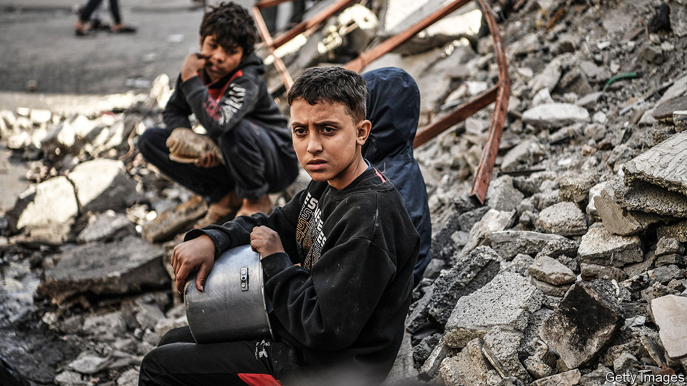

###### No relief

# War, hunger and disease stalk Gaza’s 2.2m people 

##### The territory is on the verge of famine after three months of war 

 

> Jan 4th 2024 

ASK anyone in Gaza what he or she ate yesterday, and the answer will be brief. Families are surviving on scraps from the UN and other aid agencies. One father got two packs of cheese and some crackers on his last supply run; another went home with only a tin of beans. Mothers gather weeds to feed their children. The UN’s World Food Programme (WFP) says half of the displaced families in southern Gaza go entire days without eating anything.

On January 1st Israel announced that it would begin withdrawing some troops from Gaza. Reservists from two brigades would be sent home while those from three others would return to Israel for training. The drawdown may signal the slow start of the war’s next stage.


Israel needs fewer troops in northern Gaza. Much of it is in ruins. Yoav Gallant, the defence minister, says the army has destroyed the 12 Hamas battalions that were there. Sending reservists home could give some respite to Israel’s economy, which is short of workers due to the mass mobilisation. It could also appease America, which has pushed Israel to shift to a lower-intensity campaign of targeted raids.

But it will bring scant relief to Gazans, who have endured three months of war. The UN estimates that 85% of the territory’s 2.2m people have been displaced. Hundreds of thousands have ended up in Rafah, the southernmost city in Gaza, which is now more densely populated than New York City. Luckier ones found shelter with family or friends. The rest live in tents or makeshift shelters, crowding once-vacant lots now filled with dwellings just a metre or two apart.

Ahmed Masri fled Beit Lahiya in northern Gaza in the first month of the war. After a stay in Khan Younis, in southern Gaza, he moved to Rafah in early December. He sent a photo of how his family of six has lived for the past month: under a tarpaulin held up by plywood scavenged from a construction site. “We were lucky,” he says. “The people arriving now, they can’t find wood.”

Cramped, filthy conditions are spreading disease. The World Health Organisation says that 180,000 people are suffering from respiratory infections. It has recorded 136,400 cases of diarrhoea and 55,400 cases of lice and scabies, among other ailments. Only about one-third of Gaza’s hospitals are even partly functional, and they are short of basic supplies; those in the south are operating at three times their intended capacity.

For most families, though, the most pressing concern is food. The WFP says that “virtually all households” in Gaza are skipping meals and that 26% of the territory’s population suffers from an “extreme lack of food”. The WFP has three criteria for declaring a famine. Gaza already meets at least one of them.

Israel says it is not obstructing aid deliveries to Gaza. It blames Hamas for stealing supplies, and the UN and charities for not sending more. There is evidence that the former claim is true, but even if it were not, the aid entering Gaza would be insufficient to feed the population. On some days fewer than 100 lorries enter the enclave, compared with 500 before the war, when Gaza also had its own farms to provide food. The few products in local markets have soared in price: a sack of flour now costs around 500 shekels ($137), ten times its pre-war cost.

As for not sending enough supplies, aid workers would like to bring more into Gaza, but the logistics are a nightmare. Lorries must be inspected at an Israeli-controlled checkpoint, where an ever growing list of prohibited goods (including things like water filters) are removed. The Rafah border crossing with Egypt is not designed for large volumes of goods. Once inside Gaza, lorries must navigate damaged roads and daily bombing.

Though it sent some reservists home, Israel insists there are long months of fighting ahead. If it does not do more to facilitate the entry of humanitarian aid—perhaps by sea, an idea European countries have discussed—those months will push Gaza into a man-made famine. ■

