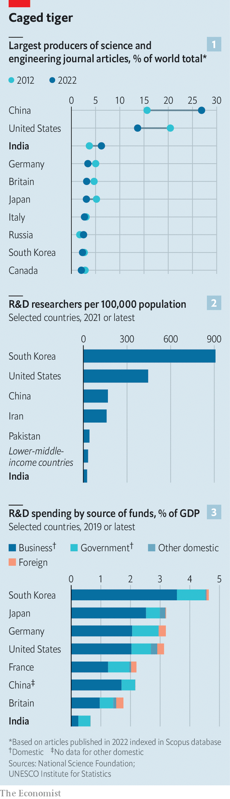

###### Big Bangalore theory

# Moon landing apart, Indian science punches far below its weight 

##### The government needs to get out of the way and the private sector should step up 

 

> Jan 3rd 2024 

Shivakumarriah V. wanted to get his head examined. Not that his behaviour had been odd of late. The 61-year-old civil contractor was on a routine visit to the Indian Institute of Science (IISc) in Bangalore, the country’s leading research institution and one of his clients, when he heard about a study into the human brain. So he offered his up for inspection.

He arrived at the sleek new Centre for Brain Research (CBR) in IISc’s lush campus early one morning in November. Clinicians took his height, weight and blood and checked his heart. A neuropsychologist conducted a cognitive assessment. Another clinician checked his gait and balance, looked at the back of his eyeballs for a test known as optical coherence tomography, and, after a light lunch, led him to another room for an mRI.

The aim is to monitor Mr Shivakumarriah’s brain, as well as those of another 1,500 volunteers in Bangalore and 10,000 in the village of Srinivaspura, about 100km away, every year or two for at least ten years, maybe 20. At the end of it, CBR will have richly detailed longitudinal data on the brain health of Indians, which it hopes will lead to better understanding of the causes of—and ways to postpone—dementia and other neurodegenerative diseases. Similar studies such as Boston University’s Framingham Heart Study Brain Ageing Programme yield data on a Western cohort. For the first time, “we will have data on Indians”, says Thomas Gregor Issac, an associate professor at CBR.

You took me to heaven

Indian science seems to be having a moment in the Sun—and other celestial bodies, too. In September the Indian Space Research Organisation (ISRO), a government body, launched , an indigenously designed spacecraft, to study the Sun. That was ten days after ISRO landed a spacecraft on the Moon, making India only the fourth country to manage the feat, and sent a rover pootling about to take pictures and analyse samples of lunar regolith. This year the space agency is expected to send a mission to Venus. Human space flight should follow no later than 2025.


Back on Earth a covid-19 vaccine, developed by Oxford University and AstraZeneca, was produced mainly by an Indian company, Serum Institute of India, and became the world’s cheapest and most widely administered. The same firm has jointly developed a malaria vaccine, which was approved by the World Health Organisation in October 2023.

When it comes to projects with clear goals—such as the brain research at CBR or space technology at iSRO—India does well. Indeed, the government has a set of nine “missions” aimed at boosting the country’s research, including in artificial intelligence (AI), quantum computing and deep ocean exploration. The government plans to set up three “centres of excellence” for AI in top academic institutions and is also funding the construction of a gravitational-wave observatory as part of lIGO, an international scientific collaboration.

All this is impressive. But India still has a long way to go before it can compete with the most scientifically advanced nations in the world. Its researchers and institutions are hobbled by a dearth of money, by the loss of talent to richer and better-equipped institutions abroad, and by thickets of red tape. Under Narendra Modi, India’s prime minister, the government is prioritising science and setting ambitious goals to improve both the quantity and quality of its research output. Can it achieve its aims? 

And then back to Earth

There is plenty of potential. India has the biggest population in the world, its economy is growing at a blistering 7%, and its scientists populate the world’s top institutions. Yet projects like CBR’s remain exceptionally rare: India punches embarrassingly below its weight when it comes to its own scientific output. It does produce the world’s third-highest number of journal articles in science and engineering, up from 3.7% of the total in 2012 to 6.2% a decade later (see chart 1). But that is still puny when compared with America (13.7%) and China (26.9%). On a list of the world’s best universities, the first entry from India comes in at 149, eight spots below China’s seventh-ranked one. In a ranking of the top academic institutions in the natural sciences its best, IISc, is ranked 122nd.

Scientific research in India operates under a number of constraints. There are a mere 26 researchers per 100,000 people, compared with an average of 32 in other lower-middle-income countries (see chart 2), 169 in China and 445 in America. India spends very little, too. At 0.65% of GDP, research and development (R&D) funding is less than half that in other lower-middle income countries and the lowest of any major science power (see chart 3). 

 


Some would argue that this is as it should be. Despite its rapid economic and geopolitical rise, India remains a desperately poor country. A third of the world’s undernourished people live within its borders. Stunting afflicts one in three Indian children. And 10% of its 1.4bn people—more than the population of Mexico—live in extreme poverty, earning less than $2.15 a day. Unlike China or America, the argument goes, India can ill afford to spend money on useless things like research.

This is wrong-headed thrice over. Practicality is one counterargument. India faces immense challenges, in everything from sanitation and health care to sustainability and air quality. It can borrow ideas from other countries, but even those must be adapted into bespoke solutions by a skilled scientist class.

A philosophical counter to the argument is that theoretical breakthroughs without any obvious utility are valuable in themselves. New knowledge may not immediately lend itself to application, but it creates the foundations upon which “to attack practical problems in a scientific spirit”, as Abraham Flexner, the founding director of the Institute for Advanced Study in Princeton, home to 35 Nobel laureates, put it in an essay, “The usefulness of useless knowledge”, published in 1939. “To be sure, we shall thus waste some precious dollars,” Flexner wrote. But the return on investment can be enormous.

The last counter is economic. “If Apple manufactures something in India, billions of market capitalisation gets created somewhere else,” says Kris Gopalakrishnan, a co-founder and former CEO of Infosys, a software-services firm. “If India wants to create disproportionate growth in its wealth it will come from creating products and technology that Indian entities, Indian shareholders own.” 

Be in no doubt that India wants to create rapid growth. Mr Modi promises citizens that theirs will be a “developed country” by 2047, the 100th anniversary of its independence from British rule (see Finance & economics section). In 2023, addressing the Indian Science Congress, a big annual conference, he explicitly linked that goal with the country’s research base, noting the role of “scientific power” in the country’s rise over the next quarter-century. The chief instrument to boost that power is the National Research Foundation (NRF), which was created by an act of Parliament last year. Modelled on America’s National Science Foundation, it envisions spending 500bn rupees ($6bn) over five years to overhaul and streamline Indian research funding.

Lessons to learn

The challenges facing Indian science, many of which the NRF is intended to fix, are legion. But they can be sorted into four broad buckets. The first is money. India’s overall spending on R&D is low by global standards, but the government is, surprisingly, blameless. Among other major science powers, the state rarely funds more than a quarter of a country’s overall R&D spending, with the rest made up by industry and philanthropy. In India the government accounts for nearly two-thirds. Measured in terms of purchasing power, its dollar contribution is more than twice as high as the British government’s. It is the private sector that is not pulling its weight.

The low participation by private companies can be partly explained by the way government money is distributed. Nearly two-thirds of India’s R&D spending is devoted to defence, the space programme and atomic energy, areas in which the state has not traditionally collaborated with industry. Government bodies and agencies perform more than half of R&D in India, compared with 16% in China and under 10% in most other advanced economies. What money remains for academic research institutions is spread too thinly across far too many projects. 

The second bucket is institutions. India has about 40,000 of them focused on higher education, but less than 1% engage in research. This small cadre of elite institutions produces much of India’s scientific output, while the majority of universities busy themselves with teaching. Few places do both well. 

Moreover, most top-class institutions focus on specific disciplines, with few opportunities for collaboration across areas of science, let alone with the humanities. Nor do they work much with each other. The result is a science establishment that is less than the sum of its parts. There is an urgent need to address both “unnecessary duplication” and “the gaps which are in our R&D system”, admits Ajay Sood, a physicist who now serves as the principal scientific adviser to the government of India, a position created in 1999.

The third major problem for Indian science is talent. At first blush this seems counter-intuitive. Researchers at the country’s top state institutions uniformly express satisfaction with their salaries, and India is teeming with people. At 31%, a larger proportion of its graduates studied STEM subjects than in America (20%) or even Israel (27%). But many students graduate with a poor education because of inadequate facilities, mediocre teaching and outdated curriculums, and many of the most talented go abroad. India loses people to overseas institutions at every stage: masters, PhD and post-doc. Once they have gone, it is difficult to get them back.

Last year India became the largest source of overseas graduate students in America, ahead of China. Including undergraduates, Indians now make up a quarter of all foreign university students in America. Of the roughly 2.5m immigrant STEM workers in that country, 29% are Indian. In ai, India is the source of 8% of the world’s top researchers; the proportion who work in India itself rounds to zero.

The NRF is designed to solve each of these problems. Officials say they would like to see India’s research-spending-to-GDP ratio more than double, to between 1.5% and 1.8%, with most of the new cash coming from industry. Research institutions will be incentivised to submit proposals for grants jointly with businesses that have committed their own funding. Of the NRF’s 500bn-rupee expenditure, only 140bn rupees, or 28%, will come from the state. For its part, the government says it will fund more high-risk projects.

A second strand of the NRF is connecting research institutions with each other and with universities. One way to do this is to set up “centres of excellence”, for example in quantum computing and communication at smaller universities, and then lure scientists from elite institutions with the promise of autonomy, equipment and a mandate to recruit the best researchers from anywhere in the world.

To make that last bit possible, the government plans to raise funding for post-docs and to set up endowed professorships. At current salary levels, someone working in America “is getting ten times more money. So why should he come back? Or why should someone in India not go?” asks Akhilesh Gupta who, as a senior adviser in the department of science and technology, is a key figure in the implementation of the nRF. Good facilities and good professors should, the hope is, attract good students, helping to stanch the flow of talent to the West. Moreover, the National Education Policy of 2020 seeks to restructure higher education to produce better qualified undergraduates, too.

The brain research centre in Bangalore, which predates NRF by several years, is an example of how elements of this plan could work in practice. It was set up as a public-private partnership with IISc in 2014 thanks to the gift of a huge sum, by Indian standards, of 2.25bn rupees ($27m) over ten years by Mr Gopalakrishnan’s philanthropic organisation, Pratiksha Trust. Last year the foundation topped up funding with another 4.5bn rupees. The CBR has world-class facilities, scientists who are well paid, and a long-term mandate. Its shiny new building contrasts with the dated early- and mid-20th-century edifices elsewhere on the IISc campus, whose interiors seem stuck in time. Yet the ranks of Indian philanthropists giving money to domestic research institutions can be counted on the fingers of two hands.

Riding on a silver dream

Attracting researchers back to India will in part depend on the success of such partnerships. But they have to contend with a fourth constraint on Indian science: bureaucracy. The current system can be stifling for those with experience of academic life abroad. Consider the case of Yamuna Krishnan, a chemist. Queuing for coffee one day in 2005 at the University of Cambridge, where she was a post-doc, she overheard a fellow caffeine-seeker complain to his mate that “all science from China and India is copy-cattery”. “I was seething by the time I reached the front of the queue,” says Dr Krishnan. She returned to India because “I wanted to show that you can do something completely original.”

 


She quickly found a position at the National Centre for Biological Sciences in Bangalore, a rare institution open to interdisciplinary appointments, and spent nearly a decade engineering DNA molecules into tiny machines inside biological cells. But eventually Dr Krishnan grew weary of bureaucratic hurdles to advancing her work, of the difficulty of collaborating with medical schools, and of demands for “deliverables” that lead to the creation of products. Despite having found applications for her work—which government funding bodies prize above all—she found it impossible to take forward. “I realised it was not going to be possible without me giving up being a scientist and becoming an administrator,” says Dr Krishnan. “The way academia is run by the government, it treats everybody like a crook.” She eventually moved to the University of Chicago.

Bureaucracy in the form of excessive control, overbearing regulations and limited autonomy is the chief complaint of India’s researchers and institute directors. Irritants range from the irksome to the infuriating. Guidelines around faculty-to-student ratios prevent institutes from hiring more researchers. Funds often take months to arrive only to be yanked away at the end of the financial year. A newish procurement system aimed at levelling the playing field for vendors across India’s single market has led to higher prices and slower deliveries of equipment. Purchases from overseas are even harder. 

As a result the quality of Indian science is uneven: it is world-class in theoretical fields such as string theory, but lags behind in disciplines that require equipment and experimentation. This may also be partly to blame for India’s poor show in translating research into applications.

A deep suspicion of the outside world is a common theme: arranging conferences with international visitors is made more fraught by the need to seek permission from central ministries. It is sometimes granted just a few days before the event. Government clearance is required for foreign trips longer than a few days. Non-Indian post-docs are subject to humiliating annual reporting requirements.

The sorts of rules that apply to running electricity departments or the postal service should not apply to running scientific institutions, grumbles Rajesh Gopakumar, a theoretical physicist and director of the International Centre for Theoretical Sciences in Bangalore. Umesh Waghmare, president of the Indian Academy of Sciences, says it is difficult even to meet officials to discuss these problems.

Researchers across disciplines are particularly exercised by what they see as an increasingly narrow focus on tangible outcomes: useful inventions rather than advances in basic science. “That has created a bit of a void when it comes to people who do research for curiosity,” says Arindam Ghosh, a physicist at IISc. Expecting industry to take up the slack is a non-starter. “Right now the thinking is that for a country like India applied research is important. Of course it is. But so is basic research,” says Kiran Mazumdar-Shaw, a self-made billionaire whose fortune comes from Biocon, a biopharmaceutical firm. “Let’s be honest: the private sector is not keen on funding basic research.”

Dr Gupta says the government recognises that it must continue supporting fundamental science, expecting businesses to get involved only if they see clear benefit. But bureaucracy and a deep lacuna of trust are obstacles here, too. “The private sector thinks that all government people are corrupt. The government thinks that the private sector will waste [its] money. Both these perceptions are not wrong,” says Dr Gupta. “We do have people of these kinds on both sides. But I think we need new trust-building.”

This is one area where the NRF falls spectacularly short. It was envisioned as an arm’s-length body whose board would be made up mostly of leading researchers, with a third of its members from industry and philanthropy. Instead, the NRF will be led by a board made up chiefly of officials, with the prime minister as president and ministers of education and science as vice-presidents. Actual scientists “may” be appointed, but no more than a handful. “It is not just this government. Indian governments have not historically understood the meaning of the word ‘autonomy’,” says one policy analyst.

Bureaucracy and state meddling are not uniquely Indian sins. But in few places has so much changed so little. In 1967 Ward Morehouse, an American intellectual, began writing a book looking at the first two decades of science in independent India. Entitled “Sarkar and Vigyan: Government and Science in India”, and edited by Jahnavi Phalkey, a science historian, it will be finally published later this year. In it, he notes that “a majority of the scientists and technologists we have, are made less effective through the lack of the right type of administrative support”.

In 1998 A.P. J. Abdul Kalam, the father of India’s nuclear bomb, the country’s first principal scientific adviser, and a future president of India, co-wrote “India 2020”, a how-to guide for making India a developed country in a quarter of a century. (Sound familiar?) “All of us [scientists] have to keep pushing for...liberalisation and empowerment,” he wrote. The role of the government, meanwhile, “is to shed its presence and to empower various agencies within itself and also to empower private initiatives”. The NRF is clear in its intention to do the latter. But the government has yet to recognise that it is its own hand that is holding back the ascent of India’s science. ■


