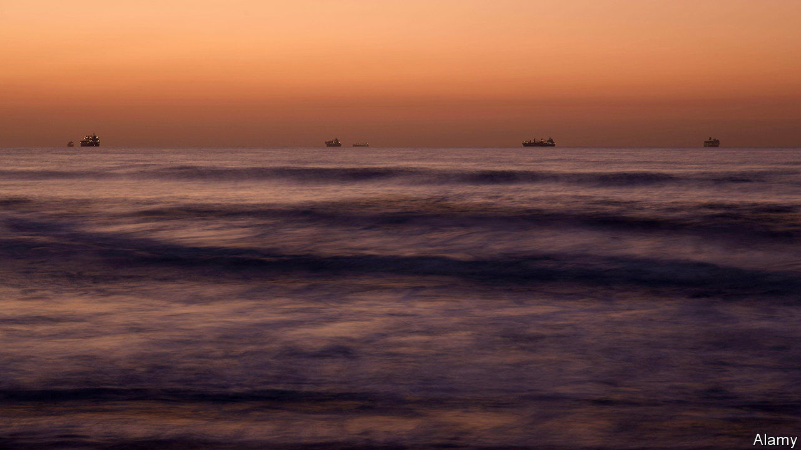
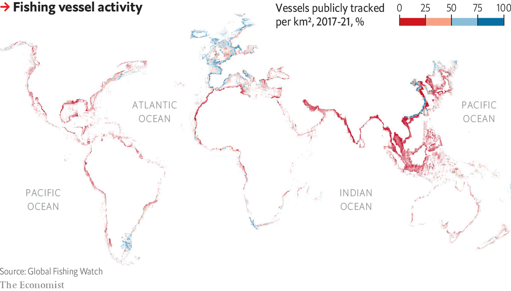

###### Ghost ships

# Vast amounts of the world’s shipping sails unseen 

##### New AI tools could help to eradicate blind spots on the oceans 

 

> Jan 3rd 2024 

In maritime legend, the  traversed the world’s oceans undetectable except to the naked eye. Its mysterious voyages have inspired poems, novels, an opera, and, it would seem, an armada of imitators.

According to a new study in , three-quarters of all industrial fishing vessels and a quarter of transport and energy ships (a category that includes oil tankers, cargo ships, passenger ships and support vessels), have been left out of previous tallies of human activity at sea. The oversight is substantial—the UN has previously calculated that the maritime economy represents a value of $1.5trn a year.

The underestimate suggests current mapping techniques cannot be relied upon for an accurate picture of seafaring practice. Most public mapping is done through the automatic identification system (AIS), which relies on ships to broadcast their location, identity and activities to those onshore. But coverage is patchy. The European Union requires AIS broadcasts from all ships longer than 15m, while Americans spare those shorter than 19m. China, Japan and South Korea have no specific AIS regulations. Large areas of the world, including much of the Pacific and South Atlantic, have poor AIS reception.

Much of the missing tonnage has its origins in Asia, where the number of untracked vessels exceeds those from all other continents combined. Other hotspots for dark sailing include the Gulf of Mexico and regions on the northern and north-western coasts of Africa.

The latest analysis was undertaken by researchers led by Global Fishing Watch, a non-profit organisation that builds maps and technology to track activity on the world’s oceans. The researchers used satellite data that provided continuous high-resolution images of the busiest 15% of the world’s oceans from 2017 to 2021, and cross-checked this vast dataset with 53bn historical ship locations available through AIS. They then trained neural networks to recognise ships, based on their characteristic glare of reflected light, and used data such as distance from port, daily speed and nearby signs of marine life to classify their activity. While noting that most vessels shorter than 15m probably escaped their view, they estimated a false positive rate of less than 2% for those they did identify.

 


Though legitimate reasons exist for sailing incognito, the researchers point to a number of suspicious sites of activity (see map). These include a region in North Korean waters that the authors suggest corresponds to illegal fishing, having briefly boasted the world’s highest density of fishing vessels between 2017 and 2019. Meanwhile the Great Barrier Reef Marine Park, off the eastern coast of Australia, was visited by an average of three fishing vessels a day, suggesting possible unobserved environmental damage.

The researchers were also able to monitor the growth in stationary ocean-based infrastructure, an area where no comprehensive data is publicly available. On the positive side, they found that the number of wind turbines in China increased by 900% between 2017 and 2021; Britain and Germany led growth in Europe with more modest figures of 49% and 28%, respectively. However, the number of offshore oil structures also increased by 16% during that same period. 

With improved satellite data, and yet more sophisticated algorithms, an even clearer picture of ocean traffic will soon emerge. The  of the world, wherever they may be, will be mysterious no longer. ■


