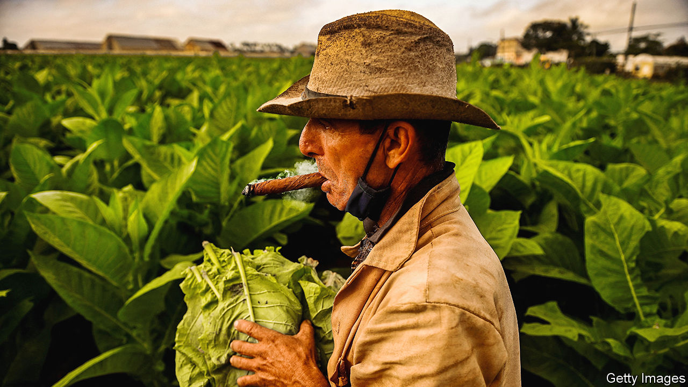

###### Until forever, failing

# Cuba’s private-sector experiment is faltering 

##### Mostly because it is not bold enough 

 

> Jan 3rd 2024 

It was an admission of sorts. When Manuel Marrero Cruz, Cuba’s prime minister, stood in front of the National Assembly in late December to announce a package of new economic measures, he first blamed the American embargo for the woeful state of the country’s economy. But then he added: “We could have done much more.” That is an understatement. 

 is in its worst state since the collapse of the Soviet Union in the 1990s. Even the official figures—which one Western businessman in Havana, the capital, describes as “an exercise in a cover-up”—make grim reading. Annual inflation, according to the government, is at 30%. The fiscal deficit is forecast to be at least 18% of GDP in 2024. In 2023 the economy contracted by around 2%, according to Alejandro Gil, the economy minister. 

Unable to take part in a democratic election, many Cubans are voting with their feet. Migration from the island is at its highest level since the revolution in 1959, reports the Washington Office on Latin America, an advocacy group. During the fiscal years of 2022 and 2023 some 425,000 Cuban migrants went to the United States and 36,000 submitted asylum applications in Mexico. That is more than 4% of the population. Many have left for other destinations, including Russia, where detailed migration figures are not published. At the start of the school term in September, Cuban schools were missing 17,000 teachers, according to the ministry of education. 

Some of Cuba’s problems have been exacerbated by recent events. During Donald Trump’s tenure as president of the United States, sanctions on the island were tightened. Cuba was also added to a list of state sponsors of terrorism. Meanwhile tourism, which accounted for 11% of GDP in 2019, has not recovered from the pandemic. In 2023 the number of visitors was barely 2m, though the government had hoped for 3.5m. Last year Venezuela reduced its shipments of crude oil to the island, as it was struggling to process enough for its own needs. That caused Cuba’s government to impose rationing and warn of blackouts. (Shipments rebounded in September, before being cut again in November, after American sanctions on Venezuela’s state oil company were lifted.) 

But the biggest problem is the enduring reluctance of Cuba’s rulers to allow the private sector to thrive. Much has changed in the country since Fidel Castro, the revolutionary leader, declared in 1968 that “there will be no future in this nation for private business or the self-employed”. Raúl Castro, Fidel’s brother and successor, who formally took over the presidency in 2008, moved to end certain pretences such as the idea that Cubans would rather swap their houses than sell them. A modest housing market now exists. 

Since 2018 under Miguel Díaz-Canel, the current president, private enterprise has been steadily extended, too. In 2021 Cubans, previously restricted to being sole traders, were permitted to become entrepreneurs and run small- and medium-size enterprises (with up to 100 employees). There are now 10,000 of these SMEs, accounting for fully 14% of GDP. They fill the gaps where the inefficient state has failed. Delivery companies which import food are one example. “It’s all easier here now, if you have money. I order everything online,” says one Havana-based expatriate as he displays his well-stocked freezer, crammed with American frozen food. 

It was clear from the meeting of the National Assembly in December, however, that any further attempts to open up the economy to the free market would be resisted by the regime’s elderly top brass, many of whom were schooled by Castro. “We are stuck. We need to increase production!” Esteban Lazo, the 79-year-old president of the Assembly, blurted out in despair during one meeting. 

Mr Lazo complains about the symptom, but not the cause. It is he and his cohort who have prevented some of the basic reforms which the country desperately needs. This is particularly notable in the agricultural sector. Farmers cannot import their own equipment or sell most of their produce directly to consumers; instead they have to go through the state. But the government is useless at getting fuel and parts to farmers. Cuban agricultural production fell by 35% between 2019 and 2023, according to official figures.

Another example of old-fashioned thinking concerns the exchange rate. Cuba’s two-currency system was scrapped in 2021. But there are still official fixed rates of 24 Cuban pesos per US dollar for state enterprises and 120 to the dollar for individuals. The black-market rate, however, is more than 270 pesos for each dollar. 

The mismatch causes a series of distortions, most of which favour the rich. Petrol is priced at 30 pesos a litre, which at the black-market rate is equivalent to about ten US cents per litre. That is cheaper than in Kuwait, where petrol is heavily subsidised. Opulent early-20th-century mansions, confiscated from the “bourgeoisie” by the state after the revolution in 1959, can be rented from a government-owned estate agent in Havana for around $300 a month if you pay in pesos, in cash and know the right people.

Yet instead of accepting that its official rate is out of kilter, the government blames the messenger. At the assembly meeting Mr Marrero, the prime minister, accused foreign websites, which track the street exchange rate, of publishing what he said were “fictitious” rates. The data-publishers are “enemies” of the revolution, he said. 

There are some reformers in government. Mr Díaz-Canel is believed to be more sympathetic to private business than his elderly colleagues. On December 29th he said the state was not embarking on a “crusade” against the private sector, but warned that it would not be allowed to become an anti-revolutionary faction either. The message was that political loyalty still remains a prerequisite for running a business in Cuba. Mr Gil, the economy minister, is also viewed as a cautious reformer. 

Some changes were announced at the meeting last month, including an unspecified rise in the price of petrol and a 25% rise in electricity prices for heavy consumers this year. Although that is a move in the right direction, it will hit private businesses, most of which have so far enjoyed almost free electricity. There is also a plan to phase out subsidised staples, such as rice or sugar, and instead provide direct benefits to poorer people. Mr Díaz-Canel said the measures “will give a necessary jolt to the economy”. He added: “We will make more revolution and more socialism.” 

In practice, that seems unlikely. More probable is that a manipulated private sector and artificial exchange rate will benefit a few well-placed insiders, while small tweaks to a rotten system will not be enough to stem Cuba’s decline. ■

