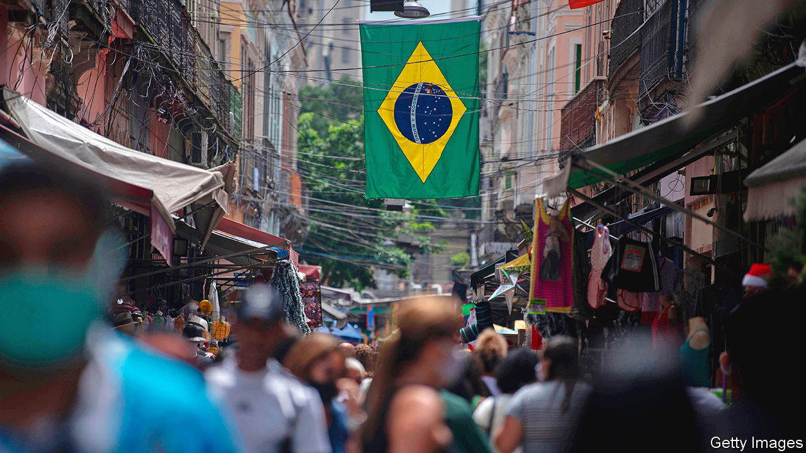

###### Hacker heaven

# Why is Brazil a hotspot for financial crime? 

##### Its success as a fintech hub is mostly to blame 

 

> Jan 4th 2024 

Brazillians have long been early adopters of fintech. In 2017 EY, an accounting firm, found that two-fifths of Brazilians regularly used online banking, one of the highest rates worldwide. In 2020 44% of customers had a digital-only account, compared with less than 20% in the United States and Canada, according to a survey by Accenture, a consulting firm. That year the central bank released Pix, an instant-payments platform. It has been wildly successful. Today it has 3bn transactions a month. That is five times more than transactions by debit and credit cards combined.

This bonanza has attracted cyber-criminals. Their main weapon has been the “banking trojan”, a programme that steals users’ account information. According to Kaspersky Lab, a cyber-security firm, Brazil is the top country for attacks by banking trojans, with 1.8m attempted infections from June 2022 to July 2023 (the latest data available). Globally eight of the 13 most popular types of trojans are made in Brazil. 

Cyber-criminals initially focused on trojans as they require little skill to use. However, as banks developed better defences, criminals were forced to branch out into more complex and lucrative attacks. Brazil’s underworld has developed the most advanced “point of sale” malware, which scammers use to filch bank details from card readers, according to Kaspersky Lab. Known as Prilex, this application can block contactless payments by stopping the short-range connection between a credit card and the payment terminal. The terminal reads: “Error. Please Insert.” When a customer inserts her card and PIN, the malware uses the credentials to authorise a fraudulent transaction. During Rio’s carnival in 2016, a hacker used a basic version of this software to remotely take over 1,000 ATMs. 

Another example is ransomware, which gangs use to scramble computers and demand money to restore them. In October last year Brazil’s lawmakers met to discuss the increasing use of artificial intelligence in cyber-crime, too. 

The financial losses are big. According to Andre Fleury of Accenture, Brazil is in the top five countries for the cost of cyber-crime. He estimates the figure is around $20bn per year. That is the equivalent of 0.9% of GDP. There is some hope, though. In 2022 a hefty data-protection law came into effect, forcing companies to defend consumers’ data. In 2023 Brazil’s banks spent $9bn on cyber-security, nearly double the amount in 2019, according to the Brazilian Federation of Banks. The bigger problem is naive customers who fall for scams, says Eduardo Mônaco of ClearSale, a Brazilian fraud-management company. Until they fully know the risks, there will be plenty more phish in the sea. ■

