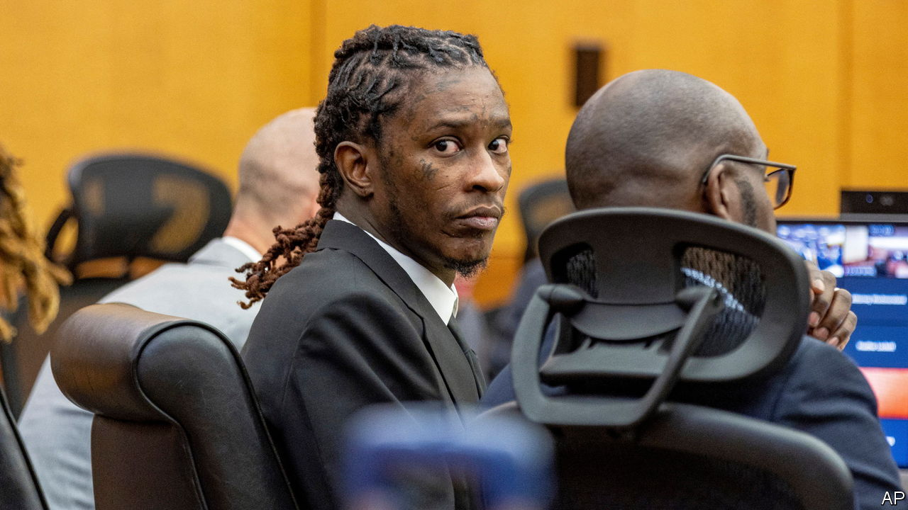

###### The Economist explains

# How art is used against artists, like Young Thug, in court 

##### The lyrics of rap music are regularly used as evidence in criminal trials 

 

> Jan 2nd 2024 

THE “P” IN “Pushin P”, a song featuring Young Thug, does not refer to the street name for methamphetamine, according to the rapper’s lawyers—rather, it stands for “positivity”. The threatening connotations of “Thug” are also misleading, they claim. That supposedly stands for “Truly Humbled Under God”. And his lyrics, which often reference drugs and violence, are supposedly written from the perspective of a fake persona. 

Prosecutors do not buy it. Jeffrey Williams, the Atlanta-born artist behind the pseudonym, stands accused of eight counts, including racketeering and gang conspiracy. (He denies all charges.) In a trial which recommences on January 2nd, at least 17 sets of lyrics will be submitted as evidence against him. Young Thug is perhaps the best-known rapper to , but he is not alone. In America and Britain, rap lyrics are increasingly presented by prosecutors as confessions. How is art used in court—and why is rap music singled out?

Most art forms find their way into court only when the case is about the work itself, such as trials involving theft or forgeries. Art can also be thrust into the dock when it offends the establishment. In the 1920s police in America arrested blues singers when their songs were dubbed the “devil’s music”. “”, a novel by D.H. Lawrence, a British writer, about an affair was at the centre of an obscenity trial in 1960. Lawyers in Nevada slapped Judas Priest, a British rock band, with a lawsuit over alleged subliminal messaging as the “Satanic Panic” took hold in the 1980s. Repressive regimes continue to try artists they dislike—a Russian court in 2012 convicted , a punk band, of hooliganism for singing “Virgin Mary, Put Putin Away” in a Moscow cathedral. 

But art is rarely used as evidence that other crimes have been committed. In 2022 “How to Murder Your Husband”, an essay listing different ways to commit the crime, was barred from a trial in America in which the author, a , was convicted of killing her spouse. (Judges noted that the text had been written years earlier, presumably before she began planning.) The same holds true for music. Before rappers picked up their microphones, lyrics were rarely used as evidence in court, says Jack Lerner of the University of California, Irvine. 

Like artists in other genres, rappers have faced their fair share of obscenity trials. But today they are not usually prosecuted for their art alone. As in Young Thug’s trial, lyrics are used as evidence against artists charged with other offences, typically relating to drugs or violence. The same is rarely true of other genres.  regularly belt out murder ballads: Johnny Cash, who sang about shooting a man in Reno “just to watch him die”, was arrested seven times, including on drug charges, but there is no record of his lyrics being used to jail him. A investigation found that since 1950 just four trials had used non-rap lyrics or written fiction as evidence of assault or violent threats. Hundreds of criminal cases have involved rap. 

Why is rap music treated differently? Perhaps because it is an effective way to sway a jury. People are more likely to consider identical lyrics to be threatening, and drawn from life, when told they come from rap rather than country music, according to a study by the University of California, Irvine. The term “rap music” itself can awaken latent racial bias in jurors, says Mr Lerner. Prosecutors seem to understand this: an American legal manual from 2004 encouraged the use of rap lyrics to present defendants as a “criminal wearing a do-rag and throwing a gang sign” rather than the “nicely tailored… altar boy”.

Prosecutors would retort that speech can be used as evidence. And in most instances, there is other evidence linking rappers to the crimes they are charged with. But rappers feel their creativity is being misconstrued. Jay-Z, one of the most famous, has criticised an “unwillingness to treat rap”, a form of black expression built on exaggeration and fictional storytelling, “like art”. ■

