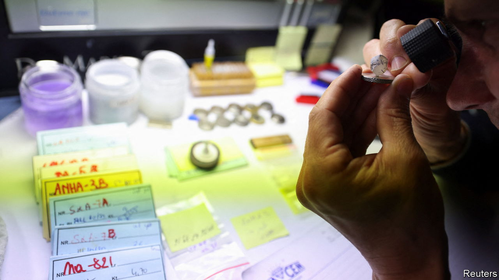

###### The Economist explains

# How sanctions on Russia will change the diamond trade 

##### New rules add up to the biggest shakeup of the industry in decades 

 

> Jan 4th 2024 

RUSSIA’S DIAMOND industry is under pressure. On January 1st the G7, a group of rich countries, and the European Union banned imports of rough diamonds mined in Russia—a third of the total extracted worldwide in 2022. On January 3rd the EU added Russia’s state mining company, and its chief executive, to its sanctions list. This is the first phase of a comprehensive sanctions scheme: in March the G7 and EU will ban Russian gems that have been cut and polished abroad. In September they will introduce a certification scheme to verify where diamonds were mined. These measures add up to the biggest change to the business in decades. Why has it taken so long to impose sanctions on Russia’s diamond industry—and what impact will they have?

Russian diamond miners generate about $4.5bn in revenue each year. That is peanuts compared with the revenue from Russia’s oil and gas exports, which, despite sanctions, was a record $384bn in 2022. Diamond sanctions are as much symbolic as they are practical. Nearly all the industry’s revenues come from the vast Siberian operations of Alrosa, a state-controlled monopoly. Anton Siluanov, Russia’s finance minister, chairs its supervisory board. Under a sponsorship deal with the Russian navy, a submarine in the Black Sea Fleet bears the company’s name.

Western governments have had Alrosa in their sights since Russia invaded Ukraine in February 2022. But until now their actions have had a small impact. The Kimberley Process, a scheme established by the United Nations in 2003 to prevent the trade in “blood diamonds” mined in war zones, cannot do the job: it operates by consensus, meaning, in effect, that Russia has a veto. America and Britain banned imports of Russian rough diamonds shortly after the war began, but more comprehensive sanctions were held up by negotiations: Western countries struggled to agree on a system, and diamond traders in Antwerp, a hub for the industry, lobbied the Belgian government to slow down the implementation of sanctions in the EU, fearing they would hurt business. Meanwhile, Russian firms could send gems abroad to be cut and polished: 90% of the global supply is processed in India. These could then be legally exported to America or Britain. Alrosa’s most recent financial results, from August 2023, showed buoyant sales.

The new sanctions will eventually close the loophole, locking all Russian diamonds out of G7 markets. In September 2023, finally satisfied with the EU’s proposals, Belgium abandoned its objections: the bloc’s participation will strengthen the sanctions’ impact. But there will still be challenges. Western sanctions on Russian oil and gas, introduced earlier in the war, have had a limited impact. The diamond industry’s complex supply chains will make an effective ban hard to implement: stones are often traded multiple times before they are sold to jewellers, and in the process gems from different countries are often grouped together and labelled as of “mixed origin”.

The new scheme will eventually make clear the source of every diamond sold in countries implementing the sanctions. Paul Zimnisky, a diamond-industry analyst in New York, thinks that mid-level processors outside the G7 and EU will have the most onerous obligations. If they are to keep trading with Russian miners and with the West they will need to be “very diligent”, he says. They will probably have to sign up to a rigorous tracing system, which may be overseen by a third party. So far the G7 has only given a rough outline of its plans for such a system. 

Technology could help. The Gemological Institute of America, an industry group, inscribes microscopic serial numbers on cut diamonds. Sarine, an Israeli firm, uses 3D scanning to create digital models. De Beers, the industry’s blue-blood miner, has an in-house tracing scheme for its most valuable stones. But none of these systems is widely used.

Even if a workable one is devised, it will be costly for Western miners and traders. It is not yet clear if those costs will be passed on to consumers. The sanctions will probably hurt Russia, too, but are unlikely to cripple its industry: it will pivot towards its growing customer base in China and India, as the oil and gas sector has. Still, the sanctions could have an indirect benefit: helping the West clamp down on the trade in blood diamonds. The Kimberley Process has largely stopped rebel groups using the gems to fund wars, but has failed to prevent governments from doing the same. A tracing system would sidestep the scheme and Russia’s influence on it. In future it may be used for stones from countries besides Russia. In time, says Mr Ziminsky, the sanctions could bring an “unprecedented level of transparency to the diamond industry.” ■

