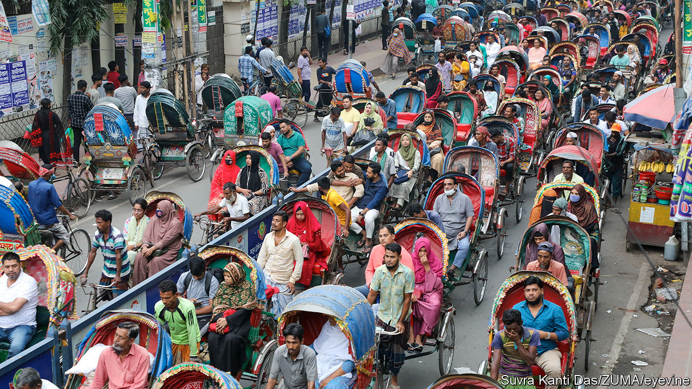

###### The Economist reads

# What to read and watch about Bangladesh 

##### Five books and a documentary explain a large and fascinating South Asian country 

 

> Jan 5th 2024 

THE OUTCOME of the election due to be held in Bangladesh on January 7th is not uncertain. Sheikh Hasina, who has governed the South Asian country since 2009, has made sure that . Her government has locked up politicians from the main opposition party, the Bangladesh Nationalist Party, which plans to boycott the election, silenced journalists and curbed the activities of NGOs. Sheikh Hasina, who heads the Awami League, has ruled repressively since she won back power from her nemesis, Khaleda Zia of the BNP, in an election 15 years ago. Some Bangladeshis accept the undermining of democracy as a price worth paying for the development that Sheikh Hasina’s government has brought. Bangladesh, which today has a population of 170m, is doing better on many measures than India, its giant neighbour, and Pakistan, the country from which it broke away in 1971. It has higher literacy and female-employment rates. Since 2016 economic growth has exceeded 7% a year.

As part of Bengal in British-ruled India, then as East Pakistan, the region that is today Bangladesh was one of the poorest corners of the subcontinent. When it gained independence in 1971 the destruction caused by its war with Pakistan was compounded by a cyclone and a famine. Bangladesh is in much better shape today. But covid-19 and the war in Ukraine have slowed economic growth and caused a cost-of-living crisis. Sheikh Hasina’s attempt to make Bangladesh a one-party state has made matters worse. The Awami League’s control of jobs and government contracts has fostered corruption and discouraged foreign investment, threatening economic growth. These five books and a documentary help explain how Bangladesh got here.

By Scott Carney and Jason Miklian. 

Bangladesh was born in a storm. The Bhola tropical cyclone, which smashed into East Pakistan in November 1970, killed perhaps 500,000 people, making it the deadliest on record. The botched response by Pakistan’s government (based in West Pakistan) paved the way for Sheikh Mujibur Rahman, the leader of the Bengali nationalist movement (and Sheikh Hasina’s father), to win a national election in the following month, write Scott Carney and Jason Miklian. Pakistan’s president, Agha Muhammad Yahya Khan, responded with force, sending troops from West Pakistan to massacre Bengalis. America’s president, Richard Nixon, and Henry Kissinger, then his national security adviser, backed Yahya. This decision went counter to the advice of diplomats in East Pakistan, including the consul-general in Dhaka, Archer Blood. Bengali independence fighters triumphed because India went to war on their side. Gary Bass  America’s part in the Bangladesh war in “The Blood Telegram: Nixon, Kissinger, and a Forgotten Genocide”, published in 2013Messrs Carney and Miklian, by contrast, focus on the natural disaster that led to all this. Climate change is probably making cyclones more intense. Low-lying Bangladesh is especially vulnerable, and has been a leader in coming up with ways to cope. “The Vortex provides an introduction to the country’s history, and sounds a warning. 

By Naomi Hossain. 

Naomi Hossain tells the story of how Bangladesh overcame adversity. Analysts have often attributed the country’s success to pro-market reforms in the 1980s that encouraged the growth of the garment industry. This brought women into the workplace and money to Bangladesh. Ms Hossain, an academic, delves deeper. Alongside economic reforms, governments brought in policies that slashed infant mortality, reduced population growth and extended life expectancy, all within a few decades. That the policies worked is clear, but how they came about is less so. “It has never been obvious why an elite known best for corruption and violent winner-takes-all politics should have committed to a progressive, inclusive development pathway,” writes Ms Hossain. She argues that, despite the political strife, the crises of the 1970s forced the elites to enter into a social contract with one another and with aid donors. Thanks in part to the density of its population and to the freedoms that the government once gave to development NGOs Bangladesh became an ideal place to test out social and economic innovations. 

By Rabindranath Tagore. Translated by William Radice. 

In the years immediately before independence Rabindranath Tagore, a Bengali poet, became a symbol of resistance and unity for East Pakistan, and remained one for newly independent Bangladesh. The country chose Tagore’s song “Amar Shonar Bangla” (“My Golden Bengal”), which he wrote to protest against the partition of Bengal by the British in 1905, to be its anthem. Tagore, who received the Nobel prize for literature in 1913, was from a landowning Hindu family. Born in Kolkata, today in the Indian state of West Bengal, he spent several years during the 1890s in his ancestral home in Shelaidaha, Kushtia, in East Bengal (Bangladesh today). There he chronicled the lives of—mostly Muslim—peasants. Tagore’s short stories are vignettes of everyday life in Bengal during the rise of India’s independence movement. They both typify and celebrate the Bengali language and a Bengali identity that transcends religious divides. This is why the government of Pakistan, founded to be a Muslim country, tried to ban some of Tagore’s works. As Bangladesh has become more Islamicised in recent decades, Tagore’s short stories have lost favour. Religious and secular Bangladeshis now have different attitudes towards writings that once inspired unity. Beautifully translated by William Radice, Tagore’s short stories help make sense of Bangladesh’s past and show why it matters so much today.

By Kazi Anis Ahmed.

Kazi Anis Ahmed, a novelist, follows in Tagore’s footsteps, explaining Bangladesh’s tumultuous politics from the perspectives of ordinary people. Narrated by a newspaper journalist, “The World in My Hands” is a satirical tale of Pandua, a fictional country, as it enters a period of military-backed rule. The story echoes Bangladesh’s military interregnum of 2007-08. The new regime, which turns out to be no less corrupt than the previous one, offers Hissam, the journalist, opportunities to get ahead in his career. He must choose whether to take them or hold on to his integrity. His business-mogul friend Kaiser is also dragged into the country’s increasingly messy politics. Escaping corruption in a country like Pandua is almost impossible, the novel suggests. 

By Al Jazeera Investigates. (2021)

The armed forces have played a central part in Bangladesh’s story and in Sheikh Hasina’s life. Soldiers murdered her father, Sheikh Mujibur, the country’s first prime minister, in a coup in 1975. For years, Sheikh Hasina, one of few survivors in her family, was determined to avenge the killings. She and Khaleda Zia briefly united against the armed forces when the military-backed caretaker government locked them both up on charges of corruption in 2007. But since 2009 Sheikh Hasina has recognised that to stay in power she must ; she has given them perks and put loyalists like Aziz Ahmed, the army’s chief until 2021, in charge. “All the Prime Minister’s Menis about the power wielded by Bangladesh’s armed forces and their relationship to Sheikh Hasina. Al Jazeera’s film uses documents and footage taken undercover to reveal how General Aziz protected his two fugitive brothers, who were convicted of murder, and how the brothers brokered military-procurement contracts and senior public jobs in exchange for bribes. The graft, the documentary alleges, goes all the way up to Sheikh Hasina, who made a secret pact with General Aziz to enlist the army’s help to win elections in 2014 and 2018. (Bangladesh’s foreign ministry and army have both denied these claims.)

 By Ali Riaz. U

Ali Riaz, a political scientist, describes the erosion of Bangladesh’s democracy and the undermining of its social and political institutions over the past 15 years. In nine essays he examines Bangladesh’s tumultuous politics from 1990, when military rule ended, until 2019; the growth of political islam and religious extremism; and the growing competition between India and China for influence, which is making the country more important geopolitically. Mr Riaz pays particular attention to Bangladesh’s relationship to India, which has become increasingly testy. Indian border guards often kill smugglers and illegal migrants from Bangladesh, which stirs up anti-India sentiment in Bangladesh (and undermines India’s ambition to be better friends with Bangladesh than China is). He does not make firm predictions but hints at what may lie ahead under Sheikh Hasina. As she looks set to embark on her fourth consecutive term as Bangladesh’s prime minister, “More Than Meets the Eye” is a must read for anyone interested in the country.

Also try

 has written extensively about both the light and dark sides of Bangladesh’s recent past. Read our  with Sheikh Hasina and our  on the risks to the country’s successful growth model. We also explored these themes in a . Despite the mistakes it has been making, Bangladesh remains a role model. Pakistan, which was struck by devastating floods in 2022, could learn from how  for such events. Bangladesh has devised clever ways of building . The country’s way of dealing with  is an example for other countries that have the problem, like India. ■

