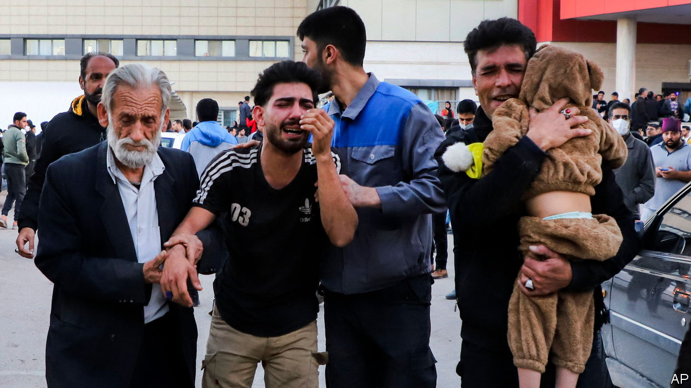

###### The world this week

# The world this week 

#####  

 

> Jan 4th 2024 

Around 100 people were killed by two bomb explosions in , in what state media and regional authorities described as a terrorist attack and which the government in Tehran later blamed on America and Israel. The blasts happened as crowds of people were heading towards the tomb of Qassem Suleimani on the fourth anniversary of his assassination by America. Suleimani had led Iran’s Quds Force and created an extensive network of militias in the Middle East, some with ties to Hamas and Hizbullah. 

 said an  drone strike killed Saleh al-Arouri, the militant group’s deputy political leader, and several of its commanders in an attack on its office in southern Beirut. Arouri had close links with Hizbullah, a militia based in Lebanon that has been shelling Israel on a near-daily basis since Hamas attacked Israel on October 7th. Meanwhile,  accused Israel of plotting to “commit actions” against Palestinians living in the country. 

The death toll from a number of attacks by Islamic nomadic herders on Christian farmers in  Plateau state rose to at least 140. Hundreds of people have been killed in the region over the years in a conflict that meshes ethno-religious feuds with rivalry over land and water. 

 stepped up its missile and drone attacks on , killing 39 people on December 29th. Ukraine responded with a barrage on the Russian border city of Belgorod, which killed 25 people. Another attack by Russia on Kharkiv and Kyiv killed five. The hostilities didn’t stop Ukraine and Russia from following through with their largest  since the start of the war. In a deal brokered by the United Arab Emirates, Ukraine released 248 Russians and Russia freed 230 Ukrainians. 

Tens of thousands of protesters took to the streets of Belgrade in the biggest demonstrations yet against  election on December 17th. The election was won by the ruling Serbian Progressive Party, tightening President Aleksandar Vucic’s grip on power. The opposition says there was widespread fraud and voter intimidation at the poll. 

 sent a new year’s message to his supporters via the X account managed by his social-media team, after resurfacing in Russia’s prison system. The country’s leading opposition figure had not been heard from for two weeks, but he has been relocated to the remote “Polar Wolf” penal colony 1,900km (1,200 miles) north-east of Moscow. He had previously been held in a prison 235km east of the city. 

Claudine Gay resigned as president of  after more allegations emerged of plagiarism in her academic writings. Claims that Ms Gay had been cribbing other people’s work surfaced after her appearance at a congressional hearing in December, where she dithered about condemning calls for genocide against Jews. Her equivocation led to a backlash from some of Harvard’s powerful donors, who questioned her leadership. 

An earthquake of magnitude 7.6 hit  Noto peninsula on the country’s west coast, killing scores of people. Separately, a Japan Airlines passenger jet that was landing at Tokyo’s Haneda airport collided with a coastguard aircraft and burst into flames. Five members of the coastguard were killed, but all 379 people on the JAL plane survived.

The leader of opposition Democratic Party of Korea, Lee Jae-myung, was stabbed in the neck. It was unclear what had motivated the attacker, a 66-year-old-man, to assault Mr Lee. The country is due to hold elections for parliament in April. 

 named Admiral Dong Jun as its new defence minister. He takes over from Li Shangfu, who was sacked two months ago and hasn’t been seen in public since August. In a sign of a wider purge, nine military officials were dismissed from their roles in the National People’s Congress. 

Javier Milei, new president, formally stopped his country from joining the expansion of the BRICS economic club. Argentina was supposed to become a new member on January 1st alongside Egypt, Ethiopia, Iran, Saudi Arabia and the United Arab Emirates. Mr Milei is an outspoken critic of China, which dominates the BRICS.

The number of illegal migrants crossing the English Channel in small boats to  fell to 29,437 in 2023. That is 36% lower than in 2022, a peak year for crossings. The government claimed the decrease showed that its policies of deterring migrants and operating a returns deal with Albania were working. Critics said the fall reflected bad maritime weather, and that the number would rise again this year. 

 lost its crown as the world’s biggest seller of electric vehicles. , a Chinese carmaker that is making a big push into overseas markets, sold 526,000 fully battery-powered cars in the final quarter of 2023, overtaking Tesla, which delivered nearly 485,000. 

The  became the first big media company in America to file a lawsuit against Microsoft and OpenAI, the creator of ChatGPT, alleging that they unlawfully used the newspaper’s content to build chatbots and “free ride” on its journalism. 

