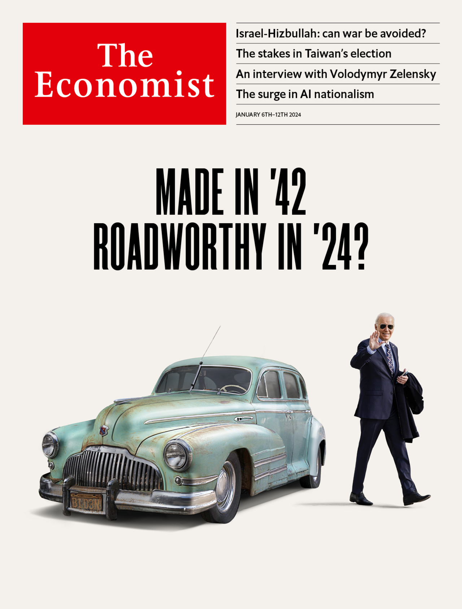

###### The Economist

# This week’s cover 

##### How we saw the world 

> Jan 4th 2024 

It’s always good to start the year by looking ahead. Inevitably, that means we are thinking about the Big Election in November. It may seem a long way off but it isn’t really, at least by the relentless calendar of American politics, and the left is already in a state of panic about the prospect of Donald Trump returning to the White House. 


Lots of Democrats would rather Joe Biden were not their presidential candidate. He doesn’t excite them. They also fear that he will lose and they see Mr Trump as a threat to democracy. The odd thing—and a further reason for this week’s cover—is that, instead of being moved either to challenge Mr Biden or to give their all in support of his campaign, many Democrats have fallen into a glassy-eyed stupor. 

We began by looking at photographs. One, for example, showed a craggy president in his aviator sunglasses. There’s no getting away from it: Mr Biden’s biggest and most intractable problem is his age. Most Americans know someone in their 80s who is starting to show their years. They also know that no matter how fine that person’s character, they do not expect them to take on the world’s hardest job.

Another design, depicting Mr Biden inside a sand timer, indicated that time is running out—not only for him but also for the Democratic Party. Filing deadlines have already passed in many states and the only other candidates on the ballot are a little-known congressman called Dean Phillips and a self-help guru called Marianne Williamson. State legislatures would have to approve new dates for the primaries closer to the convention in August. Debates would have to be organised. The field could be vast: in the Democratic primary in 2020, 29 candidates put themselves forward. 

We could not shake off the theme of time. We thought of a typographic variation, with the “B” of “Biden” as a sand timer—but whereas we are writing about Mr Biden’s political viability, this looked uncomfortably as if we thought his time was up in a more cosmic sense. 


Depicting his face as an alarm clock was weirder, but less offensive. And it chimed with the notion that this story is about missed opportunities. If Mr Biden had decided to be a one-term president, he would now be revered as a paragon of public service and a rebuke to Mr Trump’s boundless ego. But he has succumbed to the vainglorious belief that his country needs him as a proven Trump-beater. His staff’s desire to serve has been tainted by their knowledge that if he goes they will never again be so close to power.

An alternative was to focus on Mr Biden and his party. We toyed with a design showing him riding a disobedient donkey. But this could hardly have been more at odds with the truth. Like pusillanimous congressional Republicans—who could not find it within themselves to impeach or even criticise Mr Trump—Democratic stalwarts have been too meek to act on their concerns about Mr Biden’s folly.


We thought about the donkey leaping through a ring of fire. Perhaps we could raise the ring to show that the president and his party might not make it. Just now that looks all too possible. Mr Trump is leading polls in the swing states where the election will be decided. Mr Biden’s net approval rating stands at minus 16 points. If he withdrew, his replacement could be equally unelectable—Bernie Sanders, say, a self-declared democratic socialist who is a year older than the president. Or, more likely, Kamala Harris, the vice-president. Yet her chances of beating Mr Trump look even worse than her boss’s. Her campaign in 2020 was awful. Her autocue sometimes seems to have been hacked by a satirist. 

The simplest solution would have been to find a photograph of Mr Biden. We like one in which he looked like Clint Eastwood with colic. But as a cover, this had something cheap about it. Which of us, in the blink of the shutter’s eye, has not appeared feeble-minded or intoxicated? We needed something more classy.

What could be classier than a 1942 Buick? Our astute readers will spot the personalised number plate from Pennsylvania, where Mr Biden was born in that year. 


This cover was ready for the showroom—except for its title. Barring illness or disaster, we think that Mr Biden will almost certainly be running in November. Despite his shortcomings, finding an alternative candidate at this stage would be a desperate and unwise throw of the dice. That is why, rather than fret, Democrats need to unlock some excitement and create a sense of possibility about a second Biden term.


For our cover strap we posed a more subtle question: is Mr Biden roadworthy? Our astute readers will also spot that our rusting Buick has no wing mirrors. That may be legal, but is it wise?

 


: 

: 

