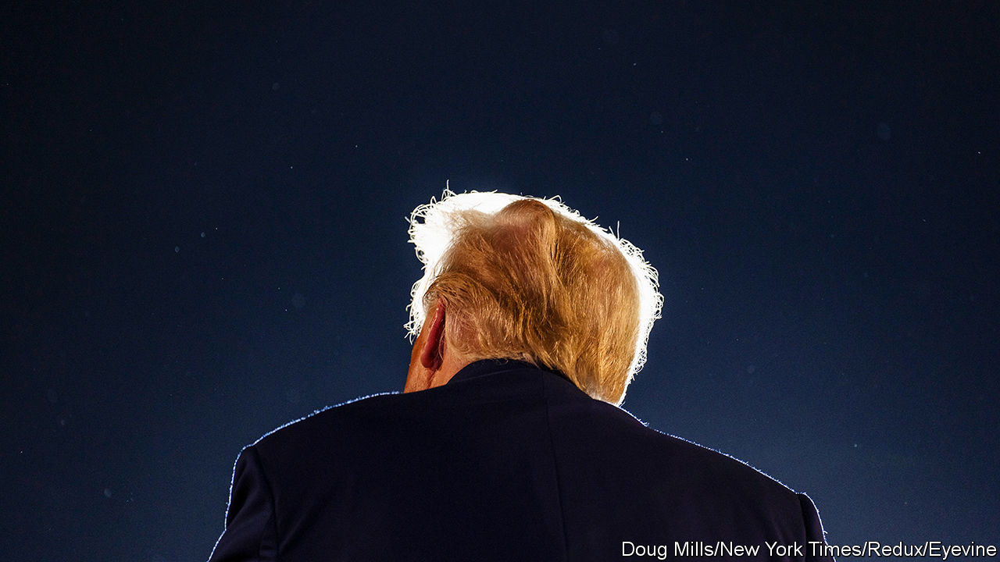

###### SCOTUS and voters

# A clash over Trump’s disqualification tests the Supreme Court 

##### The justices must try to find a way through a legal and political minefield 

 

> Jan 2nd 2024 


THE 14th AMENDMENT is no stranger to America’s Supreme Court. Many of the most controversial questions to reach the justices——turn on interpretations of “due process” or the promise of “equal protection” found in the Reconstruction-era text. But 156 years after the amendment was ratified, the court now has its first occasion to grapple with a clause that some believe disqualifies Donald Trump from becoming president again. 

Section 3 of the 14th Amendment bars those who have sworn an oath to uphold the constitution from federal or state office if they have “engaged in insurrection or rebellion” against the constitution or “given aid or comfort to the enemies thereof”. This rule was designed to keep former Confederate rebels from the levers of power after the Civil War. Few dispute that it applies with equal force to insurrectionists today. The open question is whether Mr Trump’s attempts to secure himself a second term despite losing the 2020 election—culminating in the Capitol riot three years ago—count as an insurrection and so disqualify him from trying to recapture the White House the old-fashioned way. 

A flurry of conflicting answers has emerged in recent weeks. On December 19th the Colorado Supreme Court released a ruling that removes Mr Trump from the ballot for the state’s Republican primary on March 5th. Nine days later Shenna Bellows, Maine’s secretary of state, announced that Mr Trump’s role in the January 6th attack made him ineligible to be listed on her state’s primary ballot. (Both decisions are on hold, for now, as appeals proceed.) Ms Bellows’s ruling followed an administrative proceeding in which several residents of the state challenged Mr Trump’s inclusion. She wrote that, although no one in her position “has ever deprived a presidential candidate of ballot access” stemming from a claim under Section 3, “no presidential candidate has ever before engaged in insurrection”. She has a duty, she wrote, to ensure that all candidates on the ballot “are qualified for the office they seek.”

By contrast, Michigan’s highest court rebuffed an invitation to consider a challenge to Mr Trump’s bid to appear on the primary roster. Minnesota’s did, too. Similar attempts have faltered in Florida, New Hampshire and Wisconsin. Others are under way in Oregon, Alaska and eight other states. In California, when the lieutenant-governor implored Shirley Weber, the secretary of state, to find a way to keep Mr Trump’s name off the ballot, Ms Weber demurred. “[I]t is more critical than ever”, she said, “to safeguard elections in a way that transcends political divisions.”

This disagreement among Democrats in California shows that, though political motives may animate some challenges to Mr Trump under Section 3, responses from officials and scholars have not always fallen along partisan lines. All seven judges on the Colorado Supreme Court were appointed by Democratic governors, but only four signed the opinion removing Mr Trump from the ballot. The three dissenters, without denying that the 45th president had engaged in insurrection, cited various reasons he should not be erased from the ballot: the five-day trial in the lower court was insufficient; applying Section 3 requires an act of Congress; and Mr Trump has not been criminally convicted of insurrection.

William Baude and Michael Stokes Paulsen, two law professors on the right, reject these arguments and contend in a forthcoming law-review article that it is “unquestionably fair to say that Trump ‘engaged in’ the January 6th insurrection through both his actions and his inaction”. The case, they write, “is not even close”. 

Messrs Baude and Paulsen are respected scholars with conservative bona fides (Mr Baude clerked for Chief Justice John Roberts), but the Supreme Court may shrink from their politically earthshaking position. The court was widely condemned for interfering in the 2000 election, in effect making George W. Bush the victor over Al Gore. It will be hesitant to shake up the 2024 contest by empowering states to deny voters the chance to opt for the Republican front-runner. 

Adam Unikowsky, who has litigated at the Supreme Court and comments on it, writes that disenfranchising millions of Trump voters would seem “insanely anti-democratic”. Yet it will not be a simple matter to reverse the Colorado court decision, he reckons, as its analysis is sound. He puts the chances of the Supreme Court disqualifying Mr Trump at 20%. 

The review could proceed apace. The Republican Party in Colorado (which on December 27th petitioned the court to scuttle the Colorado Supreme Court’s ruling), Mr Trump himself (who added his appeal on January 3rd) and those supporting Mr Trump’s removal from the ballot have all asked the justices to accelerate their consideration of the cases. On January 2nd Mr Trump appealed against the Maine disqualification to a court in Augusta. It, too, could end up in the Supreme Court.

The justices will juggle this novel constitutional quandary as two more Trump-related cases speed their way to them. In the spring they will consider whether Capitol rioters (and by implication, the man they were rioting for) can be charged under a federal law that criminalises corruptly obstructing an official proceeding. And in the coming weeks they may be asked to resolve whether ex-presidents enjoy “absolute immunity” from criminal prosecution for things they did in office—a question at the heart of the January 6th case that Jack Smith, the special counsel, is prosecuting.

Chief Justice Roberts may try to broker big majorities for a path through the minefield: keeping Mr Trump on the ballot while rejecting his claim to blanket immunity. But it is a hazardous time for what Alexander Hamilton pitched as “the least dangerous branch”. ■


