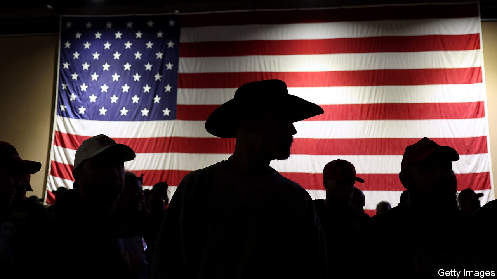
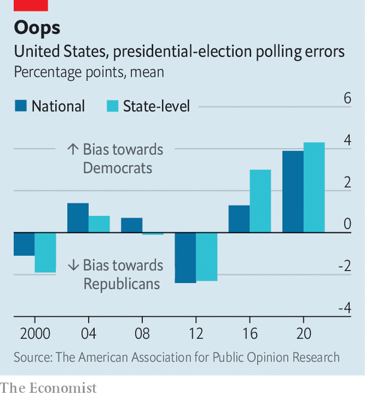

###### Handle with care

# American pollsters aren’t sure they have fixed the flaws of 2020 

##### That does not inspire confidence for 2024 

 

> Dec 31st 2023 

AS AMERICA ENTERS a nervous election year, one thing is certain: the  will be watched closely for clues about the outcome. But how much faith should be placed in them? In the past two presidential cycles they misfired, badly underestimating support for Donald Trump each time. Mr Trump looks likely to be the Republican nominee again. In head-to-head polls he leads Joe Biden by 2.3 points on average. That suggests a toss-up. Polls conducted so far in advance of the election have generally missed by a margin far greater than Mr Trump’s current lead.

And Mr Trump’s voters vex pollsters: they appear to be disproportionately less likely to take part in pre-election surveys yet turn out to vote for him. Pollsters have been grappling with ways to reflect this in their numbers, but no one knows how well their adjustments will work. In a close contest, even small errors can prove critical. 

Polling looks simpler than it is. To gauge what people think, pollsters ask questions of a tiny subset of a population. But some people—generally those who are older, whiter and have college degrees—are  than others. To make the sample better reflect the population as a whole, pollsters have two levers they can fiddle with. They can adjust how they select their sample or they can place more weight on the views of those underrepresented within it. Most do both. 

To complicate matters further, election prognosticators also have to predict who will actually vote. Pollsters filter out those they predict are unlikely to show up. Although they have various tools to do this—from voter-registration data to respondents’ stated intentions—it remains as much an art as a science.

In 2016 the size and composition of the electorate surprised pollsters. The national polls had accurately predicted Hillary Clinton’s margin in the popular vote. But at the state level polls failed miserably. Turnout surged in Republican counties in swing states across the Midwest. And it was precisely those voters—mostly white and without college degrees—that pollsters had missed because they were less likely to take part in their surveys. The white respondents who did pick up their phone calls were more likely to have college degrees and to support Mrs Clinton than the electorate was as a whole. 

Polls that had accounted for respondents’ education level were more accurate. Some 52% of national polls had done so, which helps explain why the national polls erred by far less than state polls did in 2016 (see chart). In crucial states such as Michigan, by contrast, only one in five polls adjusted for education. So in the aftermath of that election most pollsters began ensuring their samples better reflected Americans’ education levels and thus captured the widening partisan gap between those with and without college degrees. This seemed to work in the 2018 midterms: polls were more accurate than they had been in the previous five midterm cycles.

 


But then, in 2020, came another polling meltdown. In gauging the national popular vote, pollsters had their largest miss in 40 years. And their errors were no longer concentrated in the Rust Belt but rather rippled across the country. Whereas pollsters had, on average, expected Mr Biden to win with an 8.4-point margin in the popular vote, his edge turned out to be about half that. The American Association for Public Opinion Research assembled a task force of academics and pollsters to conduct an autopsy. Their findings are not reassuring: “identifying conclusively” why the polls erred, they reckoned, “appears to be impossible with the available data”. 

One theory is that some of Mr Trump’s supporters—who are unusually sceptical of institutions like the federal government and the media—may have heeded his calls to not trust pollsters. (He has recently been at it again, calling a New Hampshire poll that showed Nikki Haley trailing behind him by a mere four percentage points “just another scam”.) If enough of his backers ignored pollsters yet turned out to vote for him, estimates of the size and preferences of the electorate would be skewed. This puts pollsters in a bind: unlike demographic variables that they can adjust for, like age, sex or educational attainment, there is no objective measure of “institutional trust”.

Some have tried creative workarounds. Wick Insights, a polling firm, realised that respondents who were vaccinated against covid-19 took part in its polls disproportionately often. To adjust for this, it placed more weight on the views of unvaccinated respondents. But in 2022 its polls far overstated Republican support. 

Technology has also changed the game. Nearly every American used to have a home phone, and pollsters could randomly dial a number of households to obtain a sufficiently representative sample of the country. But with the advent of cell phones and caller-ID, response rates plummeted, from 36% in 1997 to 6% in 2018.

Use of online polling has soared in recent years. In 2016 38% of polls were conducted online. By 2020 that number had swelled to 64%. They are cheaper than live-caller polls, but bring their own challenges. Rather than reaching out to a random sample of the population, online pollsters rely on respondents opting in. Doug Rivers, the chief scientist at YouGov, an online pollster partners with, notes that, whereas phone surveys have low response rates, online pollsters can’t be sure whether “the people we are getting [to respond] are unusual in some way that we don’t understand”. 

One answer is to use a patchwork of survey methods—online, text, telephone, postal—to stitch together a fuller picture of the electorate. “As reaching people on the phone gets harder, mail is actually still a way to reach a broad swathe of the population,” says Chris Jackson, a researcher at Ipsos, a polling firm. Pollsters are also increasingly relying on voter rolls, databases of all registered voters. After 2020 the /Siena College poll started using these to identify people whose demographic data or voting history suggest they are unusually averse to speaking with pollsters. Extra efforts can then go into including them in polling samples. 

Such innovations seemed to pay off in the 2022 midterms. The average polling error was the lowest since at least 1998. But whether this success can be repeated in a general election with Mr Trump on the ballot is unclear. Mr Trump seems to animate two parts of the electorate: highly engaged Democrats who loathe him and turn out to vote against him and his party, and a historically less engaged set who turn out to vote for him but maybe not for his party.


So how should the polls be read? Even pollsters urge caution. Josh Clinton, who co-directs the Vanderbilt poll, says that “in some sense, it’s background noise”. At this stage, he notes, “it’s nearly impossible to know what’s going on”. He points to the narrow margins between Messrs Biden and Trump and the unresolved issues from 2020. Others are upbeat. “I think the state of polling is vibrant right now,” says Don Levy, the director of polling at Siena College, “and the consumer of polls has a lot to look at.” 

The discerning consumer would do well to keep a few things in mind. First, it is better to follow polling averages than any single poll. Second, it makes sense to focus above all on polls in the swing states that will determine the outcome in the electoral college, and thus who wins the presidency. Lastly, the election will almost certainly be close. Polls that show a large lead for either candidate are probably outliers.

After falling short in 2016 and 2020 pollsters are wise to underpromise and hope to overdeliver. The candidates will not be the only ones facing judgment in 2024. The polling industry will be, too. ■


