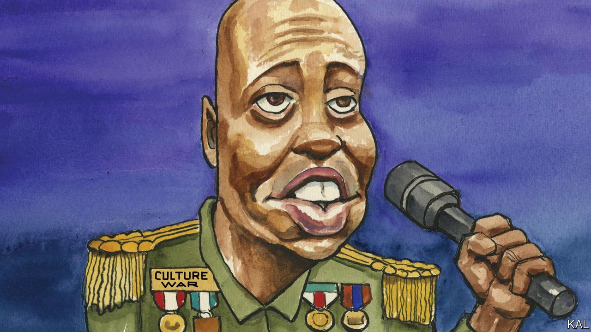

###### Lexington

# How to win the culture war 

##### Dave Chappelle is routing his critics, but “American Fiction” transcends the whole fight 

 

> Jan 4th 2024 

In America culture has become politics by other means, and that has not been good for either realm. As Donald Trump and his imitators have made politics more outlandish and offensive, films, television and even comedy, dominated as they are by creative types of the left, have grown more didactic and censorious—thereby supplying more fuel to the right. 

This loop has sucked in even some entertainers wise enough to try to stand outside it, at least to judge by the comedian Dave Chappelle’s latest Netflix special, “The Dreamer”, released on the last day of 2023. Mr Chappelle’s wit is still fanged, his storytelling still absorbing, the strike of his punchlines as surprising—as deserving of the name—as ever. 

Some jokes fall flat, but that has always been the case. What seems new are the triumphal notes. Early in the new act, Mr Chappelle says with a grin, “I love punching down.” That is ostensibly a reference to a marginalised group he is newly mocking, people with disabilities. But it registers also as a shot at the offended multitude that tried in 2021 to get Netflix to remove his show that year, “The Closer”, because of his jokes about transgender and gay people. It was among the biggest of the many uproars thus far over where to draw the boundaries for American discourse, and it was also unusual because Netflix held the line in the face of an internal uprising as well as a social-media assault.

The company’s co-chief executive, Ted Sarandos, told its employees at the time that Netflix would host shows they might not like. “There are going to be things that you might feel are harmful,” he warned. “But we are trying to entertain a world with varying tastes and varying sensibilities and various beliefs.” Whether the leaders of Netflix took their stand out of principle or commercial interest—most likely, some unknowable mix of the two—they were right on both counts. 

For his part, while Mr Chappelle may not have won the culture war, having overcome his adversaries he is relishing the rout. Since the uproar over “The Closer” he has been filling arenas as well as theatres, benefiting too from fans’ growing . According to the  he earned more in ticket sales last year than any other touring comedy act—at least $62m, a total that does not include all his events. “The Dreamer” almost immediately was listed as the most popular Netflix show in America. 

In the new show, Mr Chappelle says he is done telling jokes about gay and transgender people, before catching himself: “Maybe three or four times tonight—but that !” He knows that his fans expect such jokes. So do his adversaries, though snide reviews of “The Dreamer” from leftish publications have sounded less enraged than resigned. Everyone is going through the motions. On both sides the furious battles of yesteryear are being reprised as shtick. That is progress, of a sort. 

 Stand-up comedy tends not to age well. Its particular, backhanded contribution to pluralism is to puncture contemporary pieties and mores, and those change, or should. But as Mr Chappelle attacks this era’s cant and self-certainty, the punchlines can suggest that he, and America, remain a bit stuck. “You see, it’s a funny thing if you believe you’re absolutely right,” he observes near the end of the show. “You can get drunk off the feeling of how right you are.” Then he sticks in the now-familiar barb: “That’s why gay people are so mean.” The attacks on Mr Chappelle’s work only strengthened him, but in repeatedly picking the same fight, he is granting his adversaries some continued power, too. 

In 2022 an audience member with a knife charged at Mr Chappelle while he was performing at the Hollywood Bowl. The assailant later said the jokes were “triggering” him. Mr Chappelle, who was not injured, has turned the attack into one of his best bits. It reverses his usual pattern: the routine starts out poking at bisexuality, but then leaves that subject behind to wend towards first poignant, then hilarious punchlines about the inheritance he has squirrelled away in a safe-deposit box for his family. Maybe, when Mr Chappelle’s whole act can follow that sort of pattern, the culture wars will truly be ending. 

An American fraud

A fine new film, “American Fiction”, transcends all this bickering. Thelonious Ellison, known as Monk, is a black academic and author whose erudite novels do not sell well. Enraged by the success of a novel he sees as black-poverty porn (its title: “We’s Lives in Da Ghetto”), Monk, under a pseudonym, bats out a parody of such work (“My Pafology”), only to have it rapturously embraced by white literary types who consider themselves progressive. This broad conceit about racial tropes occasions many more subtle observations of bigotry and hypocrisy, as when a white film director inflated with self-regard over his sensitivity to anti-black cruelty casually humiliates an Asian-American assistant.

But the film’s most powerful message is that, to be compelling to a broad audience, it should not need to indulge in the conceit about racial tropes at all. Race recedes from the story’s real comedy and pathos, which lie in Monk’s relationships with his equally bruised, witty and accomplished siblings and with his aristocratic mother, who is fading into Alzheimer’s. “You know, I don’t really believe in race,” Monk says plaintively at one point. The problem, as his agent notes, is that pretty much everyone else does believe in that most poisonous of American fictions. 

Like Mr Chappelle, “American Fiction” argues that people deserve respect not just because of their identification with any broad group but because of their intricacies, because of their facets and flaws as individuals. Politics, with its traffic in demographic voting blocs, has never had much patience for such microscopic focus or even such universal themes. That is why the culture needs to supply them. ■


