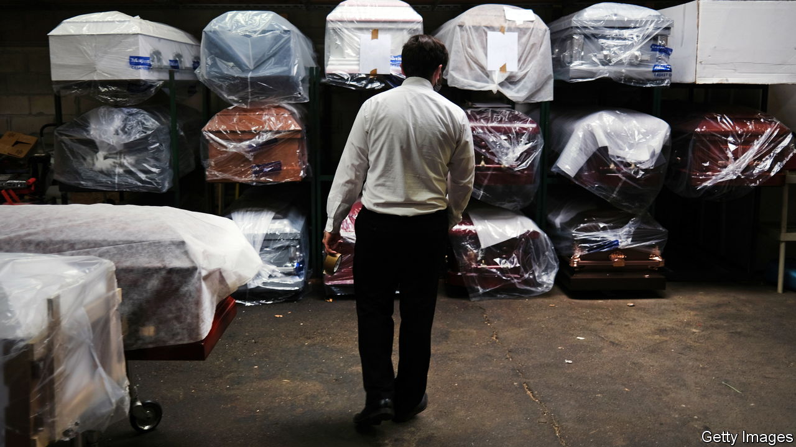
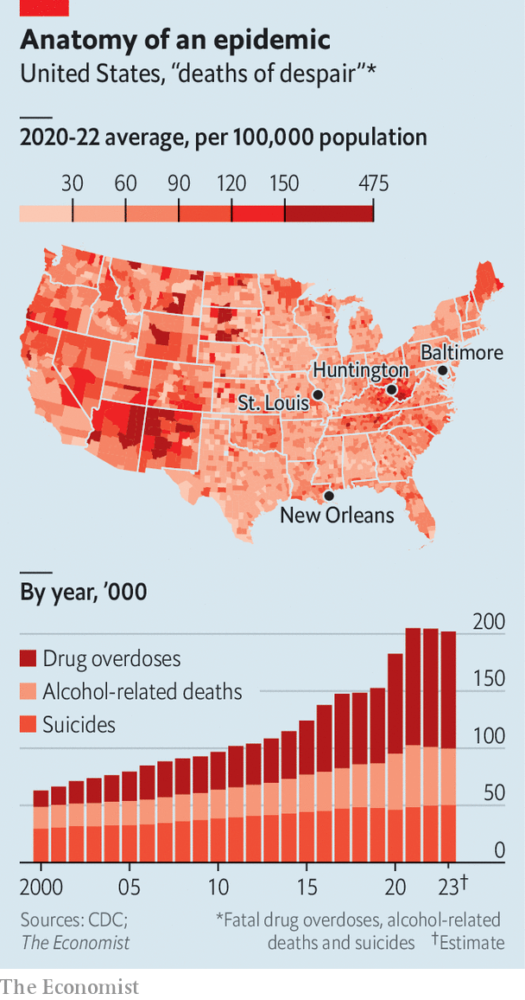
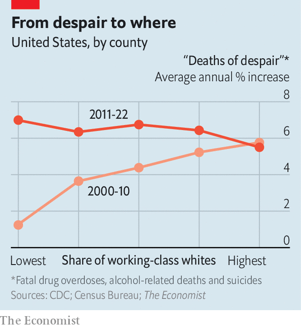

###### Do not despair

# The deaths-of-despair narrative is out of date 

##### Drugs and suicide are no longer killing more working-class whites than they are other Americans 

 

> Dec 23rd 2023 

MOST ECONOMIC theories come and go with little fanfare. Every once in a while, however, one catches fire. In 2015 Anne Case and Angus Deaton, two Princeton University economists, published a landmark study showing that from the late 1990s the mortality rate of white middle-aged Americans had started to rise after decades of decline—owing to a surge in alcohol-related deaths, fatal drug overdoses and suicides. This “deaths-from-despair” mortality rate has not slowed since: in 2022 more than 200,000 people died from alcohol, drugs or suicide, equivalent to a Boeing 747 falling out of the sky every day with no survivors. Yet even as America’s deaths-of-despair epidemic has intensified, its causes have grown harder to identify. 

When Ms Case and Mr Deaton put forward their thesis, their focus was on middle-aged white Americans without university degrees. For decades this group had been able to make a living with no more than a high-school diploma. But they were now suffering from stagnant wages and shrinking job opportunities. That, in turn, had contributed to an erosion of traditional social institutions, such as marriage and religion. Although black and Hispanic Americans had been affected by many of the same economic forces, it was whites that were left with particular feelings of despair and meaninglessness. The result was drug abuse and suicide, aided by exploitative pharmaceutical companies and inept regulators. 

This story appealed to many pundits, in part because it seemed to explain political trends. In the 2016 presidential election rust-belt states with a high concentration of white working-class people voted disproportionately for Donald Trump. Places where life expectancy had fallen most experienced the biggest swing towards the Republican candidate. The Case-Deaton theory seemed to explain why Americans in such “left-behind” communities were so receptive to Mr Trump’s bomb-throwing rhetoric and his promises to restore the American dream for the country’s forgotten. 

Many economists, however, were not convinced. Some criticised the researchers’ methodology. By adjusting for inflation using the  rather than the personal-consumption-expenditures index, for example, the duo overestimated the decline in white working-class wages. By comparing people with and without college degrees, they obscured the fact that much of the increase in mortality was concentrated in high-school dropouts, a small and shrinking segment of the population. And some researchers thought that the survey data on which the economists relied to illustrate growing mental distress was inadequate to explain the rising death toll.

Others argued that the deaths-of-despair phenomenon was better explained by supply-side factors. In 2010 Purdue Pharma, a drug company, reformulated OxyContin, its signature prescription opioid. The new “abuse-deterrent” version, unlike the original one, could not be crushed and snorted to deliver an immediate high. This prompted some addicts to switch to heroin, leading to more overdoses. When fentanyl, a synthetic opioid, entered widespread use from the early 2010s, deaths were highest in places with the greatest access to the drug.  shows that between 2008 and 2020 states with more imports—fentanyl is often smuggled from abroad, hidden in legitimate shipments—suffered from more fentanyl overdoses. 


As explanations for the causes of the deaths have evolved, so have theories about the populations most vulnerable to it. The Case-Deaton thesis centred on working-class whites. But an analysis of mortality and demographic data by  shows that the devastation has spread beyond predominantly white cities such as Huntington, in West Virginia, to more diverse places like Baltimore, New Orleans and St Louis (see map). 

 


2010 marked a turning-point. Between 1999 and 2010 counties with the highest share of working-class whites saw deaths of despair grow much faster than in the counties with the lowest. Between 2010 and 2022, though (a period that covers Mr Trump’s election), that relationship flipped (see chart). Deaths of despair rose by 5.5% per year in counties with lots of high-school-educated whites, but by 7% in the most diverse, educated ones.

A decade ago the mortality rate from alcohol, drugs and suicide was nearly one-fifth higher in conservative counties than in liberal ones. Today, deaths from despair are now as prevalent in Democratic parts of the country as in Republican ones. And because left-leaning counties tend to be bigger than conservative ones, they record 10,000 more deaths of despair per year than them. 

Indeed, the despair that Ms Case and Mr Deaton wrote about can now be found among nearly every demographic group. Black Americans are  to die from drug overdoses than whites.  are taking their own lives at ever-higher rates. Perhaps most overlooked are Native Americans, for whom the deaths-of-despair mortality rate is at least one-and-a-half times that of white Americans, and rising. Our data show that such deaths are more than three times as common in the 35 counties where Native Americans make up the largest share of the population than they are in the rest of the country.

 


What does this mean for the nearly decade-old theory of deaths of despair? “We were very optimistic about African-Americans in the first paper—there had been no upsurge in deaths for them until two years after we first wrote it,” says Mr Deaton. “The facts on the ground have changed.” 

So must the analysis. In 2010 suicides barely outpaced overdoses, and alcohol deaths lagged just behind. That justified thinking about the three causes of death together. Today, however, there are more deaths from overdoses than from the other two causes combined (see chart). 

This now looks more like a medical crisis than a social one. And if the lethality of new drugs is even partly to blame, America is in trouble: dealers have started lacing fentanyl with “”, a horse sedative that causes flesh wounds, and nitazenes, a Chinese-made opioid more than 40 times as potent as fentanyl. Such cocktails will kill even more people, even more quickly. ■


