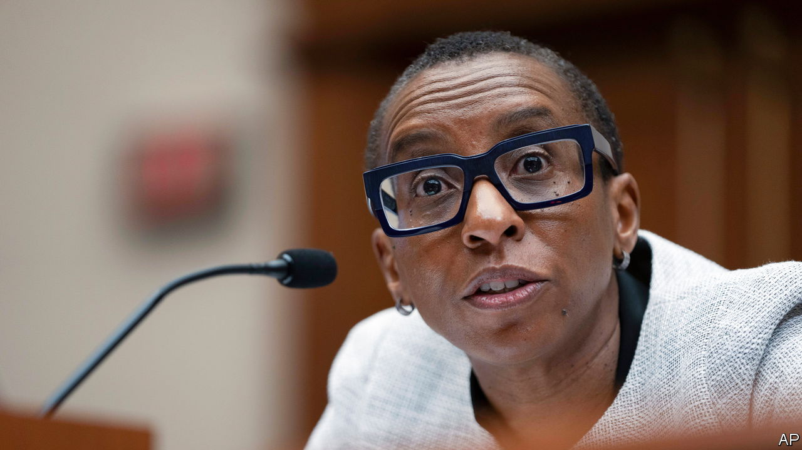

###### The Gay divorce

# The decline and fall of Harvard’s president 

##### Claudine Gay’s sloppy citations added to the embarrassment of her recent congressional testimony 

 

> Jan 3rd 2024 

When it comes to scandals, the drip-drip-drip kind can prove deadly. Embarrassments accrue; the mess metastasises. So it was with Claudine Gay, president of Harvard University. Revelations of plagiarism in her academic work were first publicised weeks ago. But more kept surfacing. The latest allegations, published on January 1st in the , a conservative outlet, brought the total to several dozen. The next day she resigned, a mere six months into her post—the shortest tenure in Harvard’s history. She determined that this was in the university’s best interests. Harvard’s provost, Alan Garber, will fill the job on an interim basis.

Plagiarism did for Ms Gay, a political scientist by training. But the pressure on her to step down began with her response to Hamas’s attack on Israel on October 7th. Critics—Harvard donors, professors, politicians—assailed her for not immediately condemning the violence and not disavowing a statement by pro-Palestinian students that blamed Israel. Larry Summers, a former president of Harvard, said he had “never been as disillusioned and alienated” with the university. A few days later Elise Stefanik, a Republican congresswoman, called on Ms Gay to resign.

Then, in early December, came her dismal performance at a . Questioned by Ms Stefanik, she and two other university leaders refused to say that calling for the genocide of Jews would be punished at their schools. Amid the blowback, the president of the University of Pennsylvania resigned. Harvard’s faculty rallied behind Ms Gay and urged the board to back her. Point-scoring Republicans and meddlesome donors should butt out, went the feeling. It rankled that some critics had in effect called Ms Gay, Harvard’s first black leader, a diversity hire.

But then came the plagiarism accusations. On December 10th Christopher Rufo, a conservative activist, accused Ms Gay of lifting phrases from other scholars’ work in her dissertation without quotation marks. Two days later Harvard’s board acknowledged that it had been notified of separate allegations in late October. An independent review of her work had uncovered “a few instances of inadequate citation”, said the board, resulting in corrections to two articles. 

Still more accusations followed, filed in two anonymous complaints with the university and published by the . About half of Ms Gay’s 11 journal articles—a thin body of scholarship compared with that of her predecessors—were said to contain lifted lines, or to lack attribution.

None of Ms Gay’s transgressions alone appears all that egregious—nothing like, for example, the data fabricated in the lab led by Marc Tessier-Lavigne, a neuroscientist who resigned as president of Stanford University in July. (Stanford’s board determined that he was unaware of the falsification.) But any Harvard student who copies others’ work without citing it, as Ms Gay appears to have done, would incur penalties ranging from academic probation to expulsion. The university could not credibly warn students about plagiarism and talk up academic integrity when its own president had been so sloppy. 

Two of Harvard’s last four presidents have now resigned amid scandal—the other being Mr Summers, whose gaffes cost him the support of some of the faculty in 2006. The latest affair is a win for the likes of Ms Stefanik and Mr Rufo. Ever-more scrutiny will mean that university presidents need to be better prepared for prime time. Ms Gay was evidently coached for her disastrous congressional testimony by lawyers with zero media-savvy. 

They also need to be better vetted. The allegations against Ms Gay predated her tenure. Eleven months ago an anonymous user posted on econjobrumors.com, a Reddit-type site for academics with an axe to grind, that “whole sentences in her literature review [were] lifted off original sources with no quotation marks”. Then, more ominously: “This won’t end well for her now that the whole world is watching.” ■


