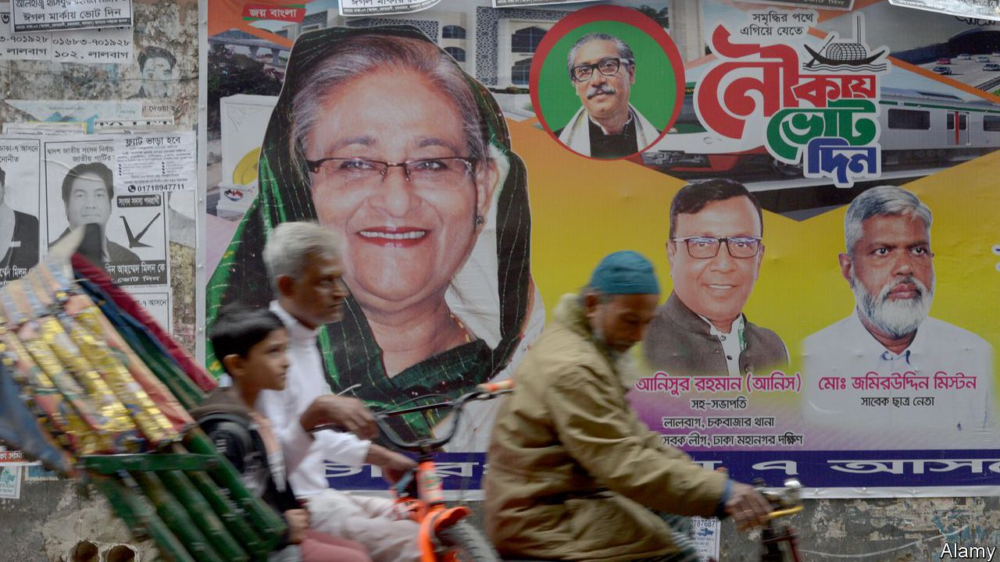

###### Sheikh, rattle and roll

# Bangladesh’s prime minister, Sheikh Hasina, wins a fifth term 

##### The country is now in effect a one-party state 

 

> Jan 8th 2024 

IT WAS the kind of result a truly democratic politician can only dream of. Not long after polls in Bangladesh’s parliamentary election closed on January 7th, a returning officer in Sheikh Hasina’s Dhaka constituency announced that the prime minister had been re-elected with 249,965 votes. The runner-up received 469.

The long-serving prime minister’s overwhelming victory was matched by that of her Awami League (AL) party, which won 222 of the 299 seats being contested. With the main opposition party boycotting the poll, the AL was the only powerful political group to take part. The process confirms Bangladesh’s transition from a flawed but competitive democracy to a de facto one-party state, albeit with some electoral democratic trappings. Unless Sheikh Hasina, who has governed uninterrupted for the past 15 years, radically changes tack, the  face ever-increasing levels of authoritarianism.

Casting her vote shortly after polls opened, Sheikh Hasina naturally declared that the election was free and fair. “I am trying my best to ensure that democracy should continue in this country,” she told reporters. Yet many leaders and thousands of supporters of the Bangladesh Nationalist Party (BNP), the only party capable of mounting serious opposition to the AL, spent election day in prison. Most of those still at liberty boycotted the poll. Of the 77 seats not won by the AL, 62 went to so-called “independent” candidates, mostly AL members or supporters who had been fielded with official encouragement to give the impression of a competitive poll. The Jatiya Party, an AL ally currently acting as the official opposition in parliament, won 11 seats. Final results were expected shortly after  went to press.

That the election result was baked in was not lost on Bangladeshis. Previous elections, following the country’s emergence from military rule in 1991, saw raucous campaigning. By contrast, streets across the country remained largely quiet in the days leading up to this vote. Except for isolated incidents of violence, including an arson attack on a train bound for Dhaka on January 5th that killed four people, the atmosphere was generally calm, though tense in opposition centres such as the teeming capital. The government had taken the precaution of deploying the army widely to maintain order.

Turnout was sluggish, with many polling stations across the country reported to be deserted. Many people eligible to vote told reporters they saw no point in doing so, given that they had little choice of candidates. Shortly after polls closed an official from the election commission told a press conference that turnout was 28%, before swiftly correcting himself and saying it was 40% (on January 8th the election commission announced an official turnout of 41.8%). Local observers considered the lower number more plausible. Either way, it represented a big drop compared with the  in 2018, in which some 80% of eligible voters took part. That election, though marred by allegations of widespread ballot-box stuffing, was not boycotted by the opposition.

Despite this farce of a poll, there is unlikely to be much imminent resistance to Sheikh Hasina’s increasingly iron-fisted rule. The BNP is ill placed to recover from the recent crackdown; its ailing leader, Khaleda Zia, Sheikh Hasina’s main rival, is languishing under house arrest after being convicted of corruption. Moreover, despite recent high inflation and other economic pressures, the prime minister’s development record remains strong. She has the support of China, India and Russia, all of which were quick to congratulate her on her victory. America and the EU said the election was not free and fair and called on the government to investigate irregularities. Yet they are wary of alienating a big Asian country that is already close to China. They are also big customers of Bangladeshi garments, the country’s biggest export. January 7th was a bad day for Bangladesh’s democracy. It was another good day for South Asia’s iron lady. ■

