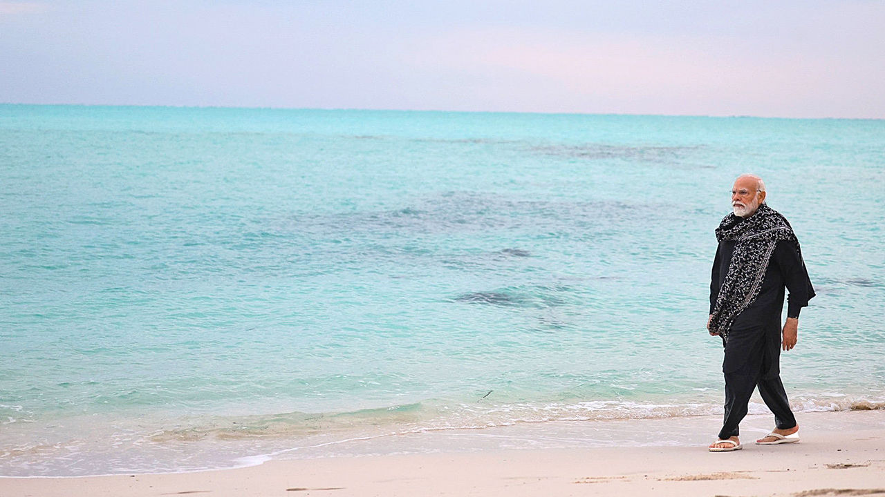

###### Beach bummer

# India bridles at China’s growing presence in South Asia 

##### A spat with the Maldives highlights regional difficulties 

 

> Jan 11th 2024 

In india as elsewhere, many fantasise about escaping to the beach in early January. Yet recent days have seen an unusual public debate about which beaches are acceptable and which, more to the point, are not. Politicians and Bollywood stars are richly praising India’s own island and coastal resorts. They are meanwhile urging people not to travel across the Indian Ocean to a traditionally hankered-after alternative: the Maldives. Some travel agents have stopped taking bookings to the archipelagic South Asian state.

What is afoot? Earlier this month Narendra Modi, India’s prime minister, paid a visit to the union territory of Lakshadweep, a tropical archipelago off the coast of the southern state of Kerala. Mr Modi praised the islands’ tourism potential and was pictured snorkelling against a backdrop of pristine—distinctly Maldives-like—white sands. This prompted three junior Maldivian ministers to take to social media with snarky comments about India’s supposedly inferior beaches and its prime minister. That angered Indian social-media users, who rallied to Lakshadweep’s and Mr Modi’s defence, and India’s government, which summoned the Maldives’ envoy in Delhi for a ticking-off. 

Besides highlighting the nationalist mood in India, the saga points to a growing strain in the long and historically close relationship between India and the Maldives, which is home to 400,000 people. It is symptomatic of the wider difficulties India faces in managing its neighbourhood as China’s influence in South Asia grows. 

India and the Maldives have a long history of co-operation on economic, defence and security issues, having established diplomatic relations after the Maldives gained its independence from Britain in 1965. Nearly 210,000 Indian visitors entered the Maldives last year, more than from any other country, representing more than 11% of total arrivals. A prolonged Indian boycott could seriously hurt the Maldives’ economy, a third of which relies on tourism. The Maldives’ government was therefore quick to try to contain the spat. On January 7th the three snarky ministers were suspended. On January 9th the Maldives’ tourism association implored Indian travel agents to end their boycott.

At first glance, the swift suspension of the three ministers looks like a victory for India, its angry social-media warriors and Mr Modi. “There is a sense of ‘look what happens to a Mickey Mouse country that misbehaves with India’,” says Happymon Jacob of Jawaharlal Nehru University in Delhi. Yet that would be short-sighted—not least because the offending politicians’ comments will have been popular with many Maldivians. As is the case with Nepal and Bhutan to the north-east, the Maldives’ relationship with India has grown more complex over the past decade as China has extended its influence in South Asia.

In 2014 the Maldives joined China’s Maritime Silk Road Initiative; three years later the two countries signed a free-trade agreement. A deal in 2017 to set up a joint ocean-observation station with China caused security concerns in India—especially after the deal encouraged some Maldivians to demand that India withdraw the few dozen soldiers, manning helicopters, that it stations in the archipelago.

In November Mohamed Muizzu, the Maldives’ newly elected president, renewed the call for the Indian troops to leave. On January 8th he embarked on a five-day visit to China, including a meeting with President Xi Jinping in Beijing. During the visit Mr Muizzu, who has not travelled to India since taking office, called on China to send more tourists to the Maldives than to any other country.

India needs to respond thoughtfully to China’s growing role in its near-abroad. Above all, suggests Mr Jacob, “a responsible aspiring great power should ask itself how to build a more successful partnership with a smaller neighbour.” That could help improve India’s standing in its neighbourhood. It might also benefit fragile local ecosystems. The calls to boycott the Maldives are now increasingly being countered by equally impassioned calls to save Lakshadweep from overtourism. ■


