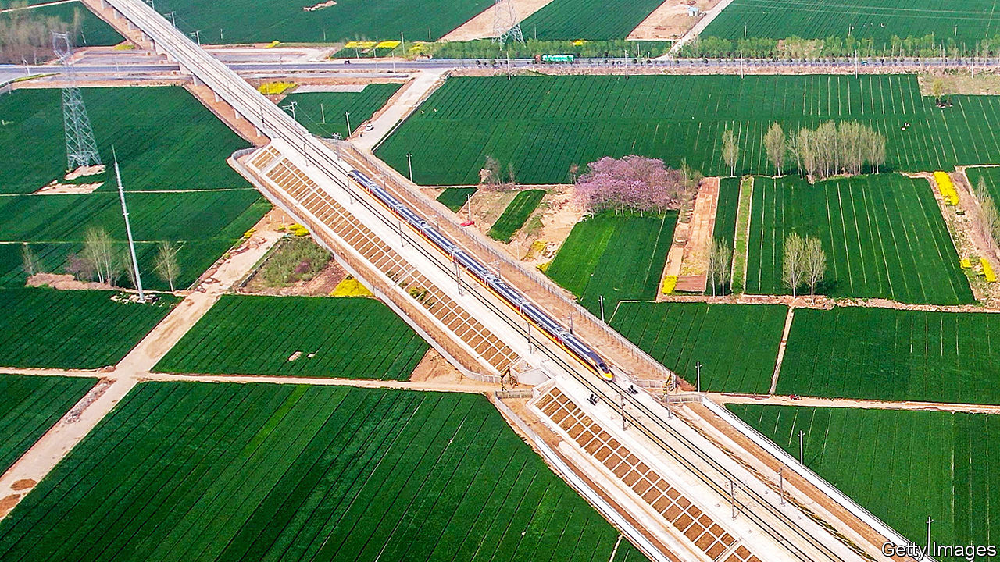
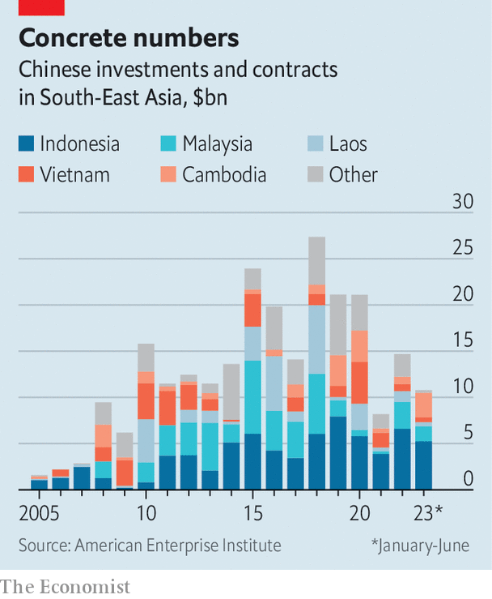

###### Beyond infrastructure

# South-East Asia learns how to deal with China 

##### The Belt and Road is having some underappreciated effects in Asia 

 

> Jan 11th 2024 

A DECADE AGO Xi Jinping, China’s leader, declared his intention to make a world-girdling web of infrastructure China’s gift to the planet. From the start, South-East Asia was to serve as a—perhaps the—main focus of what came to be called the Belt and Road Initiative (BRI). The region of 690m people was China’s backyard. South-East Asia needed trillions of dollars of infrastructure and other development. China-centred supply chains increasingly ran through the ten-country Association of Southeast Asian Nations (ASEAN). Some 60m-70m ethnic-Chinese citizens of South-East Asia, many of them successful businessmen, could help China’s mission.

Ten years on, there is no missing the wave of Chinese money that has broken over the region, bringing giant earth-moving machines, Chinese construction crews, Chinese business folk and diplomats, and not a few criminal chancers. Many BRI projects have gone well, bringing roads, railway tracks and power plants. In Cambodia, a new Phnom Penh-Sihanoukville expressway has cut the journey from the capital to the south coast from five hours to two.

But others have provided poor returns. And a few have been grossly wasteful or environmentally damaging—or spread corruption among local elites, and even opportunities for Chinese criminal gangs. Malaysia, for example, has almost nothing to show for around $1.8bn it gave Chinese firms to build two pipelines in its state of Sabah; the project has been shelved.

 


As the BRI wave recedes around the world, stories such as that can be found in many regions. Yet Chinese commitments in South-East Asia remain substantial, possibly amounting to more than $20bn last year. This leads to some striking conclusions, at least as far as the BRI’s critics in the West are concerned.

First, though Mr Xi may have hoped Belt and Road would be a strategic means to further China’s influence in South-East Asia, no grand plan is apparent. Rather, Chinese state-owned firms suffering from overcapacity at home often rushed to make money in the region, with diverse results. Second, South-East Asian countries have not only grown more cautious over their commercial dealings with China, but also—at least in the case of larger countries—more confident. Third, far from spurning fresh Chinese approaches, as some in the West hoped they would, many ASEAN members continue to welcome them. Yet they increasingly do so on terms more obviously beneficial to their own economies. They are also encouraging different sorts of Chinese investment. Infrastructure deals are flagging. Chinese investment in technology, renewable energy and electric vehicles is increasing.

Measuring the extent of Belt and Road in South-East Asia is hard. At the height of Belt and Road frenzy, from 2015 to 2017, backers of almost any project with Chinese involvement labelled it BRI. Many were not centrally directed out of Beijing. Ong Kian Ming, a Malaysian former deputy minister, says a Chinese investment vehicle approached him in 2018, promising to fund any infrastructure project, so long as the contractor came from the firm’s province in China. “Diplomacy is an inaccurate way of looking at this…Nor was it premised on strong financial principles.”

Many of the projects announced never broke ground. Even so, China has lavished tens of billions of dollars in financial support, economic assistance and concessionary lending on South-East Asia in the past decade, with Indonesia getting the biggest share. On top of that come infrastructure and other investments on commercial terms—including most of the flagship BRI projects blessed by China’s central government. According to Maybank, a Malaysian bank, investment from China to South-East Asian commercial projects averaged $27.9bn a year between 2015 and 2019. It fell to less than $11bn in 2021, before recovering to $18.6bn in 2022. That post-pandemic recovery in asean contrasts with a continued slump in BRI investment elsewhere.

Within asean, the record is mixed. Cambodia and impoverished Laos, small countries beholden to China, have embraced BRI most unquestioningly. Vietnam, long wary of its giant neighbour, has largely avoided it, preferring engagement through trade. In Indonesia President Joko Widodo, known as Jokowi, has used BRI to promote his own economic agenda, including a high-speed railway from Jakarta, the capital, to Bandung, and building a nickel-processing industry from scratch. The Philippines and Malaysia have had troubled engagements with BRI.

Though the previous Philippine president, Rodrigo Duterte, welcomed BRI investments, they have done little for the country’s development, and brought in their wake a large illegal online-gambling industry dominated by Chinese expatriates. The current president, Ferdinand “Bongbong” Marcos, has cancelled three BRI infrastructure projects and signed no new ones. As for Malaysia, its engagement with Belt and Road went awry when Chinese state banks and construction firms helped the corrupt then prime minister, Najib Razak, cover up his bilking of a Malaysian state investment vehicle, 1MDB, for which he is now jailed. 

Despite these intra-ASEAN differences, broad conclusions can be drawn, contradicting both the Belt and Road’s biggest boosters and its detractors. Certainly, the bigger the project, the bigger the risks. To political leaders, the advantage of BRI is no-strings investment and speed: quick access to Chinese finance, know-how and construction gangs. But large-scale projects require scrupulous management and risk analysis—which BRI does not come with. Jokowi’s high-speed train, cleverly branded as the Whoosh and opened late last year, was a pet presidential project that did not even feature in Indonesia’s transport master plan. Little was done in the way of impact assessments. At $7.3bn, the train ran wildly over budget. It will never pay for itself. In Cambodia and Laos, China-backed hydropower dams on the Mekong river are damaging a unique biome and imperilling the livelihoods of millions of fishers and farmers.

Yet just as BRI projects reflect the agenda of local elites more than Chinese priorities, so BRI recipients retain leverage over China when projects hit the buffers. Take Malaysia’s East Coast Railway Line (ECRL), connecting its western ports with the relatively undeveloped east coast. Its initial cost, allegedly, was grossly inflated so that millions of dollars could be siphoned off to plug gaps in Mr Najib’s 1MDB. After his fall, says Malaysia’s transport minister, Anthony Loke, Malaysia successfully demanded that Chinese counterparts cut the project’s price by 30%, raise the involvement of Malaysian firms and share the risk by jointly running the ECRL once in operation.

Bridges to batteries

With the possible exception of Laos, which has loans to Chinese entities equivalent to 65% of GDP, talk of China pursuing “debt-trap diplomacy” in South-East Asia is exaggerated. Indeed, Chinese companies and banks are often pressed to renegotiate existing deals on less favourable terms. China has meanwhile quietly acknowledged that having too many dodgy projects has harmed its reputation. Even the term “Belt and Road” is now omitted from the signage of many Chinese-backed schemes.

A decade’s experience of Belt and Road has made South-East Asian countries wary of criticising China in public. Neither can they easily criticise or cancel signature projects without incurring its wrath, including in the form of economic sanctions. As Tony Pua, a Malaysian former politician who served in the finance ministry, puts it: “We cannot go out there and condemn China, because there’ll quickly be no more Chinese tourists coming to Malaysia. We’ll be screwed not just economically. We’ll be screwed with our own ethnic-Chinese voters who are partial to China.” 

Yet South-East Asian countries increasingly do say no to deals they don’t like. They also seek investments that better reflect new priorities, such as climbing up the manufacturing value chain. Take Malaysia. Its government invited a Chinese carmaker, Geely, to turn around a struggling national carmaker, Proton, which recently agreed to a $10bn investment. It lured Huawei, China’s telecoms giant, to launch regional operations in the country. Chinese steel firms are setting up at industrial parks jointly managed by Malaysian and Chinese entities. Malaysia wants more Chinese investment in everything from e-commerce to renewable energy. Its ambition, says Yeah Kim Leng, an economist, is to be ASEAN’s main production hub.

Other ASEAN members have similar hopes for Chinese involvement—including Indonesia in EVs and Thailand in renewable energy. Investments in such areas may not be labelled BRI. Still, a decade’s experience of it has not dimmed ASEAN’s appetite for co-operation with China. Contrary to what many China hawks maintain, the legacy of Belt and Road in South-East Asia looks to be deep and enduring. ■

