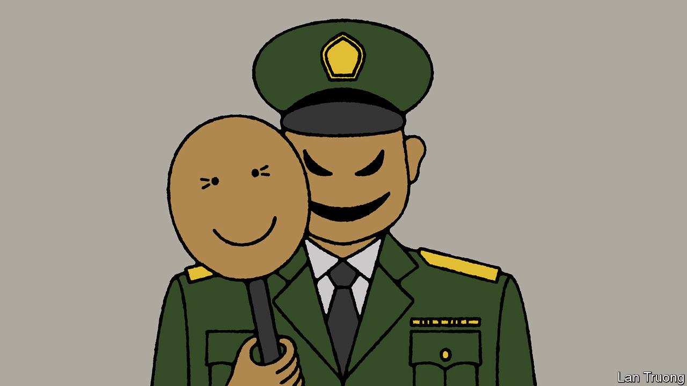

###### Banyan

# The favourite in Indonesia’s presidential election has a sordid past 

##### Victory for Prabowo Subianto would be a setback for reformasi 

 

> Jan 11th 2024 

IN A MONTH’S time some 204m Indonesians can vote in a first round to choose their new president. Two of three presidential candidates are emblematic of —that is, the era of often impressive democratic development since the fall of Suharto, the long-ruling late dictator, in 1998. Ganjar Pranowo, who is 55, and Anies Baswedan, 54, have records as competent elected leaders, respectively as governor of Central Java and as governor of Jakarta, the capital. Both are well educated. Their agendas, in a conservative majority-Muslim country, are broadly secular and liberal, and they stress the rule of law. Unlike other powerful politicians, neither is from a military-and-business dynasty.

Then there is Prabowo Subianto, the problematic favourite. He is polling at 43%, versus 25% for Mr Anies and 23% for Mr Ganjar. After President Joko Widodi, known as Jokowi, who is stepping down, the 72-year-old is the country’s most recognised politician. A former general from a powerful family, he has long revelled in a strongman image—like Mussolini, he rarely appears happier than when astride a white charger. He is immensely rich, with fingers in many pies. He has contested three presidential elections but never been elected to public office. After Jokowi defeated him twice, the outgoing president made Mr Prabowo his defence minister in 2019.


Co-opting your enemies is a notably Javanese trait. Mr Prabowo returned the favour by naming Jokowi’s son, Gibran Rakabuming Raka, the current mayor of Solo, as his running-mate. Mr Prabowo hopes to surf the wildly popular Jokowi brand to victory. In turn, Jokowi hopes to cement his legacy and his family’s influence through Mr Prabowo. That is despite his declaration in 2014 that becoming president “does not mean channelling power to my own children”.

The selection of Mr Gibran required some legal legerdemain. The constitution stipulates that presidential and vice-presidential candidates be at least 40 years old. Mr Gibran is 36. Yet in a ruling in October the constitutional court gave him an exemption. The court’s chief justice is Jokowi’s brother-in-law and Mr Gibran’s uncle. The manoeuvre stank. It undermined democratic norms. With no shame, Mr Prabowo’s people delighted in the win. 

Even more troubling is Mr Prabowo’s pre- record. He had deep ties to the discredited Suharto regime; he was at one point married to a daughter of the dictator. As an officer in and then commander of Kopassus, the army’s feared special forces, Mr Prabowo was associated with abuses committed in East Timor, as Pat Walsh of , an Australian online publication, has detailed. The former Portuguese colony, invaded by Indonesia in 1975, sought and won independence as Timor-Leste in 2002. A truth and reconciliation commission found that the Indonesian armed forces, and Kopassus especially, were responsible for committing war crimes and crimes against humanity during the occupation. Troops under Mr Prabowo’s command conducted massacres. Mr Prabowo was also responsible for training vicious local proxies who did much of the army’s dirty work. The former general denies any wrongdoing. 

Mr Prabowo’s involvement in countering the protests that toppled Suharto in 1998 is well documented. He organised the kidnapping of 23 democracy activists, of whom 13 remain missing. A military council found him guilty of the kidnappings and discharged him dishonourably. He was long banned from entering America. President Donald Trump lifted the ban in 2020.

Known for having an explosive temper, Mr Prabowo has had a makeover. Out has gone his dictator-chic safari suit in favour of business garb. Backed by a canny social-media campaign, he wants voters to know him as a cuddly grandpa. Banyan can attest to his charm, having dined with him. Younger voters know little of his dark past; the Indonesian press and television rarely mention it. 

If Mr Prabowo wins more than half of the vote on February 14th, he will become president. If no candidate gets 50%, it goes to a run-off in June between the two leading candidates. The outcome would then be harder to predict. Mr Prabowo’s people think that Mr Anies and Mr Ganjar joining forces would sink him. But he means to lure Mr Ganjar to his side and has no lack of political and financial inducements. He could then offer Anies-supporting parties cushy cabinet jobs. Bingo! An opposition-free country in the hands of a bloodstained general from the bad old days. So much for . ■


